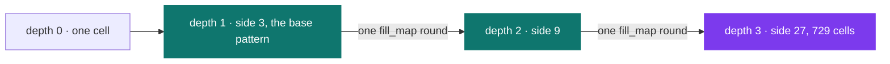
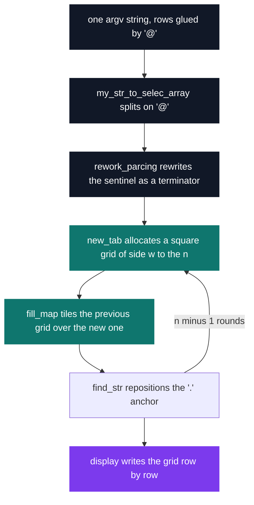

# Duo Stumper 1 — ASCII fractal

[](https://antoinepoisson.github.io/Old-School-Projects/projects/stumper-duo1-2018)

 

**Epitech project** · Stumpers (`B-CPE-210`) · Tek1 · 2018-2019 · 1 afternoon · Team of 2

> One day, one pair, a subject discovered on the spot: generating an ASCII fractal.

Nothing to read the night before. The subject is handed out at the start of the day, and by the
evening two people have to ship a C binary that grows a character grid from side 1 to side `w^n`
— 729 cells at depth 3 — and that rejects every malformed argument before printing anything.

Two real runs, base pattern `###@#.#@###`, where `@` separates rows. Depth 0 prints a single `#`:

```text
$ ./fractals 1 '###@#.#@###' '###@#.#@###'
###
#.#
###

$ ./fractals 2 '###@#.#@###' '###@#.#@###'
#########
#.##.##.#
#########
#########
#.##.##.#
#########
#########
#.##.##.#
#########
```

## Overview

The stumper is a timed exam: the subject is revealed at the start of the day and the pair has until
the evening. This one asks for a figure that repeats identically at every scale, built from a base
pattern given on the command line and a number of iterations.

The pattern is not hard-coded. It arrives as one string whose rows are glued together by `@`, which
keeps the whole shape inside a single shell argument.

| Argument | Role |
| --- | --- |
| `av[1]` | iteration count, digits only |
| `av[2]` | base pattern, rows joined by `@` |
| `av[3]` | second pattern, same length, `@` in the same columns |

Only `av[2]` reaches the engine. The second pattern exists to be checked against the first, and
`av[3]` appears nowhere outside `check_error.c`.

The width `w` is the offset of the first `@`, and the grid side is `w` to the power of the
iteration count: width 3 gives 3, 9, 27; width 2 gives 2, 4, 8.



## How it works

**Splitting without a split.** The house library has no `strtok`. `my_str_to_selec_array` cuts the
argument on `@` and writes a `/` sentinel at the end of every piece; `rework_parcing` then walks the
array and turns each `/` into a `\0`. Two cheap passes replace one allocator-aware tokenizer.



**One allocation size for every round.** `new_tab` sizes the grid with `my_compute_power_rec(w, n)`
— the *final* side, not the current round's side. Every intermediate grid therefore sits in a buffer
already as large as the last one will be, so no round ever resizes or reallocates. It costs memory
and removes a whole class of resize bugs on an afternoon deadline.

**The copy loop.** This is the core, and it uses no division and no `%` operator:

```c
    for (int i = 0; i < size * nbr_repetition; i++, count++, i_three = 0) {
        for (i_two = 0; i_two != size * nbr_repetition;
            i_two++, i_three++) {
            if (i_three == nbr_repetition)
                i_three = 0;
            if (count == nbr_repetition)
                count = 0;
            str[i][i_two] = last_str[count][i_three];
        }
        str[i][i_two] = '\0';
    }
```

Two counters wrap by hand: `count` walks the rows of the previous grid, `i_three` its columns, both
resetting at `nbr_repetition` — the side of that previous grid, call it `s`. The effect is
`new[i][j] = last[i mod s][j mod s]`: one round tiles the whole previous grid once per pattern row
in each direction, so `w` times each way for a square pattern.

**Audit note.** A substitution fractal needs two index maps: `i mod s` to pick what is read inside a
tile, and `i / s` to pick *which* tiles get a copy at all. This code implements the modular half; the
divisive half lives in the `.` anchor machinery, and `find_point_origin` scans `argv` for that dot —
so a launch as `./fractals` matches on `argv[0]` and short-circuits it. The shipped output is a clean
periodic tiling rather than a Sierpiński carpet with holes at every scale.

**One slot too many.** `new_tab` reserves `size + 1` row pointers, then hands a buffer to all
`size + 1` of them before writing its `NULL` terminator at index `size + 1` — one past the end. From
depth 2 on, `display` prints one uninitialised row after the grid and the depth-3 run can end on a
segfault. The sentinel slot has to be counted once, not twice.

**Nothing prints before the input is valid.** Five guards run in order, each with its own `stderr`
message and a `84` return:

| Guard, in order | Message on stderr |
| --- | --- |
| Exactly three arguments | `Invalide nbr charac` |
| No missing argument | `Invalide input 1` |
| Digits in `av[1]`, alphabet `#` `.` `@` in the patterns | `Invalide input 2` |
| Both patterns the same length | `Invalide input 3` |
| `@` in the same columns in both patterns | `Invalide postion of line breaker` |

Zero iterations short-circuits the whole engine and prints `#`, which is the correct depth-0 figure.

## What this project demonstrates

- A data structure, its allocation strategy and its copy loop designed from scratch, in a pair, on a
  subject seen for the first time that morning
- 13 functions over 6 source files, 244 lines of C, on a 31-file home-made libc
- A grammar validated before execution: same-length patterns, aligned `@`, three-character alphabet

## Key features

- Grid growth by repeated substitution, side `w^n`, driven entirely by the pattern given at launch
- Pattern rows carried inside one shell argument, separated by `@`
- Five distinct format checks, each with its own diagnostic, all returning `84`

## Technical stack

- **Languages** — C
- **Tools** — Makefile, gcc, Criterion, Git
- **Concepts** — fractal by substitution, dynamic 2D allocation, recursion over a grid

## Engineering constraints

- Timed exam, one afternoon, subject revealed on the spot
- Work in pairs, one deliverable
- No standard string library: `my_strlen`, `my_getnbr`, `my_putstr` and the split are all local code

## Beyond the baseline

Test scaffolding rarely survives a timed exam. The Makefile still carries a `tests_run` target that
links Criterion with `--coverage` and pipes the run through `gcovr`, plus a `debug` target that
rebuilds with `-g` and runs the binary under valgrind.

## Verification

`tests/test.c` stands up the Criterion harness — `cr_redirect_stdout` and `cr_redirect_stderr` in an
`.init` hook — so output-comparison cases could be written straight away. The single `Test` in it
has an empty body, and the `tests_run` rule reaches for `$(TESTSRC)` while the variable above it is
spelled `TEST_SRC`. Behaviour was checked by hand: the depths shown above, plus the five rejections
— wrong argument count, non-digit iteration, foreign character, length mismatch, misplaced `@`.

## Build & run

```bash
make                                       # builds lib/my/libmy.a, then ./fractals
./fractals 3 '###@#.#@###' '###@#.#@###'   # 27 x 27 grid
./fractals 3 '#.@##' '#.@##'               # 2-wide pattern, 8 x 8 grid
```

Produces `fractals`. Any malformed argument exits `84` with a message on `stderr`.

---

[← Stumper — timed algorithm challenges](../README.md) · [↑ Tek1](../../README.md) · [⌂ All projects](../../../README.md)
