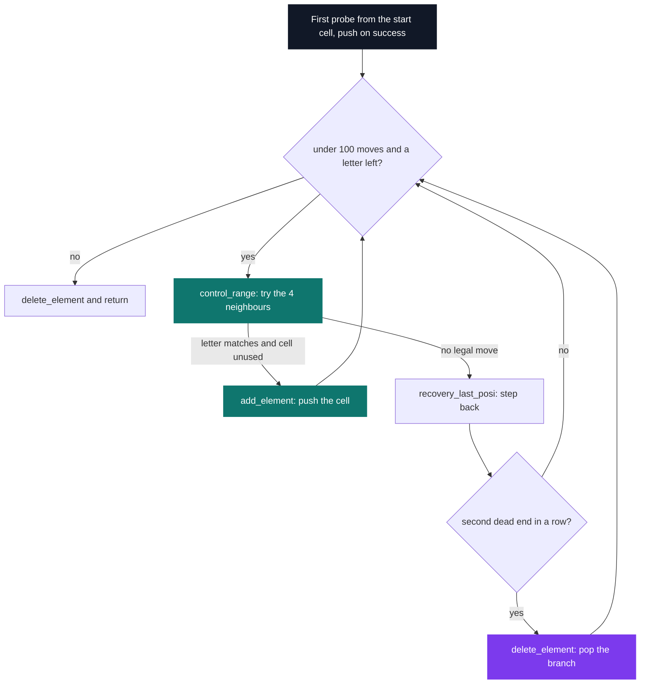

# Duo Stumper 2 — Boggle

[](https://antoinepoisson.github.io/Old-School-Projects/projects/stumper-duo2-2018)

  

**Epitech project** · Stumpers (`B-CPE-210`) · Tek1 · 2018-2019 · 1 afternoon · Team of 2

> Searching for a word in a letter grid, in one afternoon and in a pair.

## Overview

Boggle reads like a lookup and is really a constrained graph walk. A word has to be traced cell to
cell, the moves allowed here are the four orthogonal ones, and no cell may be reused inside a single
word — drop that last rule and the walk oscillates forever between two adjacent identical letters.

The pair's answer was to refuse recursion outright. `analyze()` is a loop, and the path lives in a
hand-rolled linked list that is the visited set and the undo stack at the same time. Subject read on
the spot, shipped the same afternoon.

The grid is not decoration printed at the end. `create_two_d_tab()` renders the border into the
`char **` itself, so what the search sees and what the player sees are the same buffer:

```text
$ ./boggle -g catsoeradnilesto
+++++++++++
| c a t s |
| o e r a |
| d n i l |
| e s t o |
+++++++++++
> 
```

Row 0 and row `s + 1` are `+` fills, letter rows are `| a b c d |`, and a NULL pointer lands at index
`s + 2` so `display_tab()` can walk the array without being told the size. Each row is allocated
`s * 2 + 5` bytes and fills `s * 2 + 3` of them, which is why every letter sits two columns apart.

## How it works

Three flags, and a strict contract between them.

| Flag | Meaning | Default |
| --- | --- | --- |
| `-s` | grid side, so `s * s` letters | `4` |
| `-g` | grid contents, lowercase only | required |
| `-w` | word to test; absent means interactive mode | — |

**`argv` is walked three times, not once.** `check_for_flags()` collects every `-s` first, then every
`-g`, then every `-w`. That ordering is the point: `-g abcd -s 2` and `-s 2 -g abcd` both build the
same 2×2 grid, because the side is known before the length check runs. A single left-to-right pass
would have rejected the first form for a reason that has nothing to do with the user.

Validation is split in two passes, both before the framed grid is allocated. `check_error()` handles
shape — argv count, flag letters, character classes — and every rejection goes through
`my_puterror()`, which writes to `fd 2` and returns `84`, so the message and the exit code are one
call.

`check_for_flags()` handles meaning — is this string actually `s * s` long, is the side positive.
Its three appliers signal the same way, but their return values are discarded, so those messages are
printed and the run keeps going.

| Input | Message on `stderr` | Exit |
| --- | --- | --- |
| fewer than 3 `argv` entries | `Invalide Nbr Argument.` | `84` |
| unknown flag letter | `False Flag.` | `84` |
| uppercase in `-g`/`-w`, non-digit in `-s` | `Wrong Argument.` | `84` |
| no `-g` at all | `You must use the -g flag` | `84` |
| `-s` not positive | `The size must be > 0` | run continues |
| `-g` length ≠ `s * s`, side left at 4 | `16 characters required for the -g argument` | run continues |
| `-g` length ≠ `s * s`, side set by `-s` | `Invalid size` | run continues |

`./boggle -s 0 -g abcd` prints the last two messages back to back, then walks into `fill_tab()` with
`arg_g` still NULL. The four rejections above it are the ones that stop.

**The walk.** `control_range()` tries the four orthogonal neighbours in a fixed order (`x+1`, `x-1`,
`y+1`, `y-1`) and takes the first that matches the wanted letter *and* is absent from the visited
list. No diagonals. A move pushes the position, one dead end steps back, a second dead end in a row
pops the branch, and a 100-move ceiling stops a walk that stops making progress.



The whole visited set is 44 lines of `tool_list.c`. One neighbour test carries the idea — bounds,
letter, and history checked in a single condition:

```c
if (*x < var->flag_s && var->tab[*x + 1][*y] == charac &&
    research_list(var, *x + 1, *y) != 1) {
    *x += 1;
    return (1);
}
```

**Two grids, one pointer.** The design keeps two representations: the framed buffer for the screen,
and a dense `s * s` array for the walk. `convert_to_algo()` builds that dense array and returns it,
but `is_boggle.c` declares it as returning `int`, and `is_algo()` drops the value — so the search
never receives the grid that was built for it.

`control_range()` therefore walks the rendered buffer, and its third neighbour test guards on
`tab[*y + 1]` while dereferencing `tab[*x]`. With the default side, `boggle()` sweeps `x` across the
11-column row while `control_range()` reads `x` as a row index; at `x = 6` it reaches the NULL row
and the first word submitted faults at `is_boggle.c:31` under AddressSanitizer, in both modes.

The push, the pop and the membership scan underneath all do what they claim — the mapping between
the two coordinate systems is what the clock took.

Without `-w`, `game_loop()` prints the grid once, then loops on a `> ` prompt reading proposals with
`getline()` until EOF. `convert_from_algo()` is wired as the payoff: for every node left on the list
it subtracts 32 from that cell, so a hit is meant to be shown by reprinting the grid with the word
in upper case.

## What this project demonstrates

- Backtracking written by hand, with its own visited set, in a language that ships no containers
- Two representations of one grid — rendered and dense — and an explicit mapping between them
- Validation layered as shape-then-meaning, both passes running before the grid is allocated

## Key features

- Square grid of configurable side (`-s`), border and NULL sentinel rendered into the buffer itself
- Search over the four orthogonal neighbours, never diagonal, never revisiting a cell
- Exploration through an explicit linked-list stack (`tool_list.c`) instead of recursion
- Two entry modes: one-shot `-w`, or an interactive prompt fed by `getline()`

## Technical stack

- **Languages** — C, 485 lines across 9 files in `sources/`, plus 5 headers
- **Tools** — Makefile, gcc, Criterion, gcovr, Git
- **Concepts** — backtracking over a grid, linked list of visited positions, option parsing, interactive loop

## Engineering constraints

- Timed exam lasting one afternoon, subject discovered on the spot, worked in pairs
- Every string routine comes from `libmy`, the team's own 26-file, 679-line C library —
  `my_strlen`, `my_strcmp`, `my_strcpy`, `my_getnbr` and `my_puterror` carry all of it, leaving
  `printf` and `getline` as the only libc calls in the program beyond `malloc` and `write`
- The Makefile builds a binary named `boggle`, and every failure path returns the literal `84`;
  `EXIT_ERROR 84` is `#define`d in four headers and read by none of them

## Beyond the baseline

- An explicit stack instead of recursion: an unusual choice, and the one that removes any risk of
  stack overflow when `-s` grows the grid
- A Criterion target wired into the Makefile despite the format — `tests_run` compiles with
  `--coverage` and then calls `gcovr`

## Verification

The Criterion file sets up `cr_redirect_stdout()` and `cr_redirect_stderr()`, which is the fixture
this program needs: every result is printed, never returned, so nothing is assertable until stdout
is captured. The harness landed inside the afternoon; the cases are what the clock took.

The target never links it. The recipe passes `$(TESTSRC)` while the variable is spelled `TEST_SRC`,
so `tests/test.c` is silently dropped from the command line and the binary is left without a `main`.

Behaviour was re-checked directly instead: both grid renders in this file and every row of the
message table are the real output of the built binary.

## Build & run

```bash
make                                  # builds ./boggle
./boggle -g catsoeradnilesto          # interactive: the grid, then a "> " prompt
./boggle -g catsoeradnilesto -w cat   # one-shot check
```

`-s` generalises the renderer, frame width included:

```text
$ ./boggle -s 5 -g abcdefghijklmnopqrstuvwxy
+++++++++++++
| a b c d e |
| f g h i j |
| k l m n o |
| p q r s t |
| u v w x y |
+++++++++++++
> 
```

---

[← Stumper — timed algorithm challenges](../README.md) · [↑ Tek1](../../README.md) · [⌂ All projects](../../../README.md)
