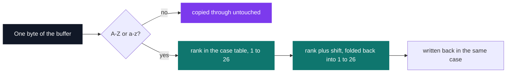
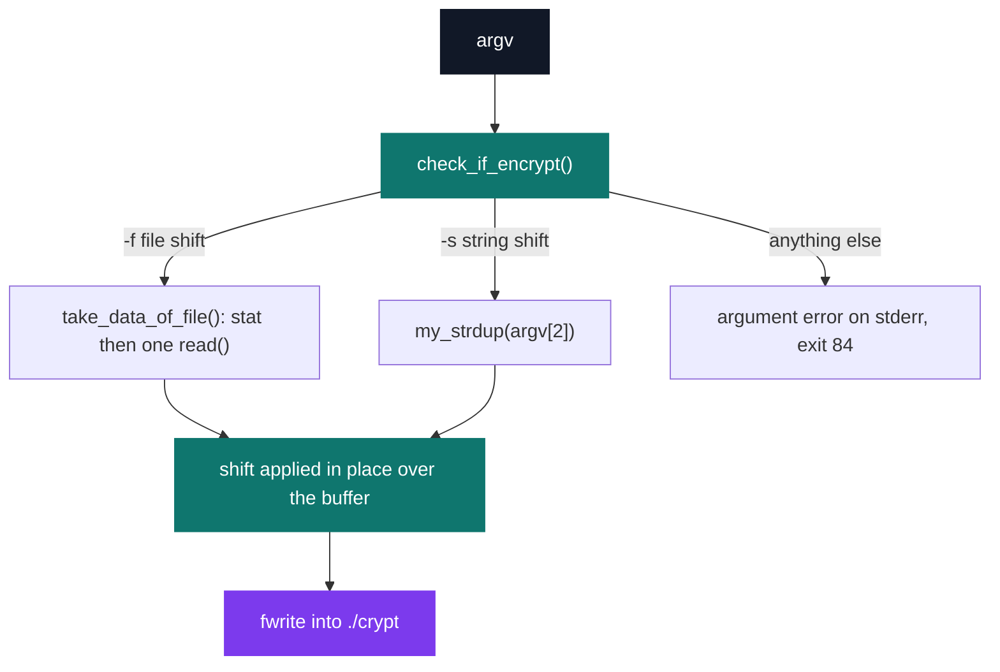

# Duo Stumper 3 — Caesar cipher

[](https://antoinepoisson.github.io/Old-School-Projects/projects/stumper-duo3-2018)

  

**Epitech project** · Stumpers (`B-CPE-210`) · Tek1 · 2018-2019 · 1 afternoon · Team of 2

> Encrypting and decrypting a file with Julius Caesar's two-thousand-year-old secret code.

The cipher is one line of arithmetic. The program around it is not: it swallows a whole file in a
single `read()`, leaves every non-letter byte exactly where it was, keeps upper and lower case in
separate tracks, and takes a shift that is negative, zero or a million — one afternoon, in a pair.

A real session with the compiled binary, encrypting then decrypting the same line:

```console
$ cat plain.txt
Attack at dawn, Brutus! (Legion XIII, 44 BC)
$ ./cesar -f plain.txt 3 && cat crypt
Dwwdfn dw gdzq, Euxwxv! (Ohjlrq ALLL, 44 EF)
$ ./cesar -f crypt -3 && cat crypt
Attack at dawn, Brutus! (Legion XIII, 44 BC)
```

## Overview

The Caesar cipher shifts each letter by a fixed number of positions in the alphabet. `cesar` applies
it to a whole file or to a single string, and writes the result into a file named `crypt`.

| Invocation | Input | Result |
| --- | --- | --- |
| `./cesar -f <file> <shift>` | the file's bytes | `./crypt` |
| `./cesar -s <string> <shift>` | `argv[2]` | `./crypt` |

Punctuation, digits, spaces and newlines are copied through untouched — only the `A-Z` and `a-z`
ranges are transformed, and a letter keeps the case it came in with.



The direction rests on the sign of the shift alone: encrypting with `3` and decrypting with `-3` are
the same call to the same function. A leading `+` is not accepted — only digits and a leading `-`
pass the argument check.

## How it works

`check_if_encrypt()` reads the flag and picks the source of the plaintext before anything is
allocated. Both branches converge on one transformation and one writer.



**Reading.** The file is not read line by line: `stat()` gives its size, one `read()` fills a buffer
allocated to that size plus a terminating byte, and the shift is applied in place — one `read()` for
the whole file, no reallocation, no line buffer to grow.

**The alphabet table.** `create_tab_alpha()` builds two strings, one for `a-z` and one for `A-Z`,
each with a `'0'` sentinel at index 0 so that ranks run from 1 to 26 rather than from 0. That choice
is what makes the wrap-around code readable — and it is also what rules out the obvious `%`.

```c
static int find_good_charac(int alpha, int nbr)
{
    int result = alpha + nbr;

    if (result < 1) {
        while (result < 1)
            result = result + 26;
    }
    else if (result > 26) {
        while (result > 26)
            result = result - 26;
    }
    return (result);
}
```

In C, `%` keeps the sign of the dividend: `-23 % 26` is `-23`, not `3`. With a 1-based table, a
naive modulo would index the sentinel or fall off the front of the string. Folding by repeated
±26 is symmetric, so one function covers both directions — the four cases below all come out right.

| Input | Shift | Output |
| --- | --- | --- |
| `xyz XYZ 42 !?` | `3` | `abc ABC 42 !?` |
| `xyz XYZ 42 !?` | `-23` | `abc ABC 42 !?` |
| `xyz XYZ 42 !?` | `26` | `xyz XYZ 42 !?` |
| `xyz XYZ 42 !?` | `1000003` | `opq OPQ 42 !?` |

**One transform, both ways.** `sources/cesar_encrypt.c` differs from `cesar_decrypt.c` by exactly
two lines — its header comment and its function name — and the Makefile leaves it out of the build:
once the sign carries the direction, the second copy has nothing left to do.

The bare `./cesar <file> <shift>` path still wired into `main()` is dead for the same reason. Below
four arguments `check_if_encrypt()` already returns 84, and the fallback `check_error()` demands
exactly three — no invocation satisfies both, so every run goes through `-f` or `-s`.

**Errors.** Argument count, an unreadable file, a non-numeric shift and a failed allocation each get
their own message on `stderr` and a return of 84. The pipeline is C-string based, so this is a text
cipher: a NUL byte in the input ends the buffer there.

## What this project demonstrates

- Encryption preserving case and leaving everything non-alphabetic untouched
- Shift brought back into [1;26]: negative and out-of-range values accepted, the direction resting on the sign alone
- 346 lines of C across 8 compiled files, on top of an embedded standard library of 42 C files reused as is

## Key features

- Caesar-style shift cipher over the contents of a file
- Reading through stat() to get the size then read() in a single block
- Result written into an output file named crypt

## Technical stack

- **Languages** — C
- **Tools** — Makefile, gcc, Criterion, Git
- **Concepts** — shift cipher, modular arithmetic, file reading

## Engineering constraints

- timed exam lasting one afternoon
- subject discovered on the spot
- work in pairs

## Beyond the baseline

- A complete embedded library with my_printf and get_next_line, reused as is under time pressure
- Criterion tests despite the timed format

Paired exam; the binary is called cesar.

## Verification

The property that matters is the round trip: `+n` then `-n` must give back the original bytes. On a
2000-byte text file, encrypting with `7` and re-encrypting with `-7` yields a file `cmp` reports as
identical to the input.

`make tests_run` wires Criterion and `gcovr` into the build, with stdout and stderr redirection
ready in `tests/test.c`. The harness is in place; the case body is empty and the rule references
`$(TESTSRC)` where the variable is spelled `TEST_SRC` — the afternoon ended before the suite did.

## Build & run

```bash
make                          # produces ./cesar
./cesar -f plain.txt 3        # encrypt a file  -> ./crypt
./cesar -f crypt -3           # decrypt it back -> ./crypt
./cesar -s "Attack at dawn" 29
```

---

[← Stumper — timed algorithm challenges](../README.md) · [↑ Tek1](../../README.md) · [⌂ All projects](../../../README.md)
