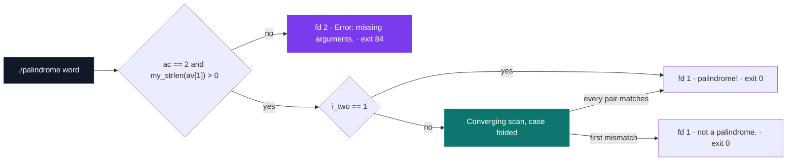

# Solo Stumper 2 — palindrome

[](https://antoinepoisson.github.io/Old-School-Projects/projects/stumper-solo2-2018)

 

**Epitech project** · Solo Stumpers (`B-CPE-130`) · Tek1 · 2018-2019 · 1 afternoon · Solo

> Detecting whether a word reads the same both ways — fast and flawlessly.

A stumper is a timed solo exam: the subject appears at the start of the afternoon, no help is
allowed, and the deliverable is graded by a machine that compares bytes. The algorithm here fits
in twelve lines. Everything that can fail is in the contract wrapped around it.

Three exit paths, each checked to the character: `palindrome!` on fd 1, `not a palindrome.` on
fd 1, and `Error: missing arguments.` on fd 2 with return code 84. No `printf`, no formatting
layer — three `write()` calls with hard-coded byte counts of 12, 18 and 26.

## Overview

The program takes one argument and answers whether it reads the same in both directions, case
ignored. Everything before that answer is validation: `check_error` tests the argument count
first and the string length second, so `av[1]` is only touched once it is known to exist.



Five source files, 103 lines including the Epitech comment headers, and a single-function static
library built alongside. The only C library function the deliverable calls is `write()`.

## How it works

**Two indices, no buffer.** The reflex answer is to reverse the string and compare the copy. That
copy costs a buffer the size of the input. The scan walks from both ends of the original instead
and returns at the first mismatch, so it allocates nothing and reads no memory beyond the
argument it was handed.

Written out on a nine-character word, the two indices meet in the middle after four comparisons:

```text
  r  e  s  s  a  s  s  e  r
  ^                       ^      i = 0   i_two = 8    r == r
     ^                 ^         i = 1   i_two = 7    e == e
        ^           ^            i = 2   i_two = 6    s == s
           ^     ^               i = 3   i_two = 5    s == s
              ^                  i == i_two, stop
```

Case folding is a six-line helper: an upper-case letter is brought down through the 32-value gap
between the two ASCII blocks, so `Kayak` and `kayak` follow the same path. Digits, spaces and
punctuation fall through untouched.

```c
static int check_maj(char av)
{
    if (av >= 'A' && av <= 'Z')
        return (av + 32);
    return (av);
}

int palindrome(char *av)
{
    int i_two = my_strlen(av) - 1;
    int i = 0;

    if (i_two == 1)
        return (1);
    for (; (i != i_two) && i_two >= 0; i++, i_two--)
        if (check_maj(av[i]) != check_maj(av[i_two]))
            return (0);
    return (1);
}
```

## What this project demonstrates

- An allocation-free comparison that exits at the first diverging character
- Output written straight to the file descriptors, with the return codes the grader expects
- A deliverable whose whole C library surface is `write()` — `my_strlen` is written by hand

## Key features

- Palindrome detection on a single string passed as an argument, case-insensitive
- Comparison by a double walk from the ends — no reversed copy, no dynamic memory
- Deliberately minimal deliverable: 5 source files, 103 lines, one home-made `my_strlen`

## Technical stack

- **Languages** — C
- **Tools** — Makefile, gcc, Git
- **Concepts** — converging indices, writing through write, compliant return codes

## Engineering constraints

| Constraint | What it removed |
| --- | --- |
| Timed exam, one afternoon | No room for a second design once the first one runs |
| Strictly individual work | No pair review to catch a boundary condition |
| Return code 84 on error | The exit status is part of the output, not an afterthought |

The project ships its own library too. `my_strlen` is compiled apart and archived into
`libmy.a`, and both `check_error` and `palindrome` count characters through it rather than
through `string.h`.

## Verification

The Makefile carries a `tests_run` rule already wired for Criterion (`--coverage -lcriterion`)
against a `tests/` directory, but no test file was delivered with the exam. The table below is
the behaviour of the compiled binary, run argument by argument.

| Argument | Output | fd | Exit |
| --- | --- | --- | --- |
| `kayak` | `palindrome!` | 1 | 0 |
| `Kayak` | `palindrome!` | 1 | 0 |
| `12321` | `palindrome!` | 1 | 0 |
| `nolemonnomelon` | `palindrome!` | 1 | 0 |
| `no lemon no melon` | `not a palindrome.` | 1 | 0 |
| `abca` | `not a palindrome.` | 1 | 0 |
| `xy` | `palindrome!` | 1 | 0 |
| *(no argument or `""`)* | `Error: missing arguments.` | 2 | 84 |

Spaces go through `check_maj` unchanged and are compared like any other character, which is why
`no lemon no melon` is rejected while its unspaced form passes.

**Two off-by-ones, both in the loop header.** `if (i_two == 1)` fires on length **2**, not on
length 1, so `xy` is reported as a palindrome. A one-character string needs no guard at all: `i`
and `i_two` are both 0 on entry, the loop never runs, and the function returns 1.

The stop condition `i != i_two` has the same shape. The two indices only land on each other in
the middle of an odd-length word, so `abba` runs until `i_two` goes negative and checks every
pair twice — 4 comparisons where `i < i_two` would have ended it in 2.

## Build & run

```bash
make            # builds ./lib/my/libmy.a, then the palindrome binary
./palindrome kayak
```

Both Makefiles pass `-Wall --extra`; `--extra` is a typo for `-Wextra` that current clang
rejects, so on a Clang toolchain the four translation units compile directly instead:

```bash
gcc -Wall -Wextra -I ./include/ -o palindrome \
    check_error.c palindrome.c main.c lib/my/my_strlen.c
```

Produces `palindrome`.

---

[← Stumper — timed algorithm challenges](../README.md) · [↑ Tek1](../../README.md) · [⌂ All projects](../../../README.md)
