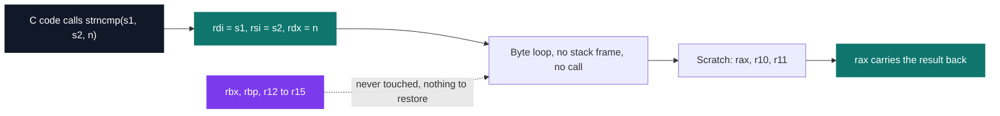

# MiniLibC

[](https://antoinepoisson.github.io/Old-School-Projects/projects/asm-minilibc-2019)

   

[Tek2](../../README.md) / [Assembly](../README.md) / **ASM_minilibc_2019**

*Epitech project · x86-64 Assembly (B-ASM-400) · March 2020 · 2 weeks · Grade A*

Eleven libc functions written in x86-64 assembly and linked into `libasm.so`, a shared object the
dynamic loader will accept in front of the real `libc`. Put `LD_PRELOAD=./libasm.so` before a
dynamically linked binary and `strlen`, `memcpy` and the rest resolve to this code instead.

The subject pinned the toolchain to `nasm` and `ld`, which leaves no compiler in the chain.
`nasm -f elf64` turns each `.asm` file into an ELF64 object, `ld -shared` links them into
`libasm.so`, and `gcc` is never invoked — nothing sits between the source and the instruction stream.


**The contract is the ABI.** A C caller and this assembly never see each other's code; the only
thing that makes them agree is the System V AMD64 calling convention. Arguments arrive in `rdi`,
`rsi`, `rdx`, `rcx`, `r8`, `r9` in that order, the return value leaves in `rax`.



**Nothing goes on the stack.** Across the twelve sources there is not one `push`, `pop` or `sub
rsp`, and not one `call`: every function is a leaf. They stay inside the caller-saved set — `rax`,
`rdi`, `rsi`, `rdx`, `r8`–`r11` — so `rbx`, `rbp` and `r12`–`r15` are never written at all.

That register discipline is worth being strict about because of how the failure looks. Clobber a
callee-saved register and the program does not crash here. It crashes later, in the caller's
caller, in code that has nothing to do with the bug.

**`strlen`, side by side.** On the left, the C the compiler would normally be handed. On the right,
the whole of `src/strlen.asm` below its header comment, blank lines included.

```c
size_t strlen(const char *s)
{
    size_t n = 0;

    while (s[n] != '\0')
        n++;
    return n;
}
```

```nasm
section .text

global strlen:

strlen:
    mov rax, 0
    cmp rdi, 0
    je end
    cmp byte[rdi], 0
    je end


counter_size:
    inc rax
    add rdi, 1
    cmp byte[rdi], 0
    jnz counter_size

end:
    ret
```

The two guards before `counter_size` carry the weight. The first returns zero for a null pointer
without ever dereferencing it. The second is there because the loop increments *before* it tests:
on an empty string it would answer 1 and walk `rdi` one byte past the terminator.

| Function | Signature | Code lines |
| --- | --- | --- |
| `strlen` | `size_t strlen(const char *)` | 15 |
| `strchr` | `char *strchr(const char *, int)` | 23 |
| `rindex` | `char *rindex(const char *, int)` | 36 |
| `strcmp` | `int strcmp(const char *, const char *)` | 23 |
| `strncmp` | `int strncmp(const char *, const char *, size_t)` | 25 |
| `strcasecmp` | `int strcasecmp(const char *, const char *)` | 37 |
| `strstr` | `char *strstr(const char *, const char *)` | 44 |
| `strpbrk` | `char *strpbrk(const char *, const char *)` | 35 |
| `strcspn` | `size_t strcspn(const char *, const char *)` | 27 |
| `memset` | `void *memset(void *, int, size_t)` | 21 |
| `memcpy` | `void *memcpy(void *, const void *, size_t)` | 24 |
| `memmove` | `void *memmove(void *, const void *, size_t)` | 5 |

**A guard on the way in.** Ten of the eleven functions the Makefile links open with an explicit
check before touching memory: `memset(NULL, c, n)` returns `NULL` rather than faulting,
`strstr(h, "")` returns the haystack, `memcpy(d, s, 0)` copies nothing and still returns `d`.

`strncmp` is the eleventh and the gap shows: it walks straight into the compare loop, so `n` at
zero falls through to the subtraction and answers `s1[0] - s2[0]` where the man page asks for `0`.
Every guard in the other ten is one `cmp` and one `je` — that is the price of the whole class of bug.

**`memmove` is the one the build leaves out.** It is the single name on the list where the forward
byte-by-byte loop that serves every other function is wrong: with overlapping regions the copy
overwrites source bytes it has not read yet, so the direction has to come from the sign of
`dest - src`. `src/memmove.asm` is a `mov rax, 0` / `ret` stub and is absent from the Makefile's
source list, so `libasm.so` exports eleven symbols, not twelve.

**One name is off the required list.** The required set asks for `strrchr`; what ships is `rindex`,
the BSD spelling of the same function, which the subject also names among its bonus functions. It
returns a pointer to the last match, and to the terminator when the searched byte is `\0`.

**One file, one object, one exported symbol.** Only the function name carries a `global` directive,
so every other label stays internal to its own object file. That is why `quit:` can be a label in 8
of the 12 sources and `while_size:` in 6 without the linker ever seeing a duplicate — and why
merging them into a single `.asm` would be rejected by nasm on the second `quit:`.

## Technical stack

Assembly (x86-64) · nasm, ld, Makefile, Git.

591 lines across twelve `.asm` files, 315 of them instructions and labels once comments and blank
lines are stripped. The Makefile assembles eleven of the files into `libasm.so`; of those eleven,
`strstr` is the longest at 44 code lines and `strlen` the shortest at 15.

## Build & run

```bash
make                          # nasm -f elf64 on each source, then ld -shared
LD_PRELOAD=./libasm.so ls     # the loader resolves strlen and friends here first
```

The Makefile also carries a `tests_run` rule wired to Criterion and `gcovr`, but no test file is
committed. Validation was done by substitution instead: preload `libasm.so` under real system
binaries and compare behaviour against the system libc, function by function.

---

[Tek2](../../README.md) / [Assembly](../README.md) · [⌂ All projects](../../../README.md)
