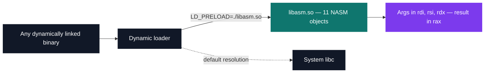

# Assembly — x86-64

[Tek2](../README.md) / **Assembly**

Twelve libc string and memory functions written in x86-64 NASM, assembled to ELF64 objects and
linked with `ld -shared` into a library the dynamic loader will accept in place of the real
`libc`. `gcc` is never invoked anywhere in the chain.

The hard part is not the loops. It is the System V AMD64 calling convention, where the punishment
for clobbering a callee-saved register is that nothing breaks here — it breaks later, in the
caller's caller, in code that has nothing to do with the bug.

| Project | What it is | Size | Grade |
| --- | --- | --- | --- |
| [MiniLibC](ASM_minilibc_2019) | Twelve libc functions in x86-64 assembly, shipped as `libasm.so` | 2 weeks · Mar 2020 | A |

The test was never a unit test. It was `LD_PRELOAD=./libasm.so` in front of a real system binary,
then checking that the binary behaved exactly as before.

<pre>
Assembly/
└── <a href="ASM_minilibc_2019">ASM_minilibc_2019/</a>   MiniLibC — the libc's string/memory functions, rewritten in x86-64 asm   · A
</pre>

Three details make it worth opening:

- **No stack, anywhere.** Not one `push`, `pop` or `sub rsp` in 586 lines of NASM. Every function
  is a leaf that stays inside the caller-saved set, so `rbx`, `rbp` and `r12`–`r15` are never
  written and there is nothing to restore.
- **`memmove` is where the byte-by-byte template stops working.** When the regions overlap, a
  forward loop overwrites source bytes it has not read yet, so the copy direction has to come from
  the sign of `dest - src` first. `memmove.asm` is a `mov rax, 0` / `ret` stub sitting outside the
  Makefile's source list, which is why the linked library exports eleven of the twelve.
- **Ten of the eleven linked functions guard before they dereference.** `memset(NULL, c, n)`
  returns `NULL` instead of faulting, `strstr(h, "")` returns the haystack, and `strlen` compares
  twice before the loop so a null pointer and an empty string both leave `rax` at zero.

---

[Tek2](../README.md)
