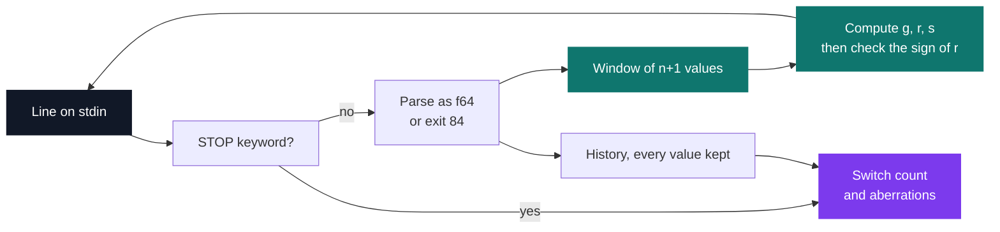
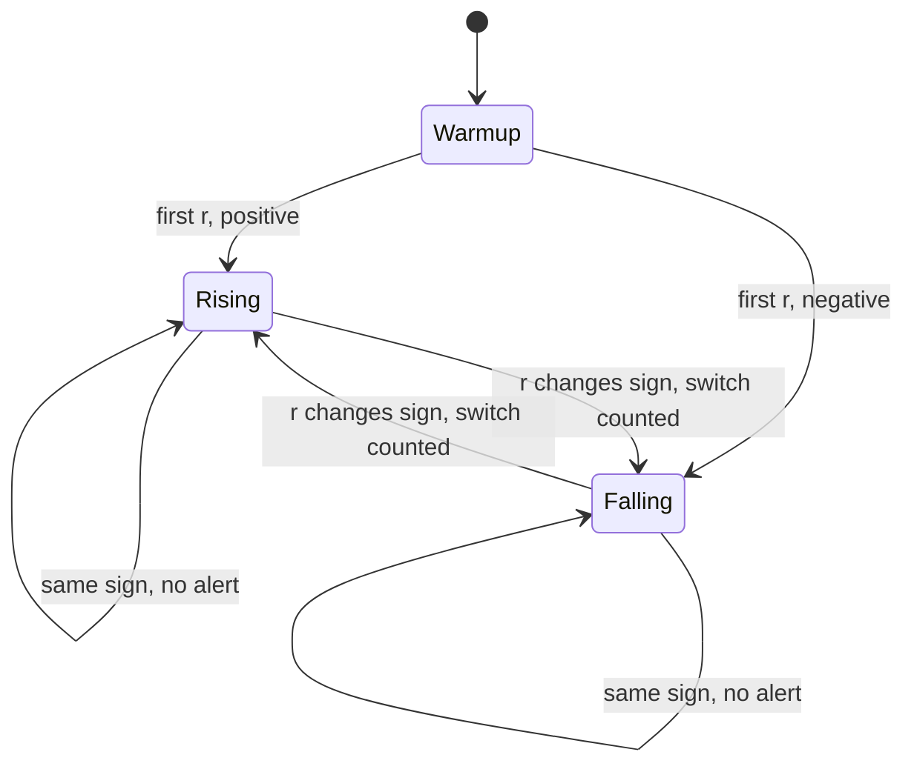

# Groundhog — real-time temperature indicators

[](https://antoinepoisson.github.io/Old-School-Projects/projects/cna-groundhog-2019)

 

[Tek2](../../README.md) / [CNA](../README.md) / **CNA_groundhog_2019**

*Epitech project · Computer Numerical Analysis - Trading (B-CNA-410) · May 2020 · 2 weeks · Grade C*

Fed the reference series of 74 temperatures one line at a time, this program reproduces the
expected output exactly: 74 indicator lines identical to the last decimal, and the five
trend-reversal alerts on lines 15, 28, 38, 50 and 71 — the lines where they belong. Rebuilt and
re-run today, the comparison still comes back with zero mismatches.

The difficulty is that each answer is due before the next line lands. Temperatures arrive live on
standard input, there is no file to re-read and no second pass, so at value 400 the trend under way
has to come out of what the program already holds.

Every per-line indicator is answerable from a window of at most `n + 1` temperatures, and that
window is the only thing the computation reads. The full history is kept for one purpose only —
the aberration report printed at the end — which is why it is also the only buffer allowed to grow.

| `Groundhog` field | Holds | Bounded |
| --- | --- | --- |
| `value` | the last `n + 1` temperatures | yes, trimmed on push |
| `average` | the last `n` first differences | yes, trimmed on push |
| `weird` | every temperature read | no, grows with the stream |
| `indicator` | `[Option<f64>; 3]` — the current `g`, `r`, `s` | yes |



Three indicators go out on every line, over a period `n` given as an argument:

| Output | What it measures | First available at |
| --- | --- | --- |
| `g` | mean of the rises over the period, falls counted as zero | value `n + 1` |
| `r` | relative change against the temperature `n` values back, in % | value `n + 1` |
| `s` | population standard deviation over the last `n` values | value `n` |

Until the window is full the field prints `nan` rather than a number computed from too little data.
The three do not become available at the same moment: `s` needs `n` samples, while `g` and `r` both
need a value to compare against, so they appear exactly one line later.

Real session, `period = 7`, on the reference series — input and output interleave because the
program answers each line as it reads it:

```console
$ ./groundhog 7
27.7
g=nan		r=nan%		s=nan
31.0
g=nan		r=nan%		s=nan
...
38.2
g=nan		r=nan%		s=3.46
39.5
g=1.69		r=43%		s=2.82
40.3
g=1.33		r=30%		s=2.50
...
38.7
g=0.57		r=1%		s=1.07
36.5
g=0.39		r=-8%		s=1.72		a switch occurs
...
STOP
Global tendency switched 5 times
5 weirdest values are [31.50, 32.10, 38.30, 42.10]
```

A reversal is a sign change in `r`, which is the cheapest detector on offer: the previous `r` is the
entire memory it needs, and only its sign is ever read back.



The aberration report at `STOP` is the one part that is not online. A value is flagged when it sits
more than 1.5 degrees away from the mean of its two neighbours — a fixed threshold instead of the
ranking the subject described, so the report returns however many values cross the bar rather than a
sorted top five.

Audit finding, visible in the session above: the count and the list disagree. Five values are
flagged, but the rendering loop stops two items short and then jumps straight to the last one, so it
prints four and drops the fourth, `36.60`. The detector and the counter are right; the `print!` loop
bound is off by one.

## Beyond the baseline

The language was free, and Rust was the deliberate answer for a project whose real subject is state.
Errors are carried as `Result<(), i32>` from parsing all the way to `main`, where the code becomes
the process exit status — no exception, no return value silently dropped.

```rust
    fn repl(mut self, input: Stdin) -> Result<(), i32> {
        for line in input.lock().lines() {
            self.eval(line)?;
            if self.stop == true {
                return Ok(());
            }
        }
        Err(84)
    }
```

Note the last line: falling off the end of the loop is a failure. A stream that stops without ever
sending `STOP` is a truncated stream, not a finished one, and the program says so with exit 84.

The whole thing is one 200-line file with zero external crates — `std` only, and `Cargo.lock` lists
nothing but the crate itself. One `unsafe` block survives, holding the previous `r` in a
`static mut`: the single piece of state that escaped the `Groundhog` struct, and Rust makes you write
the keyword to admit it.

## Technical stack

Rust 2018 · Cargo, Makefile, Git · standard library only.

| Metric | Value |
| --- | --- |
| Source files | 1 (`src/main.rs`, 200 lines) |
| Dependencies | 0 |
| Indicators per line | 3 |
| `unsafe` blocks | 1 |

## Build & run

```bash
make            # cargo build, then moves target/debug/CNA_groundhog_2019 to ./groundhog
./groundhog 7   # 7-day period, then feed temperatures on stdin
./groundhog -h  # synopsis
```

| Situation | Exit code |
| --- | --- |
| `STOP` once the window has filled, or `-h` | 0 |
| Period missing, zero, negative or not a whole number | 84 |
| `STOP` before the first indicator is available | 84 |
| Line that is neither a float nor `STOP`, blank line included | 84 |
| End of input before `STOP` | 84 |

---

[Tek2](../../README.md) / [CNA](../README.md) · [⌂ All projects](../../../README.md)
