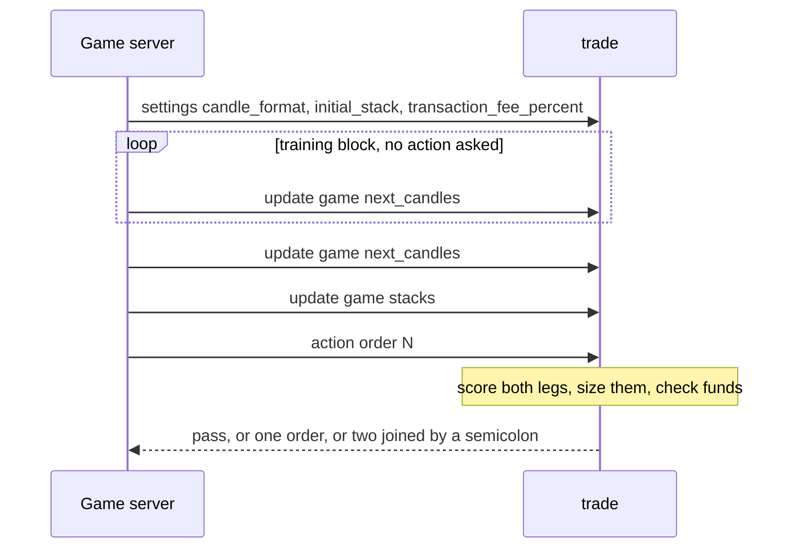
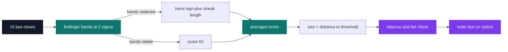

# Trade — crypto trading bot

[](https://antoinepoisson.github.io/Old-School-Projects/projects/cna-trade-2019)

 

[Tek2](../../README.md) / [CNA](../README.md) / **CNA_trade_2019**

*Epitech project · Computer Numerical Analysis - Trading (B-CNA-410) · April 2020 · 2 weeks · Grade C*

> A bot that trades three crypto pairs live against a server it does not control, one candle at a
> time, with no scientific library and no second chance on a bad order.

The bot never sees the dataset. A server pushes candles on standard input, then asks for a decision
and waits only seconds for the answer.

Two failure modes are unrecoverable, and the subject states both: answering too late collapses the
whole program, and any attempt to sell more than you own collapses it too. A bad order does not
score badly — it ends the run.

Ranking is by closing capital against the other groups, on datasets nobody has seen. The subject
also closes the obvious shortcut in writing: teams that fitted deterministic algorithms to the
training sets are now scored at −42.



**The dialogue.** The 25-line `trade` entry point reads stdin line by line and dispatches on the
first token through a lookup table — `settings`, `update`, `action` — whose default entry is a
no-op. An unrecognised server line therefore produces silence on stdout, never a malformed order.

The candle parser is driven by the `candle_format` the server announces, not by hardcoded column
indices: `parseData` walks the seven declared field names and drops each value into its slot.
Reorder the columns on the server side and the bot still reads them correctly.

A real exchange, using the candle the source keeps as its parsing reference and the 1 000 USDT
stack the experiment ledger implies — the last line is what the program actually prints:

```text
settings candle_format pair,date,high,low,open,close,volume
settings initial_stack 1000
update game next_candles BTC_ETH,1517439600,0.10933,0.109,0.10930997,0.109285,32.66246468;USDT_ETH,1517439600,1113.0,1105.00000003,1112.99999988,1112.84309464,130996.70979922;USDT_BTC,1517439600,10221.1204002,10106.08674044,10185.14136698,10207.85630909,413829.60256904
update game stacks BTC:0.0,ETH:0.0,USDT:1000.0
action order 5
pass
```

Three pairs, seven fields each, on one `;`-separated line; the stack line switches to `,` and `:`.
The answer is `pass` because the indicator needs fifteen closes in its window *and* one earlier band
width to compare against, so the sixteenth candle is the first that can produce anything else.

**The decision.** Every analysis function returns a `(score out of 100, confidence)` pair. The
engine averages them by repeating each score `confidence` times, so a coefficient of 9 outvotes a
coefficient of 1 with no weighting arithmetic at all — the whole scheme is one nested loop:

```python
    for element in tab:
        if (len(element) == 2):
            coef = element[1]
            while (coef > 0):
                result += element[0]
                divisor += 1
                coef -= 1
```



The score maps straight onto both the direction and the amount, so conviction and position size are
the same number:

| Averaged score | Action | Committed share |
| --- | --- | --- |
| 0 – 30 | sell | `(30 - score) / 30` of the held asset |
| 30 – 70 | pass | — |
| 70 – 100 | buy | `(score - 70) / 30` of the USDT stack |

On the candle above, a score of 85 commits half the 1 000 USDT stack and `takeChoseBTC` divides it
by the `USDT_BTC` close, which is where a line like `buy USDT_BTC 0.04898188070640793` comes from.

The signal is a fifteen-candle moving average with bands at two sigma, and it fires on the bands
*widening* against the previous iteration — volatility opening up — with the direction taken from
whether the average rose or fell.

The first signal in a direction is a fixed score of 72 or 28, a 6.7 % nibble. A repeated one
ratchets: `calculOfTendance` grows a multiplier with the streak length, capped at 30, which pushes
a sustained trend all the way to committing the entire stack.

**What the code admits it tried.** Ten candidate indicators live in `calcul.py`. Exactly one is
wired into the live call chain; the rest sit commented out, most of them annotated with the capital
their run closed at — a lab notebook left in the source.

| Candidate indicator | Capital recorded in the ledger |
| --- | --- |
| `compareWithLastValue` | 935 / 1150 |
| `FirstTrade` | 986 / 1073 |
| `AverageHight`, `MobileAverageHight` | 965 |
| `MobileEcartType` | 1000, never traded |
| `calculOfTendance`, three parameter sets | 1000, never traded |
| `LookLastTrade` | 960 |
| `bollingerBands` | kept |

Seven candidates were written, measured against a 1 000 USDT stack and cut; two more, `computeOBV`
and a double-Bollinger variant, are commented out with no figure next to them. That is the argument
against overfitting made empirically rather than asserted.

Scientific libraries are ruled out by the subject, so every mean, standard deviation, OBV and trend
measure in that list is hand-written. The entire program imports four standard-library modules —
`os`, `sys`, `math`, `random` — and `requirements.txt` is empty.

**Not losing the run.** Before anything reaches stdout, `calibrationDecision` rejects an order that
would overdraw the balance or whose notional falls under the transaction fee, and returns 0 — a
pass. `checkCanMultiOperation` then asks whether both legs plus both fees still fit in the USDT
stack, and only then are the two orders emitted on one line, joined by ` ; `.

When BTC and ETH disagree, the bot skips USDT entirely and trades the `BTC_ETH` book directly: one
order and one fee, instead of a sell and a buy through the quote currency.

**Audit note.** The B-suffixed helpers `determineHowManyToSellB` / `determineHowManyToBuyB` exist
with their own `_recurrence_last_actionB` counter, but `bollingerBandsBTC` calls the unsuffixed
pair, which carries a hardcoded `isBTC = False`. Both legs share one streak counter and the BTC
ratchet measures its trend on the ETH series. The split was designed, then not wired in.

## Beyond the baseline

The protocol loop (`main.py`), the market model (`classe.py`) and the strategy (`calcul.py`) are
separate modules, and `main.py` pulls exactly one name out of the strategy: `callGlobalCalcul`.
Swapping strategy means editing one list of scoring functions — which is how the ten candidates
above were tried and dropped without ever touching the dialogue with the server.

841 lines of Python across four modules, plus the 25-line `trade` entry point. No tests were
delivered: validation was playing against the server and reading the closing capital.

## Technical stack

Python · Makefile, Git.

## Build & run

```bash
pip install -r requirements.txt
make
```

There is nothing to compile: `make` moves `src/trade` to the project root and marks it executable,
and `requirements.txt` lists no dependency. The server drives the binary over stdin and stdout, so
it runs under the client-server interface rather than by hand.

---

[Tek2](../../README.md) / [CNA](../README.md) · [⌂ All projects](../../../README.md)
