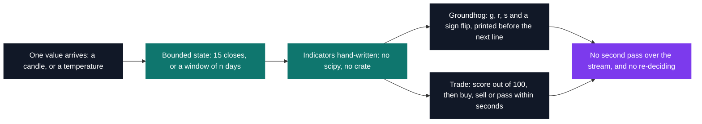

# CNA — numerical analysis & trading

[Tek2](../README.md) / **CNA**

Two programs that never see their dataset. Values arrive one at a time on standard input and the
answer is due before the next one lands: the 400th temperature has to be judged on what was kept
from the 399 before it, and a trade order that comes back late — or that the portfolio cannot cover
— ends the run rather than costing a point. Neither program could call a statistics library, so
every moving average, standard deviation and sigma band here is written by hand.

| Project | What it is | Size | Code | Grade |
| --- | --- | --- | --- | --- |
| [Trade](CNA_trade_2019) | Bot trading three crypto pairs live against the subject's server | 2 weeks | 838 lines of Python | C |
| [Groundhog](CNA_groundhog_2019) | Three sliding indicators printed per temperature received | 2 weeks | 199 lines of Rust | C |

Both sit at B-CNA-410, spring 2020, and both are built on the same constraint: one pass, bounded
state, decide now.

Trade ranks on closing capital against the other groups, on data nobody has seen — which is why
`calcul.py` still carries ten candidate indicators: one wired into the live chain, the rest left
commented out beside the capital their run closed at. Groundhog answers the same question about
state with a type system: `Result<(), i32>` propagated to `main`, 199 lines, zero external crates,
and a single `unsafe` block for the one value that escaped the struct.

<pre>
CNA/
├── <a href="CNA_trade_2019">CNA_trade_2019/</a>       Trade — a live crypto bot on three pairs, ten indicators tried, one kept    · C
└── <a href="CNA_groundhog_2019">CNA_groundhog_2019/</a>   Groundhog — trend, magnitude and reversals on a temperature stream, in Rust · C
</pre>

---

[Tek2](../README.md)
