# C++ Pool — the second bootcamp

[Tek2](../README.md) / **CPPool**

Nineteen graded subjects in a month, and most of them ship no `main` — the school compiles its own
driver against your headers, so the signature is the entire contract. Week one rebuilds object
orientation in C by hand: `libstring.a` gives every instance its own table of fourteen function
pointers, so one string weighs 120 bytes, and Rush 1 goes further with class descriptors, a
variadic `new()` and working iterators, all in one afternoon. Everything from day 06 on is C++
handing back, feature by feature, what that week cost.

| Project | What it is | Size | Grade |
| --- | --- | --- | --- |
| [Day 01](cpp_d01_2019) | A 54-byte BMP header packed by hand, then a Menger sponge printed as its holes | 1 day | B |
| [Day 02 AM](cpp_d02m_2019) | One `void *` unwrapped through three levels of tag, the type system switched off | 1 day | B |
| [Day 02 PM](cpp_d02a_2019) | 44 functions: a list of `double`, rewritten `void *`-generic, then a stack and a queue | 1 day | B |
| [Day 03](cpp_d03_2019) | `libstring.a` — a `std::string` look-alike in C, Criterion-tested | 1 day | B |
| [Day 06](cpp_d06_2019) | First classes, graded by diffing against a `main` you never see | 1 day | B |
| [Day 07 AM](cpp_d07m_2019) | Nine classes over four namespaces, aggregation by pointer, no `new` anywhere | 1 day | B |
| [Day 07 PM](cpp_d07a_2019) | Static members the deliverable may not define — the linker settles it | 1 day | B |
| [Day 08](cpp_d08_2019) | The shallow-copy double free, and 24 operator overloads in one exercise | 1 day | B |
| [Day 09](cpp_d09_2019) | A `Paladin` that is both `Warrior` and `Priest`: the diamond, resolved | 1 day | B |
| [Day 10](cpp_d10_2019) | `operator<<` with `friend` banned, then a class nobody may instantiate | 1 day | B |
| [Day 13](cpp_d13_2019) | Six folders, 1,540 lines, the same four classes growing into polymorphism | 1 day | B |
| [Day 14 AM](cpp_d14m_2019) | `dynamic_cast` down a three-level hierarchy, where test order is correctness | 1 day | B |
| [Day 14 PM](cpp_d14a_2019) | 39 asserts shipped with the subject, unmodifiable; `make test` must print OK | 1 day | B |
| [Day 15](cpp_d15_2019) | Templates: six of seven exercises are a header and no `.cpp` | 1 day | B |
| [Day 16](cpp_d16_2019) | Pointers to member functions in an `std::vector`, called back with `.*` | 1 day | B |
| [Day 17](cpp_d17_2019) | 15 function templates over 12 STL algorithms, not one hand-written loop | 1 day | B |
| [Rush 1](cpp_rush1_2019) | SKL: 904 lines of C giving objects a method table, `new()` and `delete()` | 1 afternoon · team | B |
| [Rush 2](cpp_rush2_2019) | A class diagram reverse-engineered out of a deliberately vague subject | 1 afternoon · team | B |
| [Rush 3](cpp_rush3_2019) | A system monitor where ncurses and SFML meet behind one `launch()` | 1 afternoon · team | B |

```mermaid
flowchart LR
    A["Week 1 in C: pointers, lists, a string_t carrying 14 function pointers"] --> B["Rush 1: method tables, new and delete written by hand"]
    B --> C["Days 06-07: classes, namespaces, composition, static members"]
    C --> D["Day 08: copy semantics, operators, canonical form"]
    D --> E["Days 09-10: inheritance, the diamond, abstract classes"]
    E --> F["Days 13-14: polymorphism, dynamic_cast, exceptions"]
    F --> G["Day 15: templates, checked at compile time, free at run time"]
    G --> H["Days 16-17: STL containers and algorithms, recoding forbidden"]
    A -.->|"the same problem, answered twice"| G

    classDef core fill:#0F766E,stroke:#0F766E,color:#ffffff;
    classDef alt fill:#111827,stroke:#111827,color:#ffffff;
    classDef accent fill:#7C3AED,stroke:#7C3AED,color:#ffffff;
    class A,B core
    class C,D,E,F alt
    class G,H accent
```

<pre>
CPPool/
├── <a href="cpp_d01_2019">cpp_d01_2019/</a>   Day 01 — C refresher: a hand-written BMP header and a Menger sponge         · B
├── <a href="cpp_d02m_2019">cpp_d02m_2019/</a>  Day 02 morning — pointers pushed into their most twisted corners            · B
├── <a href="cpp_d02a_2019">cpp_d02a_2019/</a>  Day 02 afternoon — lists, stacks, queues and trees, then made generic       · B
├── <a href="cpp_d03_2019">cpp_d03_2019/</a>   Day 03 — libstring.a, a tested std::string look-alike written in pure C     · B
├── <a href="cpp_d06_2019">cpp_d06_2019/</a>   Day 06 — the switch to C++: first classes, in a koala hospital              · B
├── <a href="cpp_d07m_2019">cpp_d07m_2019/</a>  Day 07 morning — object composition and references, Star Trek themed        · B
├── <a href="cpp_d07a_2019">cpp_d07a_2019/</a>  Day 07 afternoon — what belongs to a class rather than to one instance       · B
├── <a href="cpp_d08_2019">cpp_d08_2019/</a>   Day 08 — operator overloading and the shallow-copy trap                     · B
├── <a href="cpp_d09_2019">cpp_d09_2019/</a>   Day 09 — a role-playing class hierarchy, virtual and diamond inheritance    · B
├── <a href="cpp_d10_2019">cpp_d10_2019/</a>   Day 10 — operator overloading again, then abstract classes                  · B
├── <a href="cpp_d13_2019">cpp_d13_2019/</a>   Day 13 — polymorphism over a Toy Story class hierarchy                      · B
├── <a href="cpp_d14m_2019">cpp_d14m_2019/</a>  Day 14 morning — dynamic_cast and const_cast, and why to avoid both          · B
├── <a href="cpp_d14a_2019">cpp_d14a_2019/</a>  Day 14 afternoon — exceptions, satisfying a test suite you didn't write      · B
├── <a href="cpp_d15_2019">cpp_d15_2019/</a>   Day 15 — templates: genericity with no runtime cost                         · B
├── <a href="cpp_d16_2019">cpp_d16_2019/</a>   Day 16 — the standard library: containers instead of hand-written ones      · B
├── <a href="cpp_d17_2019">cpp_d17_2019/</a>   Day 17 — generic algorithms, STL only, reimplementing forbidden             · B
├── <a href="cpp_rush1_2019">cpp_rush1_2019/</a> Rush 1 — SKL, an object system rebuilt in pure C                            · B
├── <a href="cpp_rush2_2019">cpp_rush2_2019/</a> Rush 2 — Santa Claus, reverse-engineering a deliberately opaque subject     · B
└── <a href="cpp_rush3_2019">cpp_rush3_2019/</a> Rush 3 — MyGKrellm, a system monitor with two swappable renderers            · B
</pre>

---

[Tek2](../README.md)
