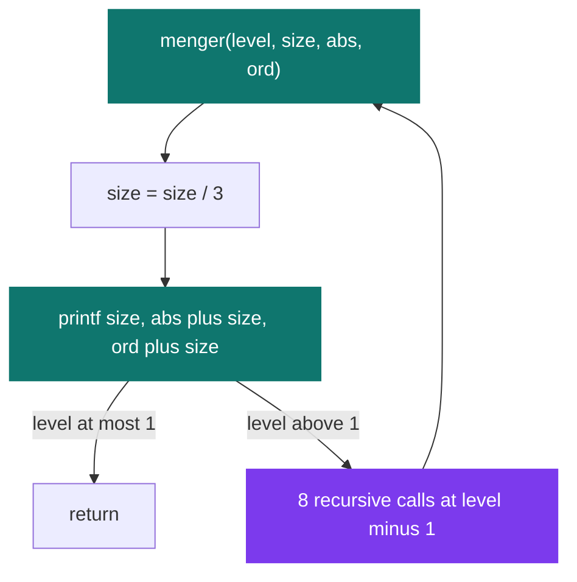

# C++ Pool — Day 01: warming back up in C

[](https://antoinepoisson.github.io/Old-School-Projects/projects/cpp-d01-2019)

 

[Tek2](../../README.md) / [CPPool](../README.md) / **cpp_d01_2019**

*Epitech project · C++ Seminar (B-CPP-300) · January 2020 · 1 day · Grade B*

The first day of the C++ pool is spent entirely in C, and its real subject is hidden: writing a
binary file format by hand. There is no library between the code and the disk. Fifty-four bytes
have to land at exactly the right offsets, in the right endianness, or no image viewer on the
machine will open the result.

That constraint has teeth because C works against you here. The compiler is free to insert padding
between struct fields, and a two-byte shift is enough to turn a valid bitmap into a broken file
that still compiles, still runs, and still writes something.

```c
typedef struct __attribute__((packed)) bmp_header_s
{
    uint16_t magic;
    uint32_t size;
    uint16_t _app1;
    uint16_t _app2;
    uint32_t offset;
} bmp_header_t;
```

Without `__attribute__((packed))` gcc aligns `size` on a 4-byte boundary and this structure
measures 16 bytes instead of 14. Everything written after it shifts, and the pixel offset stops
pointing at the pixels.

**The magic number is the second trap.** `make_bmp_header` stores `change_endian_16(0x424D)`, so
the field holds `0x4D42` in memory — and a little-endian machine serialises that as the bytes
`42 4D`, which is the ASCII `BM` every reader looks for first. Without the swap the file would
start with `MB`.

Handing `make_bmp_header` and `make_bmp_info_header` a size of 32 and appending a white 32×32
buffer produces a file that `file(1)` reports as `PC bitmap, Windows 3.x format, 32 x 32 x 32,
image size 4096, cbSize 4150, bits offset 54`:

```
00000000  42 4d 36 10 00 00 00 00  00 00 36 00 00 00 28 00  |BM6.......6...(.|
00000010  00 00 20 00 00 00 20 00  00 00 01 00 20 00 00 00  |.. ... ..... ...|
00000020  00 00 00 10 00 00 00 00  00 00 00 00 00 00 00 00  |................|
00000030  00 00 00 00 00 00 ff ff  ff 00 ff ff ff 00 ff ff  |................|
```

| Offset | Bytes | Field and value |
| --- | --- | --- |
| `0x00` | `42 4d` | magic, `BM` after the byte swap |
| `0x02` | `36 10 00 00` | file size, 4150 = 32 × 32 × 4 + 54 |
| `0x0a` | `36 00 00 00` | pixel offset, 54 |
| `0x0e` | `28 00 00 00` | info header size, 40 — taken from `sizeof`, never a literal |
| `0x12` | `20 00 00 00` | width, 32 |
| `0x1c` | `20 00` | bits per pixel, 32 |
| `0x22` | `00 10 00 00` | raw data size, 4096 |

A BMP scanline must be padded to a multiple of four bytes. At 32 bits per pixel that padding is
always zero, which is why `raw_data_size` is exactly `size * size * 4` with no correction term.

The three functions the subject asks for in `ex02` and `ex04` are consecutive stages of one
pipeline. The driver owns the buffer and the `write`; everything between the pixels and the file on
disk is in this repository.


**The fractal.** `menger.c` prints the holes of a Menger sponge instead of drawing them. Each call
divides the square by three, prints the side of its central hole and that hole's top-left corner,
then recurses into the eight surrounding thirds — never into the centre it just removed.



A level-*n* run therefore emits `1 + 8 + ... + 8^(n-1)` lines: `./menger 27 3` prints 73 of
them. Every value is padded to three digits and separated by a single space, exactly as the
subject specifies:

```console
$ ./menger 9 2
003 003 003
001 001 001
001 001 004
001 001 007
001 004 001
001 004 007
001 007 001
001 007 004
001 007 007
$ ./menger 6 2; echo $?
84
```

That `84` is the guard: `check_error` rejects a wrong argument count, non-numeric arguments, a size
that is not a multiple of 3, and a size smaller than 3^level — the case where integer division
would silently collapse the recursion to sub-squares of size zero.

**Reading the specification is the exercise.** `ex00` spreads nine output rules over a page —
palindromic bit patterns, IDs that are multiples of 13, 29 and 89, a byte equal to `0x42`, an
argument too large for a `uint64_t` — and every one of them resolves to the same letter.

Four of those rules spell the letter differently: octal `0172`, the bits `0111101000001010`,
"the sixth character of the ASCII table starting from the end", and "the last letter of the
alphabet in lowercase". The delivered `z.c` is one `write(1, "z\n", 2)`.

| Exercise | Deliverables | Subject |
| --- | --- | --- |
| `ex00` | `z.c` + Makefile | The spec that collapses to `write(1, "z\n", 2)` |
| `ex01` | `menger.c`, `menger.h`, `main.c` + Makefile | Recursive Menger sponge holes |
| `ex02` | `bitmap.h`, `bitmap_header.c` | The 54-byte packed BMP header |
| `ex03` | `pyramid.c` | Cheapest path down a triangle of distances |
| `ex04` | `drawing.h`, `drawing.c` + the `ex02` pair | `draw_square` on the pixel buffer |

**Two audit findings.** `pyramid_path` returns the right answer — on the map
`{{0},{7,4},{2,3,6},{8,5,9,3}}` it gives 12, the path 0 + 4 + 3 + 5 — but `find_path` memoises
nothing. Adjacent rooms recompute the same sub-triangle, so the call tree holds `2^height - 1`
nodes: a 20-row pyramid costs 1,048,575 calls, where a bottom-up pass over the same 210 cells
settles it in 190 comparisons.

`draw_square` writes `img[origin->x + i][origin->y + i_two]`, while the driver builds `img` so that
`img[i]` is row *i* counted from the bottom — the row index is the ordinate, not the abscissa. The
subject's own example, a 22-pixel square at `{0, 10}` inside 64×64, lands on rows 0–21 and columns
10–31 rather than rows 10–31 and columns 0–21: the right square, mirrored across the diagonal.

## Beyond the baseline

`ex02` and `ex04` ship `bitmap.h` and `bitmap_header.c` byte for byte identical. Serialising the
binary header and drawing into the buffer stay in separate translation units, so the second
exercise adds `draw_square` on top of the first without touching a single offset.

Only one of the two structures actually needs the packed attribute: `bmp_info_header_t` is
naturally aligned and measures 40 bytes either way, while `bmp_header_t` is 14 packed and 16
without. The code packs both, which is the right call — a layout that happens to be safe on this
compiler is not a property to depend on.

`make_bmp_info_header` also takes the header-size field from `sizeof(bmp_info_header_t)` instead of
the literal 40, so the number a reader trusts is derived from the layout the compiler actually
produced.

## Technical stack

C · gcc, Makefile, Git.

333 lines across 11 `.c` and `.h` files, five exercise directories, built with
`-std=gnu11 -Wall -Wextra`. `ex02` to `ex04` deliver functions, not programs — no `main`, no
Makefile — and are linked against a driver the subject supplies.

## Build & run

```bash
cd ex01 && make      # builds ./menger
./menger 9 2         # prints the 9 holes of a level-2 sponge
```

---

[Tek2](../../README.md) / [CPPool](../README.md) · [⌂ All projects](../../../README.md)
