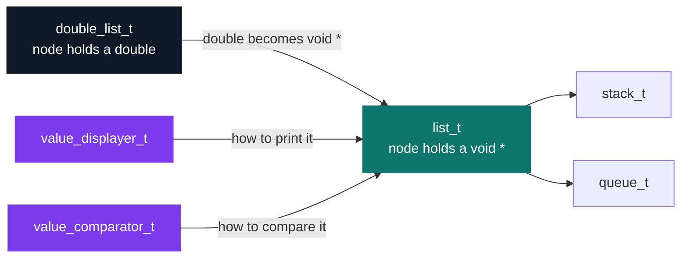
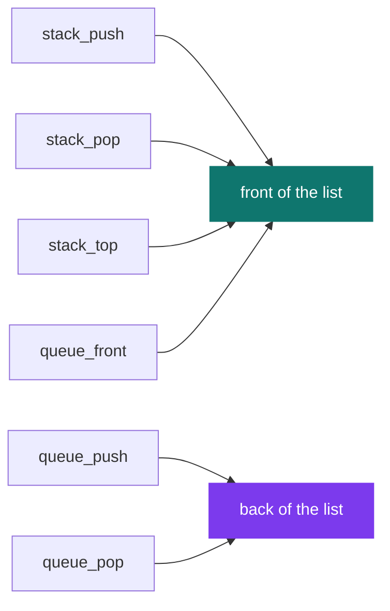

# C++ Pool — Day 02 afternoon: data structures

[](https://antoinepoisson.github.io/Old-School-Projects/projects/cpp-d02a-2019)

  

[Tek2](../../README.md) / [CPPool](../README.md) / **cpp_d02a_2019**

*Epitech project · C++ Seminar (B-CPP-300) · January 2020 · 1 day · Grade B*

**A linked list of `double`, the same list rewritten around `void *`, a stack and a queue built on
top of it, and a binary tree — 44 functions across 10 source files, 634 lines of C, and not one
`main` in the whole delivery.** The headers are supplied and may not be edited, the school compiles
its own `main` functions against these files, and `-std=gnu11 -Wall -Wextra -Werror` turns one
unused variable into a failed build.

The day starts with a singly linked list of `double`: size, insertion and deletion at the front,
the back and an arbitrary position, search by value. Thirteen functions, all mechanical.

Then it does the thing that makes the afternoon worth writing about — it rewrites the same list to
store `void *`. Genericity in C is not a feature you turn on. It is a pointer that has forgotten
what it points to, and a set of promises the compiler will never check for you.



**Two expressions, and nothing else.** Diffing the typed implementation against the generic one,
every insertion, deletion and traversal is identical once the identifiers are renamed. Exactly two
places carried type knowledge, and both had to be handed back to the caller as a function pointer.

```c
/* list_correction.c — the type knew how to print itself */
void double_list_dump(double_list_t list)
{
    while (list) {
        printf("%f\n", list->value);
        list = list->next;
    }
}

/* list_generic_extention.c — now the caller has to say */
void list_dump(list_t list, value_displayer_t val_disp)
{
    while (list) {
        val_disp(list->value);
        list = list->next;
    }
}
```

The search loop tells the same story in one line: `list->value != value` becomes
`val_comp(list->value, value) != 0`. Pass the wrong comparator and it still compiles, still runs,
and reads memory that never held what you assumed.

The generic side also gains one function the typed side never had: `list_clear`, which unlinks each
head before freeing it. Fourteen functions against thirteen; past those two function pointers and
`list_clear`, the whole diff is identifiers.

**The wrappers.** `stack.c` and `queue.c` are 37 lines each and declare no data structure at
all. Ten functions, each a single `return`, each forwarding to the generic list. A stack and a
queue are the same list with different ends declared legal.



Five of those six routings are what a LIFO and a FIFO need. The sixth, `queue_pop`, deletes at the
back, so the queue drops the element it just took in instead of the one `queue_front` points at —
and since `typedef list_t queue_t`, the compiler sees three names for one struct and says nothing.

Pushing 5, 4 and 3, then popping once:

```console
$ ./a.out
front -> 5  (size 3)
after queue_pop: front -> 5  (size 2)
```

A FIFO would answer `front -> 4`. That is the trade-off the day exists to teach: genericity through
`void *` buys reuse and spends every bit of static checking.

**What the free reuse costs.** The node is `{ void *value; struct node *next; }` — a head pointer
and nothing else, no tail. Everything that touches the back walks the list, so a queue built this
way pays a full traversal on every push.

| Operation | Cost | Why |
| --- | --- | --- |
| `stack_push` / `stack_pop` / `stack_top` | O(1) | front of the list |
| `queue_front` | O(1) | front of the list |
| `queue_push` / `queue_pop` | O(n) | walk to the tail |
| `list_get_size` | O(n) | one traversal |
| `list_get_elem_at_position` | O(n) | two size calls, then the walk |
| `list_add_elem_at_position` | O(n) | plus an O(n) size call first |
| `double_btree_get_size` / `get_depth` / `get_max_value` | O(n) | full recursive descent |

**The tree.** Seven functions over a binary tree of `double` (`tree.c`, `tree_two.c`): node
creation, an emptiness test, recursive deletion of both subtrees before the parent, size, depth as
`1 + max(left, right)`, and min and max by full descent. No ordering invariant, so every query is a
complete walk.

The two extremum functions guard the missing child differently, and only one survives it.
`double_btree_get_min_value` answers `DBL_MAX`, a value no comparison can win;
`double_btree_get_max_value` answers `0`, which sits inside the value domain. On a tree holding
`-5`, `-9` and `-2` the minimum comes back as `-9` and the maximum as `0`. An extremum recursion
has to start from the node's own value, never from a neutral constant.

Memory is manual throughout: 7 `malloc` calls, 8 `free` calls, and a `list_clear` that walks the
chain node by node. With no `main` in the delivery, the grader's own test program under Valgrind is
the only place a mistake becomes visible.

## Beyond the baseline

The subject's own tree exercise is a generic n-ary traversal: a node holding a `void *`, a parent
pointer and a `list_t` of children, walked depth-first when the caller hands it a stack and
breadth-first when it hands it a queue. `double_btree_t` appears nowhere in it. The binary tree of
`double` in `tree.c` and `tree_two.c` is seven more functions, on a structure the day never defines.

Thirteen days later the same seminar reaches C++ templates, which solve exactly the problem this
afternoon leaves open: keeping the reuse, getting the type checking back.

## Technical stack

C (gnu11) · gcc with `-Wall -Wextra -Werror` · Valgrind · Git.

Five headers are included and none of them lives here. Four are supplied by the school
(`double_list.h`, `generic_list.h`, `stack.h`, `queue.h`) and fix every struct layout and every
prototype before a line is written; the tree files add `double_btree.h`.

## Build & run

No Makefile and no executable by design: the delivery is a set of `.c` files with no `main`, meant
to be compiled together with the provided headers and the grader's own test program.

```console
$ gcc -std=gnu11 -Wall -Wextra -Werror *.c your_main.c
$ valgrind --leak-check=full ./a.out
```

---

[Tek2](../../README.md) / [CPPool](../README.md) · [⌂ All projects](../../../README.md)
