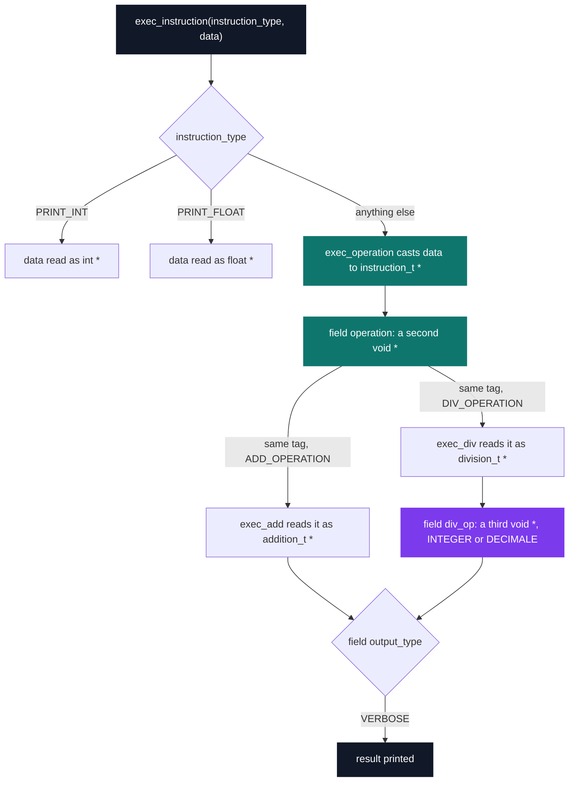

# C++ Pool — Day 02 morning: pointers

[](https://antoinepoisson.github.io/Old-School-Projects/projects/cpp-d02m-2019)

 

[Tek2](../../README.md) / [CPPool](../README.md) / **cpp_d02m_2019**

*Epitech project · C++ Seminar (B-CPP-300) · January 2020 · 1 day · Grade B*

Six exercises, nine files, 307 lines, and not one `main` among them — the school compiles these
functions against its own test program, so the prototype is the entire contract.

The difficulty is not the volume but the last two exercises, where the type system stops carrying
information. In `ex04` a `void *` arrives with an enum beside it, and that enum is the only thing
that says what the bytes under the pointer are. In `ex05` a pointer lands in the middle of a
structure whose layout the function is never told.

`castmania.c` is where that bites. `exec_instruction` forms *both* readings of the pointer before
it ever looks at the tag — `int *value = data;` and `float *value_float = data;` — then picks one.
Read the wrong one and nothing complains; a float's bit pattern simply comes out as an integer.

| Exercise | Type in the signature | What it forces |
| --- | --- | --- |
| `ex00` add_mul | `int *` | results written through an address, then a variant where the inputs are also the outputs |
| `ex01` mem_ptr | `char **` | the function allocates; the caller preallocates nothing |
| `ex02` tab_to_2dtab | `int ***` | a flat array reshaped into rows, handed back through three levels |
| `ex03` func_ptr | `void (*[4])(const char *)` | `if`/`else` chains and `switch` banned; the branch becomes an index |
| `ex04` castmania | `void *` plus a tag | five struct types reachable from one pointer, selected by two enums |
| `ex05` ptr_tricks | `const int *` back to `whatever_t *` | pointer arithmetic only: distance, and a member back to its struct |

The ladder in the middle column is the whole point of the morning. Each exercise adds one level of
indirection, or removes one guarantee the compiler was giving for free.

**Unpacking a tagged pointer three times.** `exec_instruction` takes a `void *`. When the tag is
neither `PRINT_INT` nor `PRINT_FLOAT`, that pointer is an `instruction_t *` whose `operation` field
is *another* `void *`, and on a division the `div_op` field inside it is a *third* one.



Three depths of `void *`, two enums to resolve them, and no type information carried in the
pointers themselves. `castmania.c` does it in 47 lines with seven explicit casts, two of them
nesting a cast inside a cast:

```c
            if (((division_t *)operation)->div_type == INTEGER) {
                printf("%d\n",
                ((integer_op_t *)((division_t *)operation)->div_op)->res);
```

The cast on the third line is correct only because `div_type` was tested on the first. This is the
pattern every C runtime uses for polymorphism, written out by hand with nothing checking it.

**The branch that is forbidden.** `do_action` must call one of four printing functions, and the
subject bans both `switch` and chained `if`/`else`. The enum values run from `0` to `3`, so the
enum *is* the index — and that is the entire function:

```c
void do_action(action_t action, const char *str)
{
    void (*tab[4])(const char *) = {print_normal, print_reverse,
        print_upper, print_42};
    tab[action](str);
}
```

The trade is explicit: dispatch drops from four comparisons to one load, and in exchange the array
loses the bound a `switch` gives for free. An `action` outside `0..3` indexes past `tab` and calls
whatever address happens to sit next on the stack, where a `switch` would simply have done nothing.

**Walking backwards out of a struct.** `ex05` asks for what the Linux kernel calls `container_of`:
given a pointer to the `member` field, return a pointer to the whole structure — and the subject
states that unknown fields may sit both before and after `member`.

```text
whatever_t in memory, as get_struct_ptr reads it

   +-----------+------------+-----------+
   |    ...    |   member   |    ...    |
   +-----------+------------+-----------+
   ^           ^
   |           member_ptr  (given by the caller)
   |
   member_ptr - offset     (returned)
```

The offset is measured in `int` units on both sides of the subtraction, so the units cancel and the
result lands exactly on the struct base. The distance itself is taken through an uninitialised
`whatever_t *`: no memory is dereferenced, but the pointer value is indeterminate — which is
precisely the case `offsetof` exists to cover.

**Audit note.** Recompiled today with clang, the four school headers rebuilt from the prototypes
the subject prints. The imposed flag set rejects three constructs. `-Wextra` supplies two: `int i`
compared against `strlen`'s `size_t` in `mem_ptr.c`, twice, and the `str` parameter that `print_42`
is required to accept and forbidden to use. `-Wall` supplies the third, the uninitialised
`structure` in `ptr_tricks.c`.

The `print_42` error is the subject colliding with its own flag set: the prototype is imposed and
printing `42` is all the function is allowed to do. A second mismatch needs no header to see —
`div.c` stores `decimale_div`'s `float` return into `div_op->res`, and `castmania.c` prints that
same field with `%d`. The tag told the code which struct it was holding; nothing told it which
format string went with it.

`tab_to_2dtab` is the exercise that stays useful afterwards. It copies a flat array into `length`
row buffers plus one table of row pointers — `length + 1` allocations — so the caller then writes
`res[y][x]` and never computes `y * width + x` by hand, which is how tile maps get addressed.

## Technical stack

C · gcc, Git.

Compiled with the imposed `-std=gnu11 -W -Wall -Wextra -Werror`, under the Epitech coding style,
with no `main` in any deliverable.

## Build & run

Nine files, no Makefile: each exercise is compiled on its own against the grader's `main`.

```bash
gcc -std=gnu11 -W -Wall -Wextra -Werror -c ex00/add_mul.c
```

`ex00` and `ex02` compile clean exactly as they stand. `ex01`, `ex03`, `ex04` and `ex05` include
headers the school supplied and never asked back — `mem_ptr.h`, `func_ptr_enum.h`, `castmania.h`,
`ptr_tricks.h` — so those four are absent here. The one header that *was* a deliverable,
`ex03/func_ptr.h`, is in the tree.

---

[Tek2](../../README.md) / [CPPool](../README.md) · [⌂ All projects](../../../README.md)
