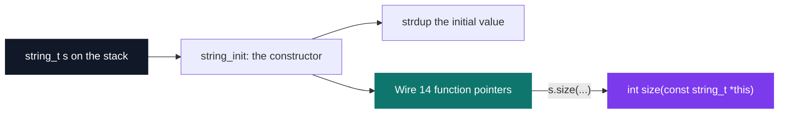
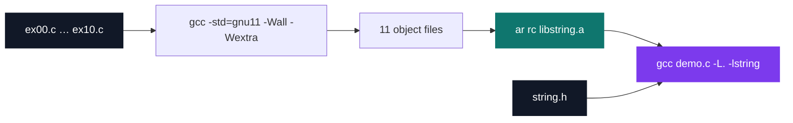

# C++ Pool — Day 03: string library

[](https://antoinepoisson.github.io/Old-School-Projects/projects/cpp-d03-2019)

  

[Tek2](../../README.md) / [CPPool](../README.md) / **cpp_d03_2019**

*Epitech project · C++ Seminar (B-CPP-300) · January 2020 · 1 day · Grade B*

Day 03 of the C++ pool does not let you write C++ yet. It asks for `std::string` — a buffer, a
constructor, a destructor and fourteen member functions — written in C, and delivered as
`libstring.a` plus its public header. Not a binary: no delivered file may hold a `main`, because
the grader links its own against the archive.

C has no classes and no implicit `this`. So the object has to carry its own method table:
`struct string_s` holds the `char *str` buffer and, right beside it, fourteen function pointers.

```c
struct string_s
{
    char *str;

    void (*assign_s)(string_t *, const string_t *);
    void (*append_c)(string_t *, const char *);
    char (*at)(const string_t *, size_t );
    int (*size)(const string_t *);
    size_t (*copy)(const string_t *, char *, size_t, size_t);
    int (*find_c)(const string_t *, const char *, size_t);
    /* … fourteen in total */
};
```

`string_init` is the constructor: it `strdup`s the initial value, then wires all fourteen pointers
onto the free functions that implement them, one assignment each. Every implementation takes a
first parameter literally named `this`.



That design has a price, and it is measurable. C++ gives each object one hidden `vptr` into a
table shared by the whole class. The imposed structure has no room for that indirection, so every
instance carries the whole table inline: `sizeof(string_t)` is **120 bytes** — 8 for the buffer
pointer, 112 for fourteen methods duplicated in every single string.

The call site is the payoff. A caller linked against the archive reads like C++, with the receiver
passed by hand.

```console
$ gcc demo.c -L. -lstring -o demo && ./demo
c_str : Hello World
size  : 11
at(4) : o
at(99): -1
append: Hello World again
clear : size=0
```

Eleven exercises are delivered, covering exercises 0 to 10 of the subject's seventeen. That range
is exactly the set of methods `string.h` declares — nothing is exported that has no body behind it.

| Method pair | `std::string` equivalent | Backed by |
| --- | --- | --- |
| `assign_s` `assign_c` | `operator=` | `free` + `strdup` |
| `append_s` `append_c` | `operator+=` | `realloc` + `strcat` |
| `compare_s` `compare_c` | `compare` | `strcmp` |
| `find_s` `find_c` | `find` | `strstr` |
| `at` `copy` `c_str` | `at` `copy` `c_str` | direct buffer access |
| `size` `empty` `clear` | `size` `empty` `clear` | `strlen`, null test, `realloc` |

One audit finding worth keeping. `find_c` walks the string and calls `strstr` on the suffix at each
index — but `strstr(&this->str[i], str)` answers *"does the needle appear at or after `i`"*, not
*"does it start at `i`"*, so the loop returns on its first iteration: `find_c("Hello World",
"World", 0)` yields `0` instead of `6`. A single `strstr(this->str + pos, str)` and a pointer
subtraction give the right offset in one pass.

## Beyond the baseline

The subject names two deliverables: `libstring.a` and `string.h`. Unit tests get a single line of
encouragement — no framework named, no target to implement, no coverage to reach.

The delivery carries **364 lines of Criterion tests against 236 lines of implementation** — more
test code than code — plus a `tests_run` Makefile rule that compiles the suite, runs it and calls
`gcovr` for coverage in the same command.

## Technical stack

C · Makefile, ar, gcc, Criterion, gcovr, Git.

## Verification

Seven files under `tests/` hold **34 test cases with exactly one assertion apiece**. Their suite
names reach fourteen of the sixteen exported functions; the two they never touch are `find_s` and
`find_c` — the one exercise where the bug above is still sitting.

Half of the cases push `NULL` through the API on purpose: `assign_s(NULL, NULL)`,
`string_init(NULL, NULL)`, `size(NULL)`, `copy(NULL, NULL, 0, 0)`. That is the right obsession for
a library, which cannot control who calls it — and it matches the code, where every one of the
sixteen functions opens with a null guard before touching a pointer.

The value assertions live in the later files: `at(NULL, 0) == -1`, `size(NULL) == -1`,
`compare_s(NULL, NULL) == 0`, `copy(s, dst, 2, 0) == 2`. Every assertion in the first two files
compares pointers instead — `cr_expect_neq(this->str, "eeeee")` weighs a heap buffer against a
literal's address — so they can only fail if the call crashed first: coverage, not a return value.

## Build & run

```bash
make            # 11 objects, then ar rc -> libstring.a
make tests_run  # compile the Criterion suite, run it, then gcovr
```



The archive builds warning-free under `-std=gnu11 -Wall -Wextra`, the flags the subject imposes,
and exports sixteen global symbols. Six of them are `at`, `size`, `copy`, `clear`, `empty` and
`c_str`. The method table hides that at the call site — you write `s.size(&s)` — but the linker
still sees a bare `size`, so any program that defines its own collides on the spot. Namespacing
those symbols is precisely the problem the C++ half of this pool is about to solve.

---

[Tek2](../../README.md) / [CPPool](../README.md) · [⌂ All projects](../../../README.md)
