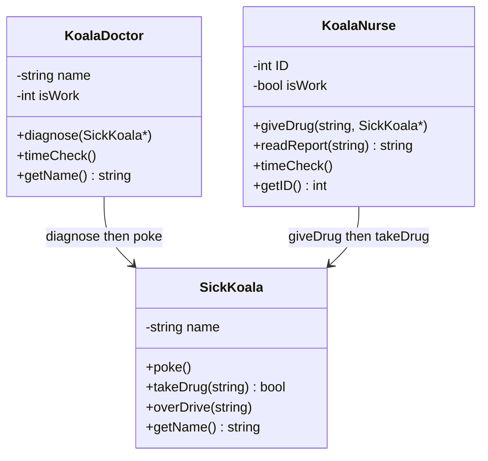

# C++ Pool — Day 06: first classes

[](https://antoinepoisson.github.io/Old-School-Projects/projects/cpp-d06-2019)

 

[Tek2](../../README.md) / [CPPool](../README.md) / **cpp_d06_2019**

*Epitech project · C++ Seminar (B-CPP-300) · January 2020 · 1 day · Grade B*

Three classes ship as six files with no `main` in any of them. The grader brings its own driver,
compiles it against these headers, and diffs the output character for character.

That is the real exercise of the day. Not "learn what a class is" — write a unit of code whose only
contract with the outside world is a header someone else will `#include`, where a missing
exclamation mark is a failed test.

The morning warms up on streams with two standalone binaries. `my_cat` copies each file from an
`std::ifstream` to `std::cout` one `get()` at a time, sending the failure message to `std::cerr`.
`my_convert_temp` reads a value and a scale off `std::cin` and reprints them in two columns.

Those columns are the whole point of the second exercise: `<iomanip>` in place of a format string.

```console
$ echo "-10 Celsius" | ./my_convert_temp
          14.000      Fahrenheit
$ echo "46.400 Fahrenheit" | ./my_convert_temp
           8.000         Celsius
```

*Both fields right-aligned on 16 characters by `std::setw(16)`, three decimals by
`std::cout.precision(3)` with `std::fixed`. Output taken from the compiled binary.*

Then the hospital, and the first real classes: private attributes, public methods, and the thing
that makes them classes rather than structs — each one owns the behaviour that acts on its own data.



The table below is the same program written twice. The left column is not a strawman: `malloc`,
`free`, `printf`, `open` and `fopen` are all on the subject's ban list, which is exactly what forces
the right column from the first line rather than at the end of the week.

| The same idea | C idiom, banned here | C++ idiom in this code |
| --- | --- | --- |
| Data | `struct koala { char *name; }` | `class SickKoala`, `name` private |
| Behaviour | `poke(struct koala *k)` | `koala.poke()`, `this` implicit |
| Lifecycle | `koala_new()` / `koala_free()` by hand | constructor and destructor, run by scope |
| Output | `printf("Mr.%s: ...", k->name)` | `std::cout << "Mr." << name` |
| File input | `fopen` / `fgetc` | `std::ifstream` / `.get()` |

**The doctor and the nurse never call each other.** The prescription travels through the filesystem:
`diagnose` draws a drug with `random() % 5` from a fixed five-entry array and writes it into
`[patient].report`; the nurse opens that file by name, announces what she found, and hands it to the
patient.

`readReport` rejects any filename that does not end in `.report` and returns an empty string without
printing, so a bad name produces silence rather than a half-formed line in the diff.


The draw is random but the run is not. The correction `main` calls `srandom()` before any object
exists, so a fixed array in a fixed order plus `random() % 5` makes the whole prescription sequence
reproducible — which is what lets a diff-based autograder check it at all.

Three of the five drugs the doctor can prescribe are ones the patient refuses. `takeDrug` returns
`false` for those, and the report file is the only place the choice was ever recorded.

| Drug written to the report | What `takeDrug` prints | Returns |
| --- | --- | --- |
| `Mars` | `Mr.[name]: Mars, and it kreogs!` | `true` |
| `Buronzand` | `Mr.[name]: And you'll sleep right away!` | `true` |
| `Viagra` | `Mr.[name]: Goerkreog!` | `false` |
| `Extasy` | `Mr.[name]: Goerkreog!` | `false` |
| `Eucalyptus leaf` | `Mr.[name]: Goerkreog!` | `false` |

One doctor, one nurse and one patient, driven by a short `main` written outside the deliverable:

```text
Dr.Cox: I'm Dr.Cox! How do you kreog?
Dr.Cox: Time to get to work!
Nurse 1: Time to get to work!
Dr.Cox: So what's goerking you Mr.Ganepar?
Mr.Ganepar: Gooeeeeerrk!!
Nurse 1: Kreog! Mr.Ganepar needs a Buronzand!
Mr.Ganepar: And you'll sleep right away!
Nurse 1: Time to go home to my eucalyptus forest!
Dr.Cox: Time to go home to my eucalyptus forest!
Mr.Ganepar: Kreooogg!! I'm cuuuured!
Nurse 1: Finally some rest!
```

*Real output of the compiled classes under `srandom(42)`. The last two lines come from destructors
that nobody called; `KoalaDoctor`'s destructor stays silent on purpose, so no `Dr.Cox` line closes
the run.*

Those two lines are the lesson of the day. Nothing in the driver asks the koala to announce it is
cured or the nurse to knock off; leaving the scope does it. Every earlier day kept here is plain C,
so this is the first code in the pool that runs without an explicit call.

**One flag, read backwards.** Both `timeCheck` methods start from `isWork = true` and print
"Time to get to work!" on the first call, so the member really holds "off duty". The alternating
clock-in / clock-out sequence the grader diffs is exact — only the name lies.

The subject runs to seven exercises and this delivery covers the first five, stopping after the
doctor. The two that follow are three linked-list classes and a `Hospital` that walks them to spread
patients across the doctors and nurses on duty: data-structure work already familiar from C, once
the paradigm shift has happened.

## Technical stack

C++ · Makefile, g++, Git.

| Unit | Files | Lines |
| --- | --- | --- |
| `ex00` — `my_cat` | 1 source + Makefile | 46 |
| `ex01` — `my_convert_temp` | 1 source + Makefile | 29 |
| `hospital` — 3 classes | 3 headers + 3 sources | 264 |

339 lines of C++ over 8 source files, 17 member functions defined across 3 classes. All of it
compiles clean under the `-Wall -Wextra -Werror` the subject imposes.

## Build & run

Each warm-up exercise carries its own Makefile and its own imposed binary name:

```bash
make -C ex00     # produces ex00/my_cat
make -C ex01     # produces ex01/my_convert_temp

echo "-10 Celsius" | ./ex01/my_convert_temp
```

`hospital/` ships headers and sources only — no Makefile and no `main`, because the grader brings
both. Point any driver at the directory:

```bash
g++ -Wall -Wextra -Werror your_main.cpp hospital/*.cpp -I hospital
```

---

[Tek2](../../README.md) / [CPPool](../README.md) · [⌂ All projects](../../../README.md)
