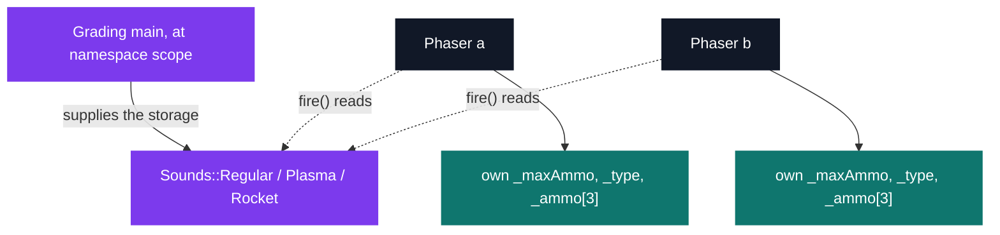
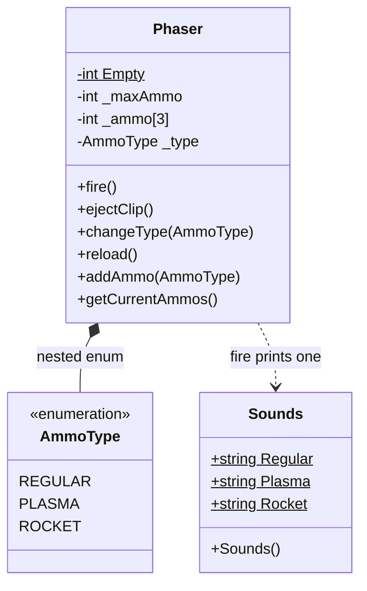

# C++ Pool — Day 07 afternoon: SKAT

[](https://antoinepoisson.github.io/Old-School-Projects/projects/cpp-d07a-2019)

  

[Tek2](../../README.md) / [CPPool](../README.md) / **cpp_d07a_2019**

*Epitech project · C++ Seminar (B-CPP-300) · January 2020 · 1 day · Grade B*

Four small C++ universes, each stripping one language mechanism down to a toy: a soldier who hands
out stimpaks without ever touching a pointer, a robot rebuilt from swappable parts by overload
resolution alone, a squad radio that is a hand-written linked list, and a phaser whose firing
sounds belong to no object at all.

The last one carries the day. `ex03/Phaser.cpp` compiles to a clean object file under
`-Wall -Wextra -Werror`; link it and the build dies on three undefined symbols. That failure is not
a bug — it is the entire point of the afternoon.

`Sounds` declares three `static const std::string` members, and the subject forbids assigning them
anywhere in the files turned in. The grading `main` supplies them at namespace scope. A static
member is not stored inside any object: it is a global wearing a class name, and its storage has
to reach the linker from somewhere else entirely.

Real console, with a `main.cpp` that builds a `Phaser` and calls `fire()` but never defines the
sounds:

```console
$ g++ -std=c++14 -Wall -Wextra -Werror -c ex03/Phaser.cpp
$ g++ Phaser.o main.o -o phaser
Undefined symbols for architecture arm64:
  "Sounds::Plasma", referenced from:
      Phaser::fire() in Phaser.o
  "Sounds::Rocket", referenced from:
      Phaser::fire() in Phaser.o
  "Sounds::Regular", referenced from:
      Phaser::fire() in Phaser.o
ld: symbol(s) not found for architecture arm64
clang++: error: linker command failed with exit code 1 (use -v to see invocation)
```

Two `Phaser` objects each own a private magazine. Neither of them owns the sounds — those live
once, before any instance exists, and outlive all of them.



**Four exercises turned in, 11 files, 584 lines, 8 classes**, with no `main` anywhere — the
school's autograder brings its own. The subject runs to five: `ex04` welds a `Skat`, a `Phaser` and
a `KreogCom` into a `Squad`, and is where the three sound strings finally get their values. The
four exercises here all build warning-free under the imposed `g++ -std=c++14 -Wall -Wextra -Werror`.

| Exercise | Classes | Mechanism it isolates |
| --- | --- | --- |
| `ex00` | `Skat` | References and default arguments — pointers banned |
| `ex01` | `KoalaBot`, `Arms`, `Legs`, `Head` | Composition by value, six overloads |
| `ex02` | `KreogCom` | Hand-rolled singly linked list, recursive walk |
| `ex03` | `Phaser`, `Sounds` | Nested enum, static class variables |

**Skat — mutation without pointers.** The exercise bans pointers outright, which removes the
obvious way to hand out writable access to a private field.

The answer is the reference return: `int &stimPaks()` gives the caller a writable alias on
`_stimpaks`, and `shareStimPaks(int number, int &stock)` moves stimpaks straight into a teammate's
counter — or refuses with `Don't be greedy` when the request exceeds the stock. Defaults `"bob"`
and `15` sit in the constructor signature.

**KoalaBot — overload resolution as an assembly line.** The robot holds an `Arms`, a `Legs` and a
`Head` *by value*, and exposes three `setParts` plus three `swapParts`. There is no type tag and
no `if`: the compiler picks the body from the argument type alone.

```cpp
void KoalaBot::swapParts(Arms &arms)
{
    Arms save = this->_Arms;
    this->_Arms = arms;
    arms = save;
}
```

Because the parts are members rather than pointers, that three-line body is a genuine exchange —
the caller's variable comes back holding the part the robot was wearing.

**KreogCom — a linked list built by hand.** `addCom` splices the new node in directly after the
receiver, so a leader that adds two comrades ends up with the chain `101010 → 51 → 65`.
`locateSquad` recurses down to the tail first and prints on the way back out.

Real run of the subject's own example — a com at `42 42`, two `addCom`, one `locateSquad`, two
`removeCom`:

```console
KreogCom 101010 initialized
KreogCom 65 initialized
KreogCom 51 initialized
KreogCom 65 currently at 56 25
KreogCom 51 currently at 73 34
KreogCom 101010 currently at 42 42
KreogCom 101010 shutting down
KreogCom 101010 shutting down
KreogCom 101010 shutting down
```

**Audit note.** Recursing before printing walks the squad tail-first, so `65` and `51` come out in
the reverse of the order the subject asks for — print, then recurse, and the order is right. And
`removeCom` prints `this->_serial` rather than the removed node's, which is why the caller's serial
appears three times and why the two heap nodes are unlinked instead of deleted.

**Phaser — two statics, and only one of them needs storage.** `AmmoType` is nested inside the
class, and `int _ammo[3]` is indexed by it, so each ammo type carries its own magazine — on a
default `Phaser` of 20 rounds, eject the regular clip, switch to plasma, and `getCurrentAmmos()`
still answers 20.



`static const int Empty = 0` is an integral constant, so its value can be written in the class
body. The subject strongly recommends using it; `fire()` compares the magazine against a literal
`0` instead, so nothing ever reads `Empty` and `nm` finds no symbol for it in `Phaser.o`.

`Sounds`' strings cannot be initialised in the class body and *are* read, so they demand a
definition. The class itself holds no state, and its constructor and destructor are declared but
never defined: an instance would not even link. It exists only to give three strings a class scope.

## Technical stack

C++ · g++, Git. No Makefile: each exercise compiles on its own against the grader's `main`, which
includes the delivered headers.

The constraint list is what shapes the code, so it is worth reading as design pressure:

| Rule imposed | Consequence in the code |
| --- | --- |
| No `*alloc`/`free`/`*printf`/`open`/`fopen` | `new` and `std::cout` only |
| No `using namespace`, no `friend`, standard library only | every name written `std::`, no privileged access |
| Pointers forbidden in `ex00` | `int &stimPaks()` returns a writable reference |
| No `main` in the deliverable | the grader's `main` defines `Sounds`' three statics |
| `-Wall -Wextra -Werror` | the five `.cpp` files compile without a single warning |

## Build & run

Each exercise compiles independently with `g++`; the day was turned in without a top-level Makefile
or a single executable. `ex00` needs C++11 or later, since `Skat.hpp` gives its two members default
initialisers in the class body — under `-std=c++98` that header alone raises two
`-Wc++11-extensions` warnings.

```bash
g++ -std=c++14 -Wall -Wextra -Werror ex02/KreogCom.cpp your_main.cpp -o kreogcom
```

Rebuilt against the subject's example `main` functions, `ex00` and `ex01` reproduce the expected
terminal character for character, and `ex03` follows the expected shape — one sound, `Reloading...`,
then the magazine emptied round by round.

For `ex03`, that `main` must define the three sounds at namespace scope, or the link fails as shown
above. The subject pins the values one exercise later, in `Squad.cpp`:

```cpp
const std::string Sounds::Regular = "Bang";
const std::string Sounds::Plasma  = "Fwooosh";
const std::string Sounds::Rocket  = "Boouuuuuum";
```

Whichever string the `main` chooses is what `fire()` prints — the subject's own two samples already
disagree, spelling the rocket `Booooooom` in `ex03` and `Boouuuuuum` in `ex04`.

---

[Tek2](../../README.md) / [CPPool](../README.md) · [⌂ All projects](../../../README.md)
