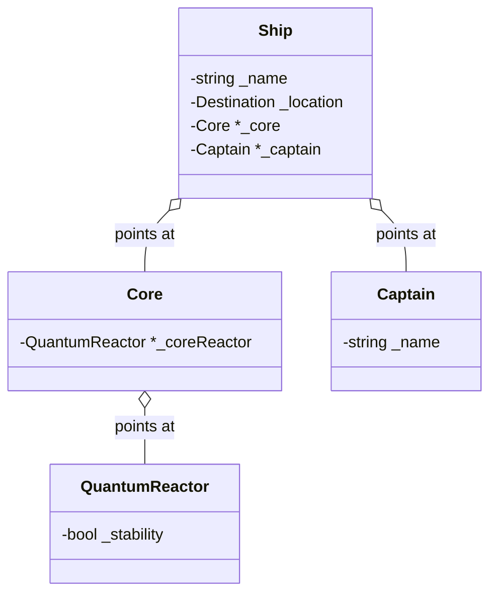
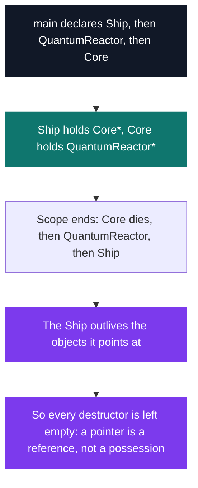

# C++ Pool — Day 07 morning: Resistance is Futile

[](https://antoinepoisson.github.io/Old-School-Projects/projects/cpp-d07m-2019)

 

[Tek2](../../README.md) / [CPPool](../README.md) / **cpp_d07m_2019**

*Epitech project · C++ Seminar (B-CPP-300) · January 2020 · 1 day · Grade B*

Nine classes across four namespaces, 867 lines of C++, and not a single `new` or `delete`. Every
object here reaches its neighbours through raw pointers it does not own, which turns a Star Trek
pastiche into one precise question: when the scope ends, who is allowed to touch what?

The delivery also contains no `main`. The school compiles its own driver against these headers with
`-Wall -Wextra -Werror`, so the header *is* the contract — every signature, every default argument
and every level of namespace nesting has to match exactly or the driver does not build.

**Value members versus pointer members.** A `Ship` owns its `_name` and its `_location`: they are
stored by value and die with it. Its `_core` and its `_captain` are pointers handed in from outside
by `setupCore()` and `promote()`. Nothing is allocated, so nothing has to be released.

`Federation::Starfleet::Ship`, reduced to two of the members it holds by value and the two it
only borrows:



**Why the empty destructors are the right answer.** Aggregation by pointer moves the ownership
question to the caller's stack frame, and stack frames unwind in reverse declaration order.

Declare the ships before the reactors and cores — which is how the exercise's driver does it — and
the ships are destroyed **last**, after the `Core` and `QuantumReactor` objects their pointers refer
to. A `~Ship` that dereferenced `_core` to shut the reactor down cleanly would be reading objects
whose lifetime has already ended. All nine destructors are therefore empty bodies.



**Three ship classes, one overload set each.** `Federation::Starfleet::Ship` and
`Federation::Ship` coexist because of the nested namespace; the Borg cube is a third, unrelated
type. Each carries four `move` overloads — with or without a warp factor, with or without a
destination — twelve near-identical functions re-testing the same assertions.

| Ship class | Overloads | Home |
| --- | --- | --- |
| `Federation::Starfleet::Ship` | 4 × `move`, 2 × `fire` | `EARTH` |
| `Federation::Ship` | 4 × `move` | `VULCAN` |
| `Borg::Ship` | 4 × `move`, 2 × `fire` | `UNICOMPLEX` |

A `move` succeeds only when the requested warp is within `_maxWarp`, the destination differs from
`_location`, and the reactor reached through `_core->checkReactor()` is stable. The two overloads
that take no warp keep the last two tests and drop the first.

**The constraint that shaped the API.** `friend` is forbidden, and so is `using namespace`. Combat
therefore has to cross class boundaries through public accessors only: `Borg::Ship::fire` drains a
Starfleet shield by `_weaponFrequency` through `getShield()` / `setShield()`, and
`Federation::Ship::getCore()` exists for no other reason than to let a Borg cube reach the reactor
it is about to destabilise. It has exactly one caller in the whole delivery, inside `Borg.cpp`.

`Federation.hpp` and `Borg.hpp` include each other, since each declares functions taking the other's
`Ship *`. Include guards plus a forward declaration of the cross-referenced classes at the top of
both headers break the cycle.

One more keyword does similar work. The exercise demands that both `Ensign Chekov;` and
`Ensign Chekov = (std::string)"Pavel Andreievich Chekov";` be rejected by the compiler. Declaring
`explicit Ensign(std::string)` as the only constructor covers both: no default constructor for the
first line, no implicit conversion for the second.

**Commanding a ship without calling it.** The commanders exercise forbids invoking `move` or `fire`
directly. `Admiral` and `BorgQueen` store *pointers to member functions* instead, bind them in their
constructor, and later apply them to a ship passed as an argument.

The subtlety is on the right-hand side. `&Borg::Ship::fire` names an overload set, and the same
expression resolves to two different functions depending only on the type of the variable it is
assigned to:

```cpp
// BorgQueen.hpp
void (Borg::Ship::*firePtr)(Federation::Starfleet::Ship *) = nullptr;
void (Borg::Ship::*destroyPtr)(Federation::Ship *) = nullptr;

// BorgQueen.cpp — same expression, two different member functions
this->firePtr = &Borg::Ship::fire;
this->destroyPtr = &Borg::Ship::fire;
```

Calling through one of them needs the `->*` operator, which is why `Admiral::fire` reads
`(ship->*firePtr)(target)`. Five such pointers are bound across the two commander classes.

**A run through the whole stack.** Construction messages, core installation, promotion, then an
order issued by the admiral and executed by the ship:

```cpp
Federation::Starfleet::Ship UssKreog(289, 132, "Kreog", 6, 10);
Federation::Starfleet::Captain James("James T. Kirk");
Federation::Starfleet::Admiral Nelson("Nelson");
Borg::Ship Cube;
WarpSystem::QuantumReactor QR;
WarpSystem::Core core(&QR);

UssKreog.setupCore(&core);
UssKreog.promote(&James);
Nelson.fire(&UssKreog, &Cube);
```

```text
The ship USS Kreog has been finished.
It is 289 m in length and 132 m in width.
It can go to Warp 6!
Weapons are set: 10 torpedoes ready.
Admiral Nelson ready for action.
We are the Borgs. Lower your shields and surrender yourselves unconditionally.
Your biological characteristics and technologies will be assimilated.
Resistance is futile.
USS Kreog: The core is set.
James T. Kirk: I'm glad to be the captain of the USS Kreog.
On order from Admiral Nelson:
Kreog: Firing on target. 9 torpedoes remaining.
```

The two last lines are the point of the exercise: the admiral's message is printed by `Admiral`,
the one under it by `Ship`, and no `Admiral` code ever names `Ship::fire`.

**Audit finding.** `Borg::Ship`'s constructor assigns `_maxWarp` twice — `9`, then `300` — and never
assigns `_side`. The exercise gives the cube a 300 m side and a top speed of Warp 9, so the second
line was meant for the other field. Nothing reads `_side` and no getter exposes it, so the slip stays
invisible in the output; the one observable symptom is a cube that also accepts warp 10 to 300, since
`warp <= _maxWarp` is tested by the two `move` overloads that take a warp.

## Technical stack

C++ · g++, Git.

## Build & run

Five headers, five implementation files, no Makefile and no executable: the day is graded by
dropping the school's own `main.cpp` next to these sources and compiling the directory in one go.

```bash
g++ -W -Wall -Werror -Wextra *.cpp
```

`Destination.hpp` — the enumeration the exercise supplies, and the source of `EARTH`, `VULCAN` and
`UNICOMPLEX` — is listed in `.gitignore` because it ships with the subject rather than with the
delivery, so a fresh clone needs it supplied before the sources compile.

---

[Tek2](../../README.md) / [CPPool](../README.md) · [⌂ All projects](../../../README.md)
