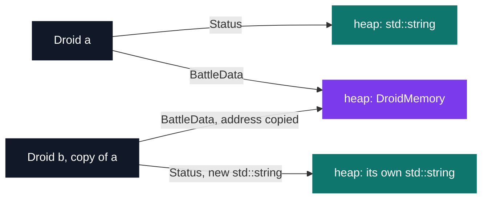
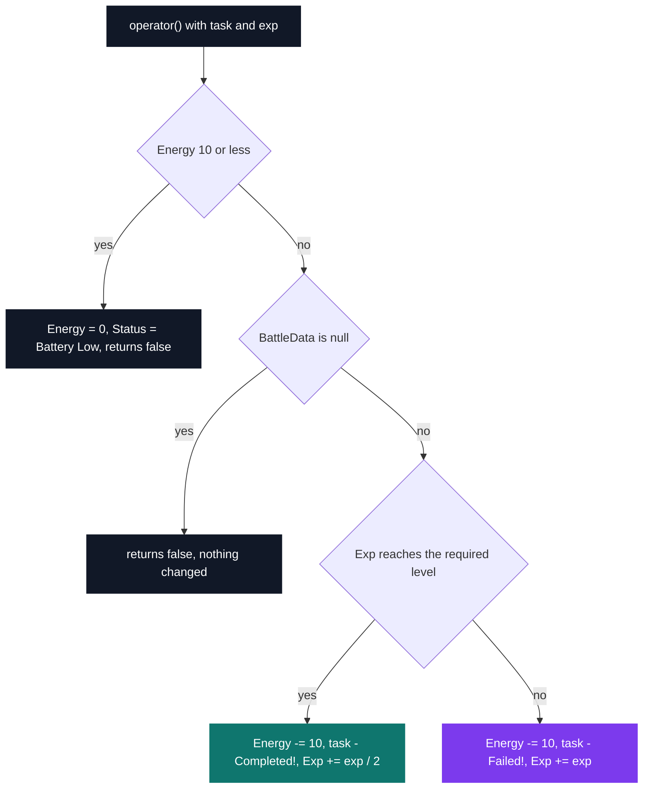

# C++ Pool — Day 08: operator overloading and canonical form

[](https://antoinepoisson.github.io/Old-School-Projects/projects/cpp-d08-2019)

  

[Tek2](../../README.md) / [CPPool](../README.md) / **cpp_d08_2019**

*Epitech project · C++ Seminar (B-CPP-300) · January 2020 · 1 day · Grade B*

> The compiler writes a copy constructor for you. For a class that owns a pointer, that free gift
> is a crash waiting to happen.

Six exercises in the subject, `ex00` to `ex02` delivered, and an operator surface that at least
doubles at every step: **5 overloads in `ex00`, 12 in `ex01`, 24 in `ex02`**, over two classes,
10 files and 913 lines. All three still compile clean under `-Wall -Wextra -Werror` and still
reproduce the expected output of the subject's sample mains, line for line.

The other half of the day is a trap. C++ generates a copy constructor whether you ask for one or
not, and it copies members one by one. For a class that owns a raw pointer, that duplicates the
*address*, not the object — two instances, one buffer, and the second destructor to run frees
memory that is already gone.

`Droid` walks straight into it. It allocates its own `std::string *Status`, and from `ex01` a
`DroidMemory *BattleData` on top. Hand-writing the copy constructor is the fix, and `ex02` treats
its two pointers differently inside the same function.



```cpp
Droid::Droid(const Droid &old_obj)
{
    this->Id = old_obj.Id;
    this->Energy = 50;
    this->BattleData = old_obj.BattleData;
	if (old_obj.Status)
		this->Status = new std::string(*(old_obj.Status));
	else
		this->Status = new std::string("Standing by");
    // "Droid '"serial"' Activated, Memory Dumped\n";
    std::cout << "Droid '" << old_obj.Id << "' Activated, Memory Dumped\n";
}
```

`Status` is per-droid state, so it gets a second allocation. `BattleData` does not: the address is
handed over, and both droids then read and write one `DroidMemory`. The subject wants a replacement
droid to carry over the `Id`, the `Status` and the `BattleData` of the one it replaces, and to set
the energy to 50 instead of copying it — which is why `Energy` is hard-set here and in
`operator=`.

**The operator surface.** `DroidMemory` merges experience, orders itself, compares itself and
prints itself; `Droid` adds identity, recharging and a call operator. Twenty-four overloads in
`ex02`, six of which exist only to accept a bare `size_t` where a `DroidMemory` would also do.

| Class | Group | Operators |
| --- | --- | --- |
| `DroidMemory` | Add `Exp`, XOR `Fingerprint`; `+=` and `+` also take a `size_t` | `<<`, `>>`, `+=`, `+` |
| `DroidMemory` | Order on `Exp`, against a memory or a `size_t` | `<`, `>`, `<=`, `>=` |
| `DroidMemory` | Equality on both fields, memory against memory | `==`, `!=` |
| `DroidMemory` | Assignment and printing | `=`, free `<<` on `std::ostream` |
| `Droid` | Recharge from a `size_t &`, assign a task | `<<`, `()` |
| `Droid` | Identity, decided on `Status` alone | `==`, `!=` |
| `Droid` | Assignment and printing | `=`, free `<<` on `std::ostream` |

**Same body, different grouping.** `DroidMemory::operator+=` literally calls `operator<<`, so the
two run identical code. Chained, they still part ways: `<<` associates left, `+=` associates right.

```text
a.Exp = 1   b.Exp = 2   c.Exp = 4

a << b << c   groups as (a << b) << c   ->   a.Exp = 7,  b.Exp = 2
a += b += c   groups as a += (b += c)   ->   a.Exp = 7,  b.Exp = 6
```

The left operand lands on 7 either way, because addition and XOR are both associative. The middle
operand is where the two chains diverge: `+=` writes through `b` on its way to `a`, and `<<` never
touches it.

**Assigning tasks.** `Droid::operator()` takes a task and the experience it requires, and charges
10 energy for it — or whatever is left, when the droid is down to its last 10. Succeeding earns
`exp / 2` experience, failing earns the full `exp` — learning from your mistakes, which is the
only thing that lifts a droid off an `Exp` of 0.



That single rule shapes the whole reference run. The first task fails on an `Exp` of 0 and banks 20
experience for it; the next failure — `Shoot some ennemies` needs 50 against an `Exp` of 30 — is
why `Run Away` appears on the following line. After that the experience outruns the requirements
and only the battery ends the loop.

```console
$ g++ -Wall -Wextra -Werror Droid.cpp DroidMemory.cpp main.cpp
$ ./a.out | cat -e
DroidMemory '1804289357', 42$
DroidMemory '1804289357', 126$
DroidMemory '846930886', 84$
Droid 'rudolf' Activated$
Droid 'gaston' Activated$
Droid 'rudolf', take a coffee - Failed!, 80$
Droid 'rudolf', Run Away - Completed!, 50$
Droid 'rudolf', Shoot some ennemies - Completed!, 30$
Droid 'rudolf', Shoot some ennemies - Completed!, 10$
Droid 'rudolf', Battery Low, 0$
Droid 'gaston' Destroyed$
Droid 'rudolf' Destroyed$
```

Those fingerprints are fixed values to hit, not free-form output: `DroidMemory` draws its
`Fingerprint` from `random()` and the grader seeds the generator itself. `1804289357` is the first
draw XOR-ed with the 42 experience points added to it, and `846930886` is the second draw arriving
untouched in the first memory — XOR is its own inverse, so `>>` cancels out exactly what `<<` had
just mixed in.

**Audit note.** The three exercises hold 20 `new` and zero `delete`: `~Droid()` announces the
destruction and releases nothing, so the double free the deep copy defends against is traded for a
leak. `operator=` has no `if (this != &droid)` guard either, and that is the same decision rather
than a second one — the self-assignment check and the `delete` of the old buffer only make sense
together, since adding the `delete` alone lets `d = d` destroy its own source before reading it.

## Technical stack

C++11 or later — the code uses in-class initialisers (`const size_t Attack = 25;`) and `nullptr`.
Two classes, 10 files, 913 lines across `ex00`, `ex01` and `ex02`. Tooling: `g++`, Valgrind, Git.

No library beyond the standard one, and `*alloc`, `free`, `*printf`, `open`, `fopen`, `friend` and
`using namespace` are all off the table — so every allocation in the day goes through `new`.

## Build & run

No Makefile, and no `main` anywhere in the three exercises: the school's autograder supplies its
own and includes the headers. Each exercise builds on its own.

```bash
cd ex02
g++ -Wall -Wextra -Werror Droid.cpp DroidMemory.cpp your_main.cpp
./a.out
```

---

[Tek2](../../README.md) / [CPPool](../README.md) · [⌂ All projects](../../../README.md)
