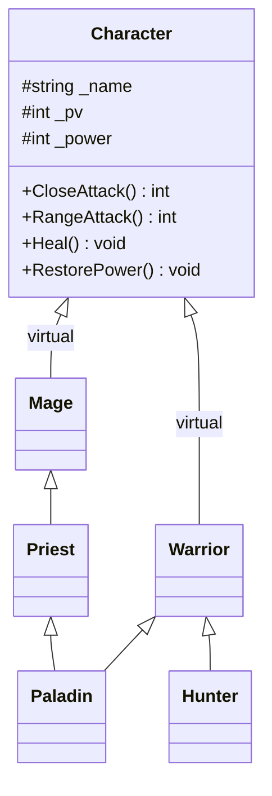

# C++ Pool — Day 09: inheritance

[](https://antoinepoisson.github.io/Old-School-Projects/projects/cpp-d09-2019)

  

[Tek2](../../README.md) / [CPPool](../README.md) / **cpp_d09_2019**

*Epitech project · C++ Seminar (B-CPP-300) · January 2020 · 1 day · Grade B*

> Six classes, one diamond, and a `Paladin` whose melee comes from one parent and whose healing
> comes from another.

`Paladin` has to be a `Warrior` and a `Priest` at the same time, and the subject is exact about what
that means: the warrior's hammer for melee, the priest's heal spell, the fire ball `Priest` inherits
from `Mage`, and a flat reset to 100 energy — a meal, not a mana potion.

Four behaviours, four different owners: `Warrior`, `Priest`, `Character`, `Mage`. C++ refuses to
guess, and two of those four picks are a hard compile error until the class says out loud which
side wins.



**Why the inheritance is `virtual`.** Both sides of the diamond reach `Character`. Declaring
`class Warrior : virtual public Character` and `class Mage : virtual public Character` collapses
the two paths into a single shared sub-object, so a `Paladin` has one name and one health pool
instead of two.

That single sub-object changes who builds it: a virtual base is constructed by the *most derived*
class, before any intermediate parent runs. `Paladin` must therefore name `Character(name, level)`
in its own initialisation list — it does, first — while the identical calls sitting in `Warrior`'s
and `Priest`'s lists are compiled and then ignored.


Constructing a single `Paladin` runs five constructor bodies — and prints `Created` exactly once,
which is the observable proof that the diamond collapsed:

```console
$ ./a.out            # Paladin p("Phiste", 42);
Phiste Created
I'm Phiste KKKKKKKKKKRRRRRRRRRRRRRREEEEEEEEOOOOOOORRRRGGGGGGG
Phiste teleported
Phiste enters in the order
the light falls on Phiste
```

**Naming the winner.** With one shared base, the ambiguity moves from the data to the methods.
`CloseAttack` is declared in `Warrior` and in `Priest`; `RangeAttack` in `Warrior` and in `Mage`.
Neither side dominates the other, so both calls on a `Paladin` fail to compile.

```cpp
class Paladin : public Warrior, public Priest {
    public:
        Paladin(const std::string &name, int level);
        ~Paladin();
        using Warrior::CloseAttack;   // hammer, 30 power, 20 + strength
        using Priest::Heal;           // little heal spell, +70 hp
        using Warrior::RestorePower;  // eats, flat reset to 100
        using Priest::RangeAttack;    // fire ball, 25 power, 20 + spirit
        int Intercept();
};
```

Only the first and the last of those four are needed to build. Drop `using Priest::Heal;` and the
priest's spell still wins, because a name declared in a derived class dominates the one it inherits
from a virtual base.

`using Warrior::RestorePower;` is the interesting one: remove it and the code still compiles, but
the mage's mana potion wins by that same dominance and the paladin tops up by `50 + intelligence`
instead of the flat 100 the subject asks for. That declaration is a behavioural choice, not a
syntax fix.

`Intercept()` is the escape hatch: `RangeAttack` now points at the fire ball, so the warrior's
charge is reached explicitly through `return (Warrior::RangeAttack());`.

| Class | Inherits | Overrides |
| --- | --- | --- |
| `Warrior` | `virtual Character` | `CloseAttack` (hammer), `RangeAttack` (intercept) |
| `Mage` | `virtual Character` | `CloseAttack` (blink), `RangeAttack` (fire ball), `RestorePower` |
| `Priest` | `Mage` | `CloseAttack` (spirit explosion), `Heal` |
| `Paladin` | `Warrior` + `Priest` | none — four `using`, plus `Intercept()` |
| `Hunter` | `Warrior` | `RangeAttack` (bow, 20 + agility), `RestorePower` (meditates) |

**The two attacks that deal zero damage.** `Warrior::RangeAttack` and `Mage::CloseAttack` both
return `0` and both cost power, which looks like a bug and is not. They are repositioning moves:
the warrior intercepts and drags the fight to `CLOSE`, the mage blinks out to `RANGE`. Combat
distance is state one class pushes and the other pulls.

Three methods write that public `Range` field — `Warrior::RangeAttack` to `CLOSE`,
`Mage::CloseAttack` and `Priest::CloseAttack` to `RANGE` — and none reads it back. `Character`'s
constructor never sets it either, though the specified default is `CLOSE`, so every "does nothing
at the wrong range" note in the subject goes unenforced: combat mode is write-only state.

**The C prologue.** The day opens in C on purpose. `koala_t` has a `cthulhu_t` as its *first*
field, which is what makes `(cthulhu_t *)koala == &koala->m_parent` guaranteed by the layout rules:

```c
typedef struct koala_s
{
    cthulhu_t m_parent;
    char m_is_a_legend;
} koala_t;
```

The supplied main then calls `attack(&_lkoala->m_parent)`, reusing the parent's function on a child
instance, and `koala_initializer` prints `Building Cthulhu` before `Building <name>` to imitate the
parent constructor call that C will never make. Two structs hand-roll what `public Character` does
with a keyword.

**Audit note.** Nothing in `Character` is declared `virtual`; only `Warrior` marks `CloseAttack`
and `RangeAttack` as such. Dispatch therefore starts one level too low: through a `Warrior *` a
`Hunter` fires its bow for 45, through a `Character *` the same object tosses a stone for 14. The
non-virtual destructor sits on the same fault line.

## Technical stack

C++ and C, 14 source files, 692 lines — 567 of C++ across six classes, 125 of C for the prologue.
Built with `g++` and `gcc`, no library beyond the standard one; `*alloc`, `free`, `*printf`,
`friend` and `using namespace` were all off the table on the C++ side.

## Build & run

Nothing ships but the sources: no Makefile, no `main`, everything at the repository root, and the
school compiles the day against a main of its own. Both halves build clean under the imposed flags.

```bash
g++ -Wall -Wextra -Werror Character.cpp Warrior.cpp Mage.cpp Priest.cpp \
    Paladin.cpp Hunter.cpp your_main.cpp
gcc -Wall -Wextra -Werror ex00.c your_main.c
```

---

[Tek2](../../README.md) / [CPPool](../README.md) · [⌂ All projects](../../../README.md)
