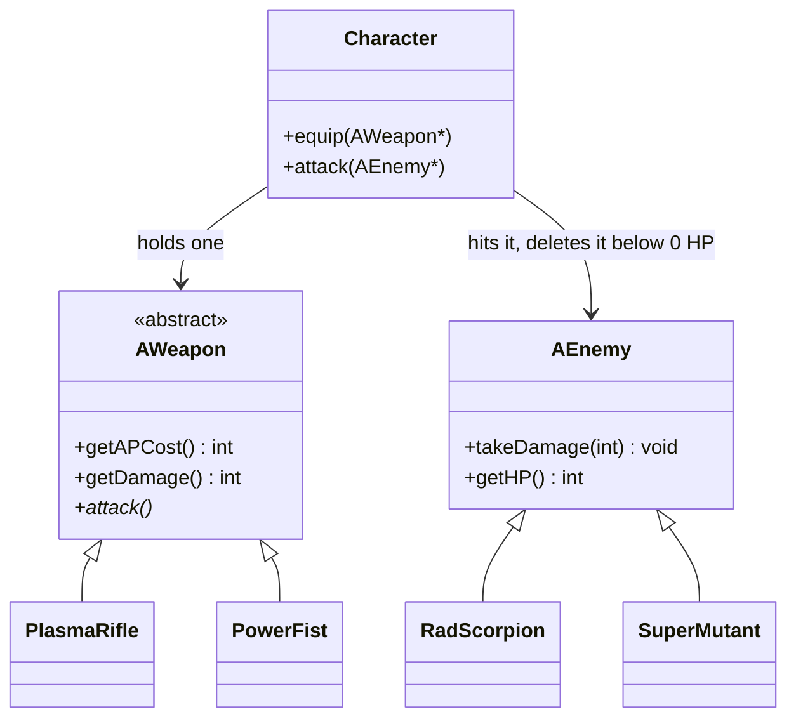

# C++ Pool — Day 10: operator overloading and abstract classes

[](https://antoinepoisson.github.io/Old-School-Projects/projects/cpp-d10-2019)

 

[Tek2](../../README.md) / [CPPool](../README.md) / **cpp_d10_2019**

*Epitech project · C++ Seminar (B-CPP-300) · January 2020 · 1 day · Grade B*

> Teach the compiler what `<<` means for a type you invented, then write a class nobody is allowed
> to instantiate.

**Nothing here ships a `main`.** The 28 source files (922 lines) are compiled against the school's
own test program with `-W -Wall -Werror -Wextra -std=c++14`. Header signatures, constructor side
effects and printed text all have to match the specification exactly — down to the spacing inside
`* pschhh... SBAM! *`.

Rebuilt against the subject's own sample mains, the three exercises turned in — the day lists five —
compile without a single warning and reproduce the expected output byte for byte, from
`* click click click *` down to the final `* SPROTCH *`.

**First idea: dispatch decided at compile time.** `friend` is banned, so the four `operator<<`
overloads are free functions that reach the object only through public getters. `Sorcerer` then
carries two `polymorph` overloads — one for `const Victim &`, one for `const Peon &` — and
`getPolymorphed()` is deliberately *not* virtual.

The compiler picks the overload from the **static** type of the argument. Same call site shape,
two different sentences:

```cpp
Victim jim("Jimmy");
Peon   joe("Joe");

robert.polymorph(jim);   // Jimmy has been turned into a cute little sheep!
robert.polymorph(joe);   // Joe has been turned into a pink pony!
```

Bind `joe` to a `const Victim &` and that second call prints the sheep line instead — the sentence
follows the reference type, not the object. That failure is the whole argument for exercise 1.

| Overload | Type | What it means for this type |
| --- | --- | --- |
| `operator<<` | `Sorcerer` | `I am Robert, the Magnificent, and I like ponies!` |
| `operator<<` | `Victim` | `I'm Jimmy and I like otters!` |
| `operator<<` | `Peon` | the same sentence — a free function has no virtual dispatch, so `Peon` needs its own |
| `operator<<` | `Character` | name, remaining AP, and the weapon it wields (or `is unarmed`) |
| `operator=` | `Squad` | destroy the units held, then deep-copy the other squad's |

**Second idea: the same choice, made at runtime.** `AWeapon` declares
`virtual void attack() const = 0`, which makes it uninstantiable — a promise the compiler enforces
on every child. `Character` stores an `AWeapon *` and takes an `AEnemy *`, and never learns what
either one really is.

`AEnemy` is the instructive counter-example. The imposed skeleton gives it a virtual `takeDamage`
and no pure virtual method at all, so in spite of the `A` in its name it stays instantiable —
`AWeapon` is the only class in the exercise that is truly sealed off.



| Concrete class | Base | Numbers |
| --- | --- | --- |
| `PlasmaRifle` | `AWeapon` | 5 AP, 21 damage |
| `PowerFist` | `AWeapon` | 8 AP, 50 damage |
| `RadScorpion` | `AEnemy` | 80 HP |
| `SuperMutant` | `AEnemy` | 170 HP, overrides `takeDamage` to absorb 3 |

Adding a third weapon touches zero existing lines, and the virtual destructor is what pays for that
freedom. `Character::attack` calls `delete` on an `AEnemy *`, so removing `virtual` from `~AEnemy()`
does not even get past the compiler: `-Wall` reports *delete called on non-final 'AEnemy' that has
virtual functions but non-virtual destructor*, and `-Werror` turns that into a failed build.

**Third idea: an interface with no implementation at all.** `ISpaceMarine` and `ISquad` are imposed
headers holding nothing but pure virtual methods and an empty virtual destructor — 7 of the
project's 8 pure virtual declarations live in those two files. The interesting one is `clone()`,
which lets a container duplicate objects whose type it cannot name.

`Squad` owns a raw `ISpaceMarine **` that starts at 50 slots and doubles on overflow. `position` is
at once the insertion cursor and the number `getCount()` reports:

```cpp
// ex02/Squad.cpp
int Squad::push(ISpaceMarine *element)
{
    if (!element)
        return (position);
    for (int i = 0; i < size_tab; i++) {
        if (list[i] == element)
            return (position);
    }
    if (position >= size_tab)
        increasing_table();
    list[position] = element;
    position += 1;
    return (position);
}
```

`TacticalMarine` and `AssaultTerminator` each return `new T(*this)` from `clone()`, so the squad
calls one virtual method and gets back the right type without a single `dynamic_cast`. Its
destructor then walks the array and deletes the units in order.

**Two things a re-read turns up.** The copy constructor clones every marine correctly but leaves
`position` at zero, so a copied squad holds its units while `getCount()` answers 0 — reproduced by
building it. `operator=` deletes the old array before reading the source, which is precisely the
self-assignment case the canonical form exists to force you to handle.

`Character`'s `operator<<` takes `os` and returns `os` yet writes to `std::cout`: send a character
into a `std::ostringstream` and the text lands on the terminal while the buffer stays empty. An
overload that ignores its stream cannot compose, which is the one property the exercise is about.

## Technical stack

C++ compiled with `g++ -std=c++14`, standard library only. Git.

The subject bans `malloc`/`free`, `printf`, `open`/`fopen`, `using namespace` and `friend`; none of
them appear in the 28 files. 15 classes, 8 pure virtual declarations, 4 destructors declared
`virtual`, 4 `operator<<` overloads and one `operator=`.

## Build & run

No Makefile and no executable: each exercise is a set of classes, compiled on its own against a
`main` you supply.

```console
$ cd ex01
$ cp ../my_main.cpp .          # the exercises ship none
$ g++ -W -Wall -Werror -Wextra -std=c++14 *.cpp
$ ./a.out
* click click click *
Predator has 40 AP and is unarmed
Predator has 40 AP and wields a Plasma Rifle
Predator attacks RadScorpion with a Power Fist
* pschhh... SBAM! *
Predator has 32 AP and wields a Power Fist
Predator has 32 AP and wields a Plasma Rifle
Predator attacks RadScorpion with a Plasma Rifle
* piouuu piouuu piouuu *
Predator has 27 AP and wields a Plasma Rifle
Predator attacks RadScorpion with a Plasma Rifle
* piouuu piouuu piouuu *
* SPROTCH *
Predator has 22 AP and wields a Plasma Rifle
```

---

[Tek2](../../README.md) / [CPPool](../README.md) · [⌂ All projects](../../../README.md)
