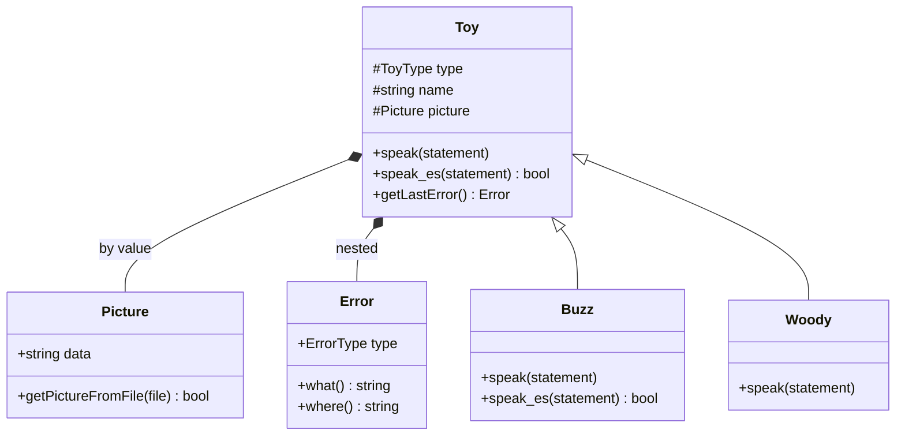
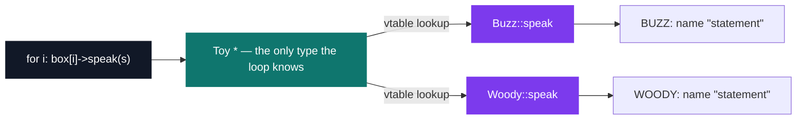

# C++ Pool — Day 13: polymorphism and interfaces

[](https://antoinepoisson.github.io/Old-School-Projects/projects/cpp-d13-2019)

 

[Tek2](../../README.md) / [CPPool](../README.md) / **cpp_d13_2019**

*Epitech project · C++ Seminar (B-CPP-300) · January 2020 · 1 day · Grade B*

> One box, two kinds of toy, one call site — and each toy answers in its own voice.

The deliverable ships **no `main`**. The grader writes it. Forty headers and implementations are
compiled against driver code the author never sees, so every class has to behave correctly under
calls it was not written for.

That is the whole point of polymorphism, and the day is built to force it: a `Toy *` that is really
a `Buzz` must answer as a `Buzz`. The loop that calls `speak()` knows only the base type.

The subject bans `*alloc`, `free`, `*printf`, `open`, `fopen`, `friend` and `using namespace`, and
grades every exercise under `-Wall -Wextra -Werror`. With the C file APIs gone, every byte of ASCII
art comes in through an `std::ifstream` and every string is an `std::string`. All six folders still
compile clean under those three flags — though `ex05` needs at least `-std=c++11`, because its
nested `Error` declares `~Error() = default`.

Six folders, **1,540 lines** across 40 files, are six successive states of the *same* four classes.
Each `exXX` keeps the trace of one step, so the diff between two folders is the lesson.

| Step | Lines | What it adds |
| --- | --- | --- |
| `ex00` | 161 | `Picture` reads ASCII art through `std::ifstream`; `Toy` holds one by value |
| `ex01` | 186 | Canonical form — `operator=` on both classes, plus a copy constructor on `Toy` |
| `ex02` | 258 | `Buzz` and `Woody` inherit `Toy`; `ToyType` gains two values; `~Toy()` turns `virtual` |
| `ex03` | 277 | `speak()` becomes `virtual` — one call site, two voices |
| `ex04` | 293 | `<<` overloaded twice, pointing in opposite directions |
| `ex05` | 365 | Nested `Toy::Error` with `what()` / `where()`, plus a `speak_es()` |

The subject runs to seven exercises. `ex06` — a `ToyStory::tellMeAStory` walking a story file line
by line and dispatching each line through a pointer-to-member-function (`&Toy::speak` or
`&Toy::speak_es`) onto alternating toys — is not in this delivery. Everything through the nested
`Error` class is.

`Toy` owns a `Picture` **by value** and, from `ex05`, an `Error` **nested inside its own class
scope**. `Buzz` and `Woody` derive from `Toy` and override `speak()`; only `Buzz` overrides
`speak_es()`.



`speak()`, `speak_es()` and the destructor are the three `virtual` members. The destructor turns
virtual in `ex02` — one exercise *before* `speak()` does — and that order matters: the moment toys
are stored behind a `Toy *`, deleting one through the base pointer without a virtual destructor is
undefined behaviour, whatever the rest of the hierarchy looks like.

**One loop, types it has never heard of.** The array is declared as `Toy *`. Virtual dispatch picks
the override at run time, from the object, not from the pointer.



A driver of the shape the grader supplies, compiled against `ex05`:

```cpp
Buzz buzz("Buzz Lightyear");
Woody woody("Sheriff Woody");
Toy *box[2] = { &buzz, &woody };

for (int i = 0; i < 2; i++)
    box[i]->speak("To infinity and beyond");
for (int i = 0; i < 2; i++)
    if (!box[i]->speak_es("Hola"))
        std::cout << box[i]->getLastError().where() << ": "
                  << box[i]->getLastError().what() << std::endl;
```

```text
BUZZ: Buzz Lightyear "To infinity and beyond"
WOODY: Sheriff Woody "To infinity and beyond"
BUZZ: Buzz Lightyear senorita "Hola" senorita
speak_es: wrong mode
```

**The trap the day is really about.** `Toy` stays copyable by value, and from `ex02` on it drops the
explicit copy constructor and leans on the implicit one. `Toy copy = buzz;` is then ordinary C++ —
no cast, no diagnostic required, nothing for `-Werror` to catch — and it quietly throws the `Buzz`
half away:

```text
Buzz Lightyear "Hello"      // copy.speak() — the BUZZ: prefix is gone
```

Nothing in the language stops it. The defence is a design choice, not a check: the heterogeneous
box holds `Toy *`, never `Toy`. A `std::vector<Toy>` would slice every toy on insertion and the
polymorphism would evaporate with no diagnostic at all.

**Two `<<`, opposite directions.** `ex04` overloads the same token twice with unrelated meanings —
one member, one free function:

```cpp
// member of Toy — art goes into the toy
Toy & operator<<(std::string const & ascii);

// free function — the toy goes into a stream
std::ostream & operator<<(std::ostream & os, Toy const & toy);
```

The member writes straight into `picture.data`, so it cannot fail. `setAscii()` does the same job
through the filesystem, so it can — and that asymmetry is exactly what `ex05` has to report on.

**Failure without exceptions.** `Toy::Error` is a nested class, and each toy carries its own
instance: a per-object `errno` rather than a global one. The subject insists back in `ex03` that
`speak` must not be `const` and leaves the reason for later — this is it, since `speak_es` has to
write its own failure into the object it was called on. There are precisely two ways to fail, and
`where()` names the method while `what()` names the cause.

| `ErrorType` | `where()` / `what()` | Raised when |
| --- | --- | --- |
| `PICTURE` | `setAscii` / `bad new illustration` | `std::ifstream` cannot open the file |
| `SPEAK` | `speak_es` / `wrong mode` | the toy does not override the Spanish version |
| `UNKNOWN` | empty / empty | initial state, nothing has failed yet |

`Woody` never overrides `speak_es()`, so it inherits the base version, which records `SPEAK` and
returns `false`. Refusing a behaviour is expressed by *not* overriding it — the absence of a method
is the feature. `Picture` follows the same no-throw convention: a missing file leaves `data` at the
literal string `"ERROR"` and returns `false`.

## Technical stack

C++ compiled with `g++`, Git. The only includes in the whole day are `<iostream>` and `<fstream>`:
four classes plus one nested inside `Toy`, four to eight files per exercise, and that is the entire
dependency graph.

## Build & run

No Makefile and no `main` ship with the day. Each exercise compiles on its own against a driver of
your choice, under the flags the subject imposes:

```bash
cd ex05
g++ -Wall -Wextra -Werror -std=c++11 *.cpp your_main.cpp -o toys
./toys
```

`Buzz` and `Woody` default to `buzz.txt` and `woody.txt`, and neither file is in the repository — so
a `Buzz("name")` built without an explicit filename reports `"ERROR"` as its picture, which is the
quickest way to see the no-throw convention in action. A default-constructed `Toy` behaves
differently: it never touches the filesystem at all, and its picture is the empty string.

---

[Tek2](../../README.md) / [CPPool](../README.md) · [⌂ All projects](../../../README.md)
