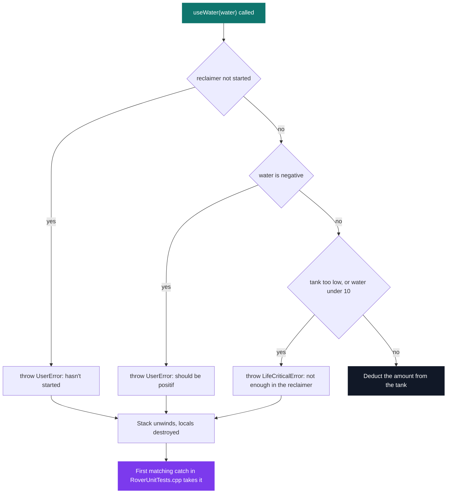
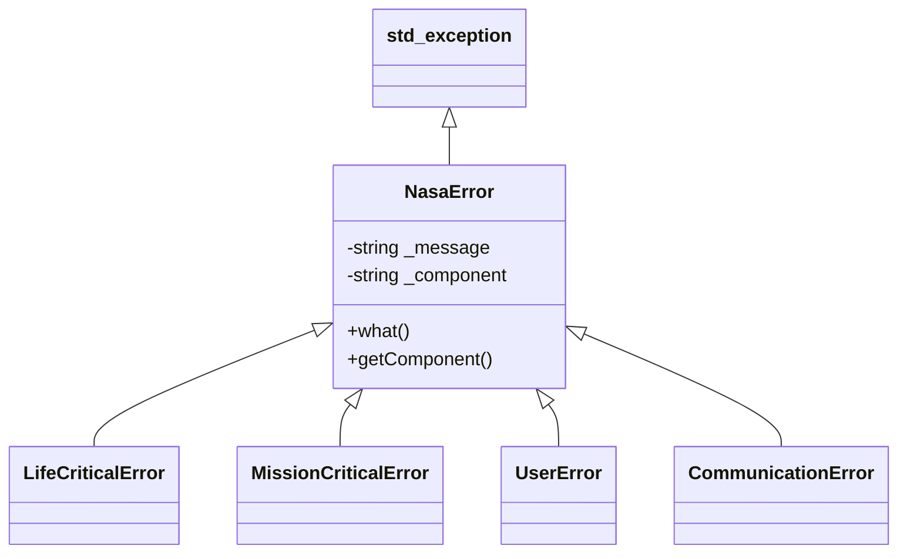

# C++ Pool — Day 14 afternoon: exceptions

[](https://antoinepoisson.github.io/Old-School-Projects/projects/cpp-d14a-2019)

 

[Tek2](../../README.md) / [CPPool](../README.md) / **cpp_d14a_2019**

*Epitech project · C++ Seminar (B-CPP-300) · January 2020 · 1 day · Grade B*

A Mars rover error-reporting system: five exception classes rooted in `std::exception`, four rover
components that throw them, and a 193-line test file shipped with the subject that the code has to
satisfy without a character being changed. `make test` compiles and prints `OK`.

The subject hands over `ex01/RoverUnitTests.cpp` and forbids editing it. Inside are 14 `try` blocks
and 39 `assert`s: 12 compare `what()` byte for byte with `std::strcmp`, 13 check the name of the
faulty component, and 14 sit just after each block to prove an exception was raised at all. Coding
against assertions someone else wrote removes the easy escape hatch — softening an inconvenient
test — which puts it much closer to real work than writing your own tests afterwards.

**Why exceptions, concretely.** A return code needs a caller who bothers to read it. A constructor
has no return value at all, so throwing is its only way to say that it failed.

```cpp
AtmosphereRegulator::AtmosphereRegulator()
{
    NasaError num_two("Not implemented.", "AtmosphereRegulator");
    throw(num_two);
}
```

Two statements, and the whole argument is made. The object never comes into existence, the caller
gets the error anyway, and — the part that bites — `~AtmosphereRegulator` never runs, so anything
the constructor had allocated before the throw is gone. This is the case for RAII, by example.

**The guards decide the message.** `WaterReclaimer::useWater` is where ordering matters most: three
checks, two different exception types, and what the caller reads depends entirely on which one
fires first. Every branch below is a real `if` in the file, in that order.



**The hierarchy carries the severity.** The subject fixes the tree and the code follows it exactly.
The type says how bad the failure is; `getComponent()` says which part of the rover to blame.

| Exception | Meaning | Thrown by |
| --- | --- | --- |
| `LifeCriticalError` | the crew does not survive this | `Oxygenator`, `WaterReclaimer` |
| `MissionCriticalError` | the mission cannot continue | `Oxygenator`, `WaterReclaimer` |
| `UserError` | the order itself is invalid | `Engine`, `WaterReclaimer` |
| `CommunicationError` | radio link, component name fixed in the constructor | declared, never thrown here |
| `NasaError` | base class: message plus faulty component | `AtmosphereRegulator` |

`CommunicationError` is the odd one out: the subject requires its `getComponent()` to always name
the communication device, so the constructor takes a message only and supplies the component
itself. It exists for the day's exercise 2, which is not part of this repository — `ex00` and
`ex01` are.



**Catch order becomes control flow.** Filling an already-full reclaimer throws
`MissionCriticalError`, and the suite triggers it three times in a row to catch the same throw site
as `NasaError const &`, then `std::exception const &`, then `NasaError const &` again.

All three have to match, which is how the suite proves both links of the chain: reaching a
`NasaError` handler proves the first, reaching an `std::exception` handler proves the second.
Catching by reference is what keeps the derived object intact rather than copying a sliced base.

The same ordering rule reappears inside the components. `Oxygenator::useOxygen` tests the
life-threatening threshold (10 units left or fewer) before the mission-threatening one (20 or
fewer), because the severe range sits inside the other; swap the two `if`s and `LifeCriticalError`
can never fire.

**Where the format invites a shortcut.** `Engine::goTorward` refuses exactly four destinations —
`(10, 10)`, `(7, 8)`, `(9, 8)`, `(-10, 7)` — which are exactly the four the suite asks about, while
`_power` is never read anywhere. The build says so out loud.

The rule being probed is "this destination is out of range for this engine's power". The code
stores the answers instead of deriving them, which is the failure mode of treating a test suite as
the specification rather than as a sample of it.

## Technical stack

C++ with pre-C++11 habits throughout and no `-std` flag in the Makefile: `const char *what() const
throw()`, no `override`, no smart pointers. Built by a 32-line Makefile with `g++ -W -Wall
-Wextra` · Git.

14 sources and headers, 613 lines, of which 193 are the test file nobody may edit. Five exception
classes, four rover components, 12 `throw` sites. `ex00/Errors.hpp` and `ex00/Errors.cpp` are
byte-identical to their `ex01/` copies.

## Verification

`make test` links `RoverUnit` from six objects and runs it. Every assertion passes and the binary
prints its single line, with one warning surviving the compile.

```console
$ make test
g++ -W -Wall -Wextra   -c -o AtmosphereRegulator.o AtmosphereRegulator.cpp
g++ -W -Wall -Wextra   -c -o Engine.o Engine.cpp
./Engine.hpp:23:15: warning: private field '_power' is not used [-Wunused-private-field]
...
g++ -o RoverUnit AtmosphereRegulator.o Engine.o Errors.o Oxygenator.o RoverUnitTests.o WaterReclaimer.o
OK
```

The suite is the only check here, and it is a specification with holes. `distanceTo`, `getX` and
`getY` are never called by it, which is why a macro bug survives untouched in `Engine.cpp`:
`ABS(x)` is `(x < 0 ? -x : x)`, so `ABS(x - _x)` expands to `(x - _x < 0 ? -x - _x : x - _x)` and
the negative branch yields `-(x + _x)` instead of the absolute value — from `_x = 3`,
`distanceTo(1, 0)` returns 4 where the answer is 2. Unparenthesised macros hide in untested code.

## Build & run

```bash
make        # builds RoverUnit
make test   # builds, runs the suite, prints OK
```

`ex00/` holds the error hierarchy on its own. `ex01/` holds the rover components, the same
hierarchy, and the test file they must satisfy.

---

[Tek2](../../README.md) / [CPPool](../README.md) · [⌂ All projects](../../../README.md)
