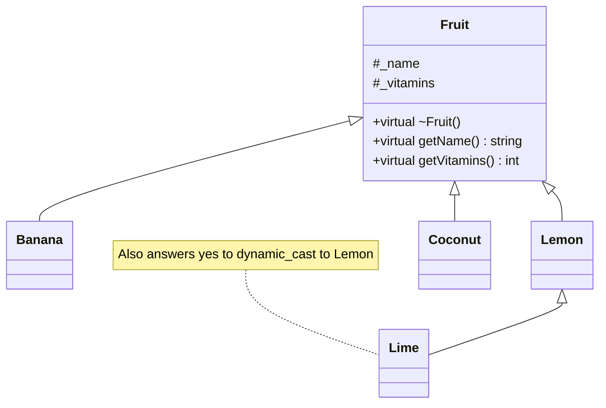
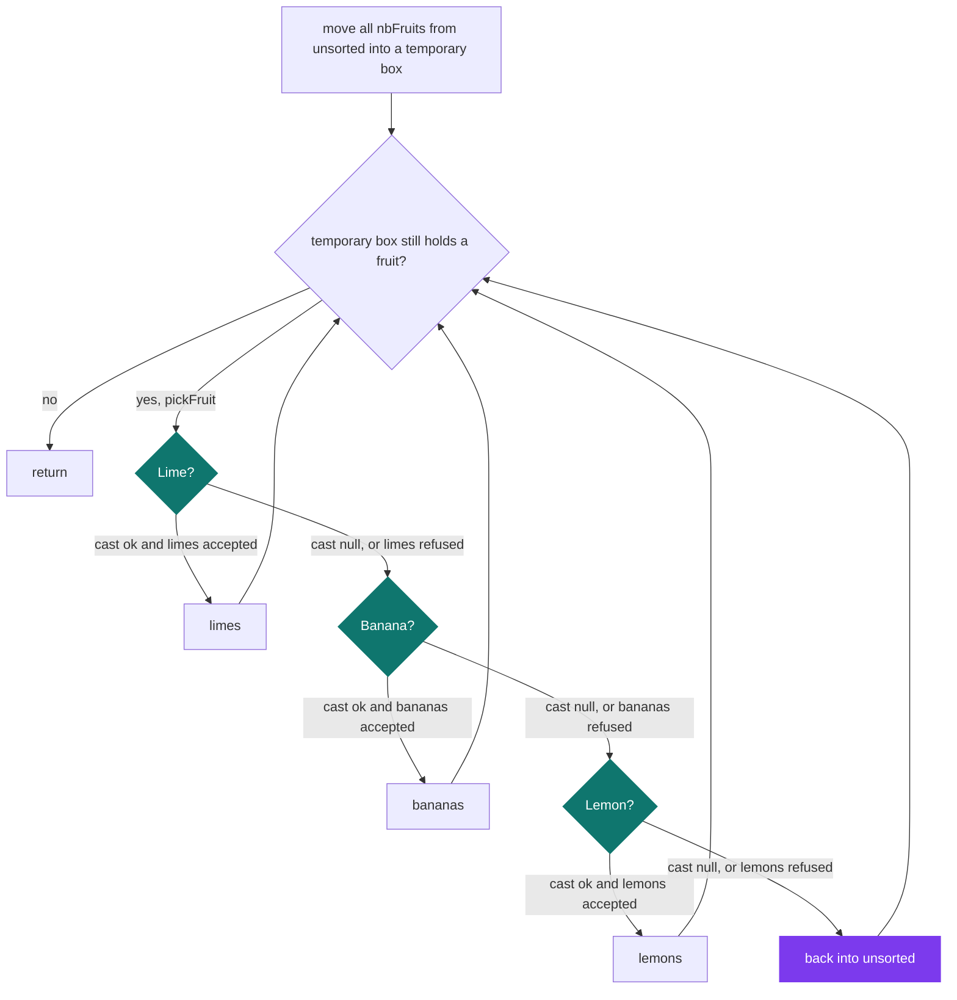

# C++ Pool — Day 14 morning: casting

[](https://antoinepoisson.github.io/Old-School-Projects/projects/cpp-d14m-2019)

 

[Tek2](../../README.md) / [CPPool](../README.md) / **cpp_d14m_2019**

*Epitech project · C++ Seminar (B-CPP-300) · January 2020 · 1 day · Grade B*

> Recovering the real type of an object hidden behind an abstraction — without getting it wrong.

`LittleHand::sortFruitBox` takes one box of mixed `Fruit *` plus three empty ones and lands every
fruit in the box that belongs to it. `FruitBox` is a linked list of `FruitNode`, and a `FruitNode`
carries exactly two members — a `Fruit *` and a `next`. No tag, no enum, no field naming the species.

The only surviving source of truth is the vtable. Four species sit under the base, each with a name
and a vitamin count fixed by its constructor:

| Class | `getName()` | Vitamins | Where it is set |
| --- | --- | --- | --- |
| `Banana` | `banana` | 5 | `Fruit("banana", 5)` initializer list |
| `Lemon` | `lemon` | 3 | `Fruit("lemon", 3)` initializer list |
| `Lime` | `lime` | 2 | assignment in the constructor body |
| `Coconut` | `coconut` | 15 | `Fruit("coconut", 15)` initializer list |

Deriving `Lime` from `Lemon` costs twice. A lime is first built as a lemon — `_name` is `lemon`,
`_vitamins` is `3` — and its own constructor body then overwrites both. And a lime answers yes to
`dynamic_cast<Lemon*>` as readily as to `dynamic_cast<Lime*>`, so test order stops being a matter of
taste and becomes the correctness of the function.



**The dispatch.** Most-derived first, then the two direct children, then the fallback. Each cast is
paired with the `putFruit` that consumes it, so one `&&` decides both "is it this type" and "did the
box take it":

```cpp
Fruit *current_fruit = save->pickFruit();
if (dynamic_cast<Lime*> (current_fruit) != nullptr && limes.putFruit(current_fruit)) {
} else if (dynamic_cast<Banana*> (current_fruit) != nullptr && bananas.putFruit(current_fruit)) {
} else if (dynamic_cast<Lemon*> (current_fruit) != nullptr && lemons.putFruit(current_fruit)) {
} else {
    unsorted.putFruit(current_fruit);
}
```

`unsorted` is both the source and the fallback destination, so iterating it in place would keep
re-picking the fruits just put back and never terminate. The function moves all `nbFruits()`
elements into a temporary box first, then dispatches out of that:



The delivery ships no `main`, so the run below comes from a driver compiled against the `ex02`
headers: one banana, one lemon, one lime and one coconut, sorted into fresh boxes twice — the second
time with a `limes` box of capacity 0.

```console
limes    (1): lime
bananas  (1): banana
lemons   (1): lemon
unsorted (1): coconut

limes    (0):
bananas  (1): banana
lemons   (2): lemon lime
unsorted (1): coconut
```

The second run is what the `&&` chain buys. `limes.putFruit` returns false, the
`dynamic_cast<Banana*>` on the next branch is null so `bananas` is never even asked, and the lime
settles in `lemons` — because a lime *is* a lemon. Overflow degrades one level up the hierarchy
instead of falling straight back to `unsorted`.

**Exercise 2 inverts the problem.** `organizeCoconut` is handed a `Coconut const * const *` — a
null-terminated array of const pointers to const coconuts — and has to return a null-terminated
array of boxes of six. Given 25 coconuts it returns 5 boxes filled 6/6/6/6/1, which is the case the
subject spells out by hand.

```cpp
result[index]->putFruit(dynamic_cast<Fruit*>(const_cast<Coconut *>(const_cast<Coconut * const *>(coconuts)[i])));
```

The `const` cannot survive, because `FruitBox::putFruit` takes a `Fruit *`. The container was never
made const-correct, and an imposed prototype is what makes that visible — the signature is printed
in the subject and no `main` ships with the code, so there is nothing to renegotiate.

Two `const_cast` appear where one does the job: the outer one already hands back a `Coconut *`. The
`dynamic_cast` here is an upcast — resolved at compile time, free, unable to fail — which leaves the
six downcasts in `sortFruitBox` as the only casts that actually read a vtable.

| Cast | What it checks | Here |
| --- | --- | --- |
| `static_cast` | Compile time only; a downcast is taken on trust | not used |
| `dynamic_cast` | Runtime; reads the vtable, yields `nullptr` on a miss | 7 uses: 6 downcasts, 1 upcast |
| `const_cast` | Adds or drops `const`; changes no bits and no type | 2 uses |
| `reinterpret_cast` | Nothing at all; reinterprets the bit pattern | not used |

**What makes any of it work.** `Fruit` declares `virtual ~Fruit()` back in `ex00`, before a single
cast exists. One virtual member is enough to give the class a vtable, and on a class without one
`dynamic_cast` is a compile error rather than a runtime miss.

Each of the four subclasses then re-declares `getName()` and `getVitamins()` with a body identical
to `Fruit`'s, while the identity that actually differs is set by the constructor. That is the same
signal as the downcasting itself: behaviour asked for from the outside usually belongs in a virtual
method on the inside.

**Audit note.** `organizeCoconut` sizes its array at `number / 2 + 1` slots for `ceil(number / 6)`
boxes and zero-fills it, so the terminating null comes free at every input size but one — with
exactly one coconut, the single slot is taken by the single box and reading the terminator walks off
the end. AddressSanitizer confirms it, and sizes 0 and 2 through 60 come back clean.

## Technical stack

C++ with RTTI: `dynamic_cast`, `const_cast`, and a `virtual` destructor as the entry ticket to
runtime type information. Built with `g++`, versioned with Git, no library beyond the standard one.

37 source files and 1,138 lines across three self-contained exercise folders: `ex01` adds `Lime`
and `LittleHand` to `ex00`, `ex02` adds `Coconut` and `organizeCoconut`. The subject runs to five
exercises; `ex00` through `ex02` are what ships here.

## Build & run

No Makefile and no `main` in the delivery — the grader supplies its own driver, and every exercise
compiles on its own with the day's mandatory warning set:

```bash
g++ -Wall -Wextra -Werror ex02/*.cpp your_main.cpp -o run
```

---

[Tek2](../../README.md) / [CPPool](../README.md) · [⌂ All projects](../../../README.md)
