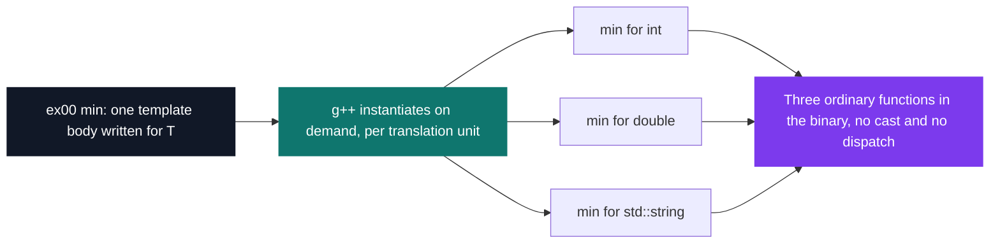

# C++ Pool — Day 15: templates

[](https://antoinepoisson.github.io/Old-School-Projects/projects/cpp-d15-2019)

 

[Tek2](../../README.md) / [CPPool](../README.md) / **cpp_d15_2019**

*Epitech project · C++ Seminar (B-CPP-300) · January 2020 · 1 day · Grade B*

Day 02 gave the C answer to genericity: a `void *`, a cast, and a promise that the caller knew
what was in the box. Day 15 gives the C++ answer — write the logic once, and let the compiler
emit a separate, fully type-checked function for every type that actually turns up.

The gain is double, and the second half is the one people miss. The type is checked at compile
time, **and** genericity costs nothing at run time: there is no cast, no indirection, no dispatch.
Call `min` with three types and the compiler writes three real functions, so the CPU only
ever sees ordinary code.



**The consequence nobody warns you about.** A template is a recipe, not code. The compiler cannot
emit `min` for `std::string` until it sees the recipe and the `std::string` in the same
translation unit. That is why six of the seven exercises here ship as one header and no `.cpp`.

Seven exercises, 8 source files, 365 lines. Each one isolates a different piece of the machinery.

| Exercise | Delivers | Template feature exercised |
| --- | --- | --- |
| `ex00` | `swap`, `min`, `max`, `add` | plain function templates |
| `ex01` | `compare` returning `-1` / `0` / `1` | deduction from two arguments |
| `ex02` | `min` template *and* `min(const int &, const int &)` | overload resolution, template vs exact match |
| `ex03` | `foreach`, `print` | a function parameter, passed generically |
| `ex04` | free `equal` + `Tester<T>::equal` | explicit instantiation in a `.cpp` |
| `ex05` | a full `array<T>` container | class template, total specialisation, member template |
| `ex06` | `Tuple<T, U = T>` | default template parameter |

**ex04 is the exception that proves the rule.** It is the only exercise with a `.cpp`, because the
subject forbids putting the bodies in the header. The only way to make that link is to name, by
hand, every type the template will ever be used with — eight explicit instantiation lines closing
the file, four for the free function and four for the member function.

```cpp
template bool equal<int>(int const &a, int const &b);
template bool equal<float>(float const &a, float const &b);
template bool equal<double>(double const &a, double const &b);
template bool equal<std::string>(std::string const &a, std::string const &b);
```

Separate compilation is bought with a closed type list. Ask for a type that is not on it and the
failure lands at link time, not compile time — the declaration in the header was perfectly happy:

```console
$ g++ -c -Iex04 main.cpp && g++ main.o ex04/ex04.cpp -o test   # main.cpp calls equal('a', 'a')
Undefined symbols for architecture arm64:
  "bool equal<char>(char const&, char const&)", referenced from:
      _main in main.o
```

**ex02 turns the question into an experiment.** A `min` template and a non-template
`min(const int &, const int &)` sit side by side, each announcing itself on stdout, and two array
helpers are made to call them. On an exact match the compiler prefers the non-template, so
`nonTemplateMin` gets the plain function; `templateMin` has to write `min<U>(...)` to force the
template even for `int`.

**ex05 is the centrepiece** — 96 lines of header, the day's longest file, holding an `array<T>`
with copy constructor, `operator=`, `size()`, `dump()` and the subject's asymmetric `operator[]`:
the mutable version *grows* the array when you index past the end, the `const` version throws
`std::exception` because a const array cannot resize.

`convertTo` is the sharpest bit: a template nested inside a template, taking the conversion
function itself as a parameter and deducing the output container type from it.

```cpp
template<typename U>
array<U> convertTo(U(*convert)(const T &)) const {
    array<U> element(_size);
    for (unsigned int i = 0; i < _size; i++)
        element[i] = (*convert)(_stockage[i]);
    return (element);
}
```

`array<bool>` gets a **total specialisation** of `dump()` so booleans print as words. Compiling the
subject's own sample against this header, plus one `array<bool>`, gives exactly the expected output:

```console
$ g++ -Wall -Wextra -Werror -std=c++11 -Iex05 main.cpp && ./a.out
[0, 0, 0, 1]
[]
[0, 0, 1.1]
[0, 0, 1]
[true, false, true]
```

**Two findings from a re-read.** That `dump()` specialisation is no longer a template — a full
specialisation is an ordinary function, so without `inline` it collides at link time as soon as two
translation units include the header, which is the day's own lesson turned back on the code. And
the bounds test reads `index > _size` where it should be `>=`, so exactly one index past the end
slips through both the grow path and the throw.

**ex06 closes on dispatch by overload.** `Tuple<T, U = T>` formats each member through private
`display` overloads for `int`, `float` and `std::string`, with a `display(K)` *template* as the
catch-all. This is ex02 in reverse: the non-template wins on an exact match, and anything else
falls through to the template.

```console
Tuple<int, std::string>  ->  [TUPLE [int:42] [string:"Karadoc toasted sandwich"]]
Tuple<float, char>       ->  [TUPLE [float:1.1f] [???]]
Tuple<int>               ->  [TUPLE [int:42] [int:21]]
```

The third line is the default template parameter doing its job: `U` was never written, so it
became `T`.

## Technical stack

C++ · g++, Git.

## Build & run

Each exercise compiles independently with `g++`; this pool day intentionally has no top-level
Makefile or single executable. The headers carry no `main` — the grader supplies its own — so a
quick check means writing one and pointing the include at a single `exXX` directory:

```bash
g++ -Wall -Wextra -Werror -std=c++11 -Iex05 main.cpp && ./a.out
g++ -Wall -Wextra -Werror -std=c++11 -Iex04 main.cpp ex04/ex04.cpp && ./a.out
```

Only `ex04` needs a second file on the command line. The pool bans `*alloc`, `free`, `*printf`,
`open`/`fopen`, `friend` and `using namespace`, so `array<T>` allocates with `new[]` and releases
with `delete[]`, and every `std::` name in these headers is written out in full.

---

[Tek2](../../README.md) / [CPPool](../README.md) · [⌂ All projects](../../../README.md)
