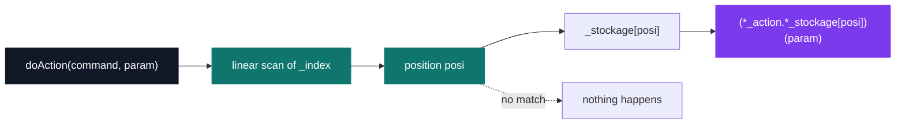
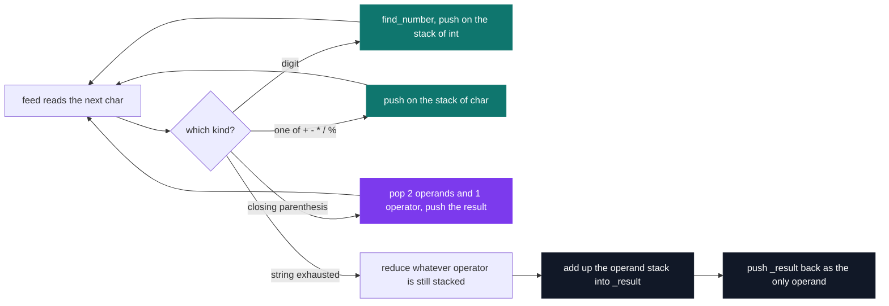

# C++ Pool — Day 16: the standard library

[](https://antoinepoisson.github.io/Old-School-Projects/projects/cpp-d16-2019)

 

[Tek2](../../README.md) / [CPPool](../README.md) / **cpp_d16_2019**

*Epitech project · C++ Seminar (B-CPP-300) · January 2020 · 1 day · Grade B*

A koala that learns commands at runtime, and a calculator that reads an expression one character
at a time and keeps nothing but two stacks. `learnAction('>', &KoalaAction::goTo)` does not store a
function pointer — it stores a **pointer to member function**, and calling one back needs the `.*`
operator that almost nobody writes correctly on the first try.

The subject leaves the type blank — `using methodPointer_t = XXXXX;` with the comment *figuring out
the actual type is up to you*. The header still carries the first guess, commented out one line
under the one that works:

```cpp
using methodPointer_t = void (KoalaAction::*)(const std::string &);
//typedef void (*methodPointer_t)(const std::string &);
```

A plain function pointer cannot bind `&KoalaAction::eat`. A member function needs an object to run
against, so its type has to name the class it belongs to. Getting that alias right is most of the
exercise; the rest is a vector.

Then the call site, where three indirections stack up on a single line:

```cpp
if (posi < _index.size() && _index[posi] == command) {
    (*_action.*_stockage[posi])(param);
}
```

Dereference the stored `KoalaAction *`, apply the member pointer to it with `.*`, call the result.
The outer parentheses are mandatory: `()` binds tighter than `.*`, so removing them — which the
compiler duly rejects — leaves it trying to call `_stockage[posi]` on its own, a member pointer
with no object behind it.

**Two parallel vectors, and that is not an accident.** `_index` holds the command characters,
`_stockage` the matching method pointers, and the same position indexes both.



An `std::map<unsigned char, methodPointer_t>` is the container this dispatch table wants: one
structure instead of two, `O(log n)` lookup, and no way to desynchronise the keys from the values.
The imposed accessor is `const std::vector<methodPointer_t> *getActions() const`, which forces a
contiguous vector of pointers to exist — the interface pins the container, and the second vector
is what keeps the characters somewhere.

`unlearnAction` therefore has to erase at the same index in both, which is the one place where the
two-vector invariant could break and does not. `setKoalaAction` is where the pair drifts from the
brief: it re-points `_action` and stops there, where the subject asks it to clear the table as well.

**The other container, the other exercise.** The subject walks six exercises — vector, list, map,
`ostringstream`, stack, `MutantStack` — and the two turned in are the first and the fifth; the
repository stores them as `ex01` and `ex00` respectively. `Parser` evaluates an arithmetic
expression with two `std::stack`, one of `char` for the five operators `+ - * / %` and one of `int`
for the operands, fed character by character.



Nothing in the code decides operator precedence, and nothing has to. The subject guarantees fully
parenthesized input, so `)` is the only reduction a valid expression ever needs — that one
guarantee removes shunting-yard and its precedence table from the problem. The `DRAIN` step is a
fallback that well-formed input leaves untouched.

The digit branch is the one that bites: `find_number` walks the digits itself to build a
multi-digit value, leaves `i` past them, and the loop body compensates with an `i--` so the outer
`for` does not skip the operator that follows.

The subject's own four expressions, and the values `result()` returns for them — compiled and run
against this code, output identical to the expected one:

```cpp
Parser p;
p.feed("((12*2)+14)");                     // 38
p.feed("((17%9)/4)");                      // 40  -> 2, plus the 38 still on the operand stack
p.reset();
p.feed("(17-(4*13))");                     // -35
p.feed("(((133/5)+6)*((45642%127)-21))");  // 861 -> 896, plus the -35 left behind
```

## Beyond the baseline

`feed` accumulates rather than starting over, and the subject asks for exactly that: *if the
operands stack isn't empty, compute an addition between the current expression result and the
remaining numbers*. The implementation reads that literally — it adds up the entire operand stack
into `_result`, then pushes `_result` back as the single surviving operand.

So state crosses the call. That is why the second `feed` above reports 40 and not 2, why feeding
`(1+2)` then `(3+4)` reports 3 then 10, and why `reset()` — `_result` back to zero, both stacks
popped empty — is what starts a fresh total.

The interesting boundary is the operator stack, which `feed` also drains before returning. Split an
expression on a parenthesis and it still works: `((12` then `*2)+14)` gives 38. End a call one
character later, with `*` still stacked, and the drain pops an operator it has only one operand
for. Whole expressions may cross a `feed`; half of one may not.

## Technical stack

C++ · g++, Git. Four files, 328 lines, no `main` anywhere in them.

The point of the day is picking the container, not writing it. What each one costs, and what makes
it the right answer:

| Container | Cost that matters | Right when |
| --- | --- | --- |
| `std::vector` | amortised `O(1)` push_back, `O(n)` search and erase | you need contiguous storage or an index |
| `std::stack` | `O(1)` push / top / pop, not iterable | LIFO *is* the algorithm |
| `std::list` | `O(1)` insert at a held iterator, `O(n)` search | you splice in the middle constantly |
| `std::map` | `O(log n)` lookup and insert, kept ordered | you address elements by key |

Day 2's afternoon in the same pool built this exact stack by hand: `stack.c`, 37 lines forwarding
to a generic linked list kept in its own files — `stack_push` calls `list_add_elem_at_front`,
`stack_top` calls `list_get_elem_at_front`. Here the whole structure is `#include <stack>` and four
calls: `push`, `top`, `pop`, `size`.

## Build & run

No Makefile: this is a pool day, and each exercise compiles on its own with
`g++ -Wall -Wextra -Werror`, which `Parser.cpp` still passes silently.

```console
$ g++ -Wall -Wextra -Werror -c ex00/Parser.cpp
$
```

`ex01` needs the `KoalaAction` test class to compile, and that class was deliberately left out —
the subject calls it *a custom class, created for your tests, to be erased in your turn-in*,
because the grader supplies its own `main` and includes the headers. `.gitignore` keeps
`ex01/KoalaAction.*` and the scratch `mainee.cpp` out of the repository for the same reason, which
is why `ex01` ships exactly two files.

---

[Tek2](../../README.md) / [CPPool](../README.md) · [⌂ All projects](../../../README.md)
