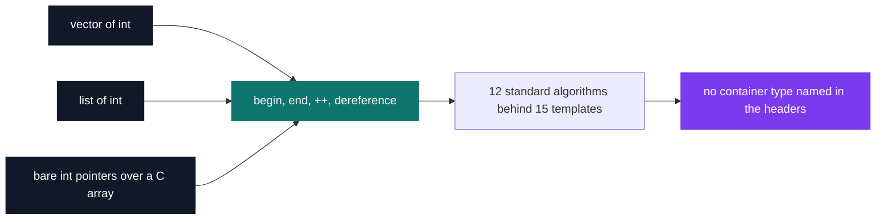
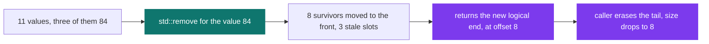

# C++ Pool — Day 17: generic algorithms

[](https://antoinepoisson.github.io/Old-School-Projects/projects/cpp-d17-2019)

 

[Tek2](../../README.md) / [CPPool](../README.md) / **cpp_d17_2019**

*Epitech project · C++ Seminar (B-CPP-300) · January 2020 · 1 day · Grade B*

Fifteen function templates in 113 lines of header: a search, a count, a sort, a merge — each one
running unchanged on a `vector`, on a `list` or on a bare C array without ever naming any of them.
Neither file contains a loop. Every wrapper hands its range to a standard algorithm and gets out
of the way.

The day sets that up on purpose. The grader never sees a `main` — the school compiles **its own**
test program against these headers — and the subject bans, in capitals, recoding any behaviour the
standard library already provides: *"You MUST use the STL algorithms EXCLUSIVELY. You MUST NOT
recode these behaviors yourself."* So the exercise is not writing a search; it is knowing which
algorithm already exists and calling it with the right iterators.

**The contract.** No container type appears anywhere in the two headers. Each function takes a
`T`, then speaks through `begin()`, `end()`, `++` and dereferencing — the single exception being
`vPrint`, which also asks the container for its `size()` to print the `Dump (n)` prefix.



The raw pointer branch is not decoration. `vIsSimilar` compares a container against an `int *`
through `std::equal`, and `vAssign` and `vApply` take two bare pointers as their range. No adapter,
no conversion — a C array is a valid range because a pointer already satisfies the protocol.

| Function | Delegates to | Compiles on `list` |
| --- | --- | --- |
| `do_find` | `std::find` | yes |
| `vPrint` | `std::for_each` | yes |
| `vHowMany` | `std::count` | yes |
| `vIsSimilar` | `std::equal` | yes |
| `vAssign` | `std::fill` | yes |
| `vFindAndModify` | `std::replace` | yes |
| `vFindAndKill` | `std::remove` | yes |
| `vApply` | `std::for_each` | yes |
| `vFlip` | `std::reverse` | yes |
| `vGiveMeTheFirst` | `std::find` | yes |
| `vRemoveDuplicate` | `std::unique` | yes |
| `vFusionOrderedLists` | `std::merge` | yes |
| `vShift` | `std::rotate` | no |
| `vToAscOrder` | `std::sort` | no |
| `vToSpecificOrder` | `std::sort` with a comparator | no |

**Two shapes.** Thirteen of the fifteen take the container and derive the range themselves.
`vAssign` and `vApply` take a raw iterator pair instead, so the caller can aim at a slice rather
than at the whole thing.

```cpp
template<typename T>
typename T::iterator do_find(T& container, int element)
{
    return (std::find(container.begin(), container.end(), element));
}

template<typename T, typename U>
void vApply(T itFrom, T itTo, U funcPtr)
{
        std::for_each(itFrom, itTo, funcPtr);
}
```

**Removing does not shrink.** `std::remove` and `std::unique` cannot resize a container: an
algorithm only holds iterators, and iterators have no idea who owns the memory. They shuffle the
survivors to the front and hand back the new logical end.



Four functions return `typename T::iterator`: `do_find` and `vGiveMeTheFirst`, where the iterator
*is* the answer, and `vFindAndKill` and `vRemoveDuplicate`, where it is the only way for the caller
to finish the erase. The school shipped `MyAlgorithms.hpp` as a skeleton of empty functions, so
those signatures came with the subject — reading them is how you work out which algorithm belongs
in each body.

**Writing into a destination.** The same rule bites harder on `std::merge`, which writes through
`containerToFill.begin()`. That is an output iterator, not an inserter: the destination must
already hold enough slots, or the merge writes past the end.

The day's reference output makes it explicit — the third line is a destination pre-filled with 15
zeros, sized by hand before the call. `vPrint` formats the count with `std::setw(2)`, which is why
the smaller sizes are padded. Compiled against these headers, step 14 reproduces the subject's
listing exactly:

```text
============ Step 14 ==========
Dump ( 8) -842, -842, -2, 2, 3, 4, 16, 18,
Dump ( 7) -42, -7, 1, 12, 42, 99, 99,
Dump (15) 0, 0, 0, 0, 0, 0, 0, 0, 0, 0, 0, 0, 0, 0, 0,
Dump (15) -842, -842, -42, -7, -2, 1, 2, 3, 4, 12, 16, 18, 42, 99, 99,
```

**Where the genericity stops.** Compiled against `std::list`, 12 of the 15 templates build
unchanged; three do not. `vToAscOrder` and `vToSpecificOrder` call `std::sort`, which needs random
access by definition. `vShift` is the interesting one: `std::rotate` itself accepts forward
iterators, and the pin comes from the arithmetic in the call — `container.begin() + nbShift`.
Swapping that for `std::advance` compiles on a `list` and keeps the wrapper container-agnostic.

That is the real lesson of the day. Writing a template is easy; the contract you accidentally sign
is the iterator category your body requires, and it stays invisible until someone hands you a
`list`.

This closes the pool's genericity arc: [day 2](../cpp_d02a_2019/README.md) bought reuse with a
`void *` that had forgotten its type, [day 15](../cpp_d15_2019/README.md) made the type a checked
parameter, and day 17 drops the container from the vocabulary entirely.

## Technical stack

C++ · g++, Git.

Header-only by obligation: templates must be visible at the point of instantiation, and the subject
forbids shipping a `main`. The project's `.gitignore` drops `a.out` and the local driver
`mainee.cpp` for that same reason. The delivery covers the day's two algorithm exercises; the three
that follow in the subject move on to encryption classes and a container wrapper.

## Build & run

Nothing to build on its own — there is no `main` and no Makefile. The headers are included by a
test program that provides the containers and the function pointers:

```bash
g++ -Wall -Wextra -Werror -I ex00 -I ex01 your_main.cpp
```

`vPrint` takes a `void (*)(int)` and `vToSpecificOrder` a `bool (*)(int, int)` comparator, while
`vApply` accepts any callable through a second template parameter — the driver supplies the display
and ordering policies.

---

[Tek2](../../README.md) / [CPPool](../README.md) · [⌂ All projects](../../../README.md)
