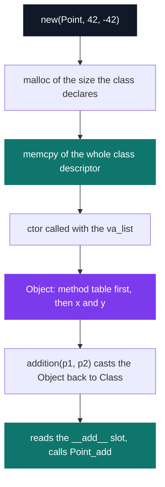
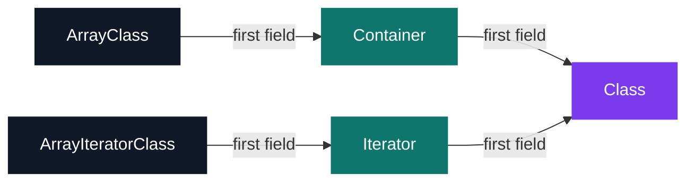

# C++ Rush 1 — SKL, objects in pure C

[](https://antoinepoisson.github.io/Old-School-Projects/projects/cpp-rush1-2019)

  

[Tek2](../../README.md) / [CPPool](../README.md) / **cpp_rush1_2019**

*Team project · C++ Seminar (B-CPP-300) · January 2020 · 1 afternoon · Grade B*

C has no classes, no virtual calls and no destructors. This rush builds all three anyway, in one
afternoon, with the easy way out removed: no `main` in the delivery, because the graders compile
the turned-in files against a `main` of their own.

The answer is 904 lines across seven `.c` files. A `Class` descriptor carries ten function
pointers, a variadic `new()` builds any type from it, and an `Array` container walks its contents
through an iterator class of its own — the machinery C++ hands over ready-made a few days later.

Building the dispatch by hand is the point of the exercise. It is the fastest way to find out what
a virtual call actually costs.

**Construction.** `new()` allocates the byte count the class declares, `memcpy`s the whole
descriptor into that memory, then calls the constructor with the remaining variadic arguments. The
method table ends up *inside* the object, at offset zero.



That offset-zero layout is what makes dispatch legal: any `Object *` can be cast back to `Class *`
and the right function pointer read straight out of the instance. `delete()` does exactly that to
find the destructor it has to call.

The cost sits in plain sight. C++ stores one pointer per object into a single shared vtable; here
every instance carries a full private copy of the table, so a `Point` holding two `int`s leads with
a name, a size and ten function pointers. Self-contained, correct, and far fatter — which is
precisely the comparison the exercise exists to make.

**The twelve-line core.** `new()` is variadic, so it cannot forward `...` to anyone. It splits into
a thin front end and a `va_list` core that the container layer calls directly:

```c
Object *va_new(const Class *class, va_list* ap)
{
    Object *new_obj = malloc(class->__size__);

    if (!new_obj)
        raise("Error Memory");
    memcpy(new_obj, class, class->__size__);
    if (class->__ctor__)
        class->__ctor__(new_obj, ap);
    va_end(*ap);
    return (new_obj);
}
```

Seven class descriptors are built on that core. `Int`, `Float` and `Char` reify the native types so
an integer becomes an object like any other; `Point` and `Vertex` only fill the slots that mean
something for a coordinate.

| Type | Source | Slots filled in the descriptor |
| --- | --- | --- |
| `Int`, `Float`, `Char` | `int.c`, `float.c`, `char.c` | ctor, dtor, str, add, sub, mul, div, eq, lt, gt |
| `Point`, `Vertex` | `point.c`, `vertex.c` | ctor, dtor, str, add, sub |
| `Array` | `array.c` | ctor, dtor + len, begin, end, getitem, setitem |
| `ArrayIterator` | `array.c` | ctor, eq, lt, gt + incr, getval, setval |

**Inheritance, by memory layout.** Containers and iterators need extra member functions, and adding
them to every class would not scale. The subject's answer is an intermediate struct that starts
with the struct it extends, so the base always sits at offset zero and every cast up the chain
stays valid.



`ArrayClass` is therefore three nested structs deep, and its descriptor is written as three nested
initialiser blocks. `begin()` and `end()` return `ArrayIterator` objects that compare on an index,
so `for (it = begin(tab); lt(it, end(tab)); incr(it))` walks the container without ever touching
its internals — the loop the subject sets as the target, and the contract the STL runs on.

**Replaying the argument list.** `new(Array, 10, Float, 0.0f)` reads a size, a type, and then the
arguments meant for the *element* constructor — which have to be consumed ten times. `va_arg`
destroys the list as it walks it, so each element is built from a fresh `va_copy` of the original:

```c
for (;i < (int)this->_size;i++) {
    va_copy(cp_args, *args);
    this->_tab[i] = va_new(this->_type, &cp_args);
    va_end(cp_args);
}
```

Destruction composes the same way. `delete(tab)` on that ten-`Float` array runs `Array_dtor`, which
deletes each element and frees the pointer table, before `delete()` frees the array object itself:
twelve allocations released by one call.

**Audit note.** The iterator guards its index with `_idx >= _size`, while `Array_getitem` and
`Array_setitem` use `i > _size` — one index too permissive. The table is allocated with `_size + 1`
slots, so `getitem(tab, 10)` on a ten-element array returns an allocated but never-initialised
pointer instead of running off the block. `__setval__` is the sharper miss: it reads the incoming
value out of its `va_list` as an `Object *`. Neither path is touched by the sample `main`.

## Beyond the baseline

The delivery covers the five exercises up to `Array`: `new`/`delete`, then `Point`, `Vertex`,
`Int`, `Float`, `Char` and the container — six concrete types on one dispatch mechanism. The sixth
exercise, `List`, and the bonus containers are not part of it.

Two properties are worth pulling out of that set. `Point` and `Vertex` build a new object in their
`__add__` and `__sub__` slots rather than mutating an operand, so `addition(p1, p2)` leaves both
sides untouched; and `Array` owns what it holds — `Array_dtor` deletes every element before freeing
the pointer table — which makes a single `delete` enough for the whole structure.

## Technical stack

C · gcc, Git. Compiled with `-std=gnu11 -Wall -Wextra -Werror`.

## Build & run

The seven `.c` files are the entire turn-in. Headers (`object.h`, `new.h`, `raise.h`,
`container.h`, `iterator.h` and the per-type declarations) and the sample `main` files come from
the subject, as do the partial `point.c` and `array.c` that had to be completed — so the sources
here are compiled against those rather than shipped as a standalone program:

```bash
gcc -std=gnu11 -Wall -Wextra -Werror new.c point.c vertex.c ex03.c -o ex03
gcc -std=gnu11 -Wall -Wextra -Werror new.c int.c float.c char.c array.c ex05.c -o ex05
```

No Makefile and no executable were delivered — each exercise is compiled on its own, all files at
the repository root, exactly as the delivery rules required.

---

[Tek2](../../README.md) / [CPPool](../README.md) · [⌂ All projects](../../../README.md)
