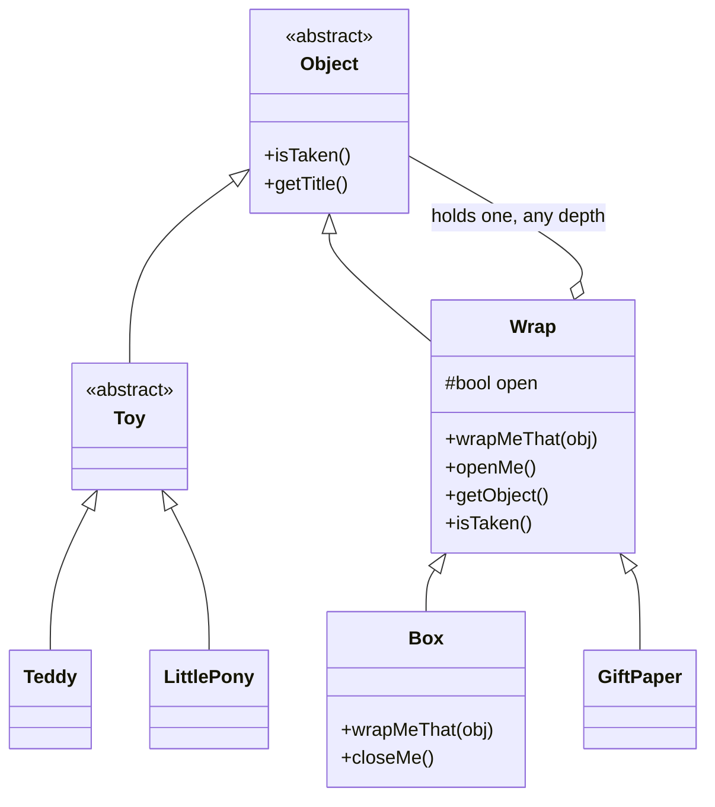
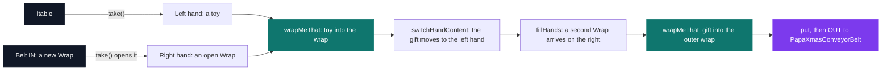

# C++ Rush 2 — Santa Claus

[](https://antoinepoisson.github.io/Old-School-Projects/projects/cpp-rush2-2019)

  

[Tek2](../../README.md) / [CPPool](../README.md) / **cpp_rush2_2019**

*Team project · C++ Seminar (B-CPP-300) · January 2020 · 1 afternoon · Grade B*

A gift-wrapping line for Santa, in C++, deduced rather than specified. The delivered hierarchy makes
a wrapped present itself wrappable — a teddy into a box, the box into gift paper, and outwards
without limit — and a table, a conveyor belt and an elf sit on top of it as a working assembly
sequence.

The statement calls itself "deliberately opaque" and then proves it: it is a scattered bullet list,
and the class diagram has to be reverse-engineered out of it before a single line of C++ is written.

The decisive edge is the one the list refuses to state. It says a `Box` is a `Wrap`, a `GiftPaper`
is a `Wrap`, a `Toy` is an `Object` — and never says what a `Wrap` is.

The imposed test function settles the argument. It must put a `Teddy` into a `Box`, then that same
`Box` into a `GiftPaper`, through one `wrapMeThat` entry point. For a box to be wrappable it must
itself be an `Object`, so `Wrap : public Object` is forced — and that single edge is what makes
wrapping recursive: a wrapped gift is still an `Object`, so it can be wrapped again, to any depth.



`Object` is abstract on `isTaken()`, `Toy` inherits the pure virtual without implementing it, and
`Teddy` and `LittlePony` are what make the toy branch concrete — each with the cry the statement
imposes, `gra hu` and `yo man`. `Wrap` answers the same call with `whistles while working`, which
is how a nested gift announces its own layers.

**The second deduction.** Cardboard and paper behave differently: a closed `Box` refuses to wrap, a
`GiftPaper` never has to be opened first. That whole difference costs one override in `Box` and a
`GiftPaper` constructor that is born open.

```cpp
// Box.cpp — a closed Box refuses, and says why on the error output
void Box::wrapMeThat(Object *obj)
{
    if (open)
        Wrap::wrapMeThat(obj);
    else
        std::cerr << "The Box need to be open" << std::endl;
}

// GiftPaper.cpp — no wrapMeThat override at all: paper is simply born open
GiftPaper::GiftPaper()
{
    open = true;
}
```

Unwrapping is the same idea run backwards. `Wrap::getObject()` hands the content back only when the
wrap is open, and calls `isTaken()` on it on the way out — so peeling a nested gift makes each layer
speak, in order.

**The workstation.** On top of the hierarchy sit the rules that turn it into a production line
rather than a data structure.

| Rule from the statement | Where it lives |
| --- | --- |
| A table collapses when it runs out of room | `Itable::addTableObject` |
| Nothing goes on a belt that already carries something | `IconveyorBelt::IN` |
| `OUT` sends the wrap to Santa's belt and frees the slot | `IconveyorBelt::OUT` |
| Elves receive a fresh wrap by pressing `IN` | `IElf::fillHands` |
| Clients reify a station through a factory | `Itable::createTable`, `IconveyorBelt::CreateConveyorBelt` |

`IElf::makeGift` is six calls, and their order is the trick. The elf has two hands, the belt only
ever yields a `Wrap` that `take()` has already opened, and a finished gift needs two layers — so the
hands have to be swapped mid-sequence to free the right one for the outer wrap.



The delivered line stops where the afternoon did, at the elf. Four stages of the statement stay
open behind it: a randomised stock, the XML serialization of a gift, a separate `santa` program
that deserialises it, and a UDP multicast "warp machine" that carries the XML to several Santas at
once. The `std::ostream` insertion the first page asks of `Object` is not there either.

**One audit note, and it is the lesson of the day.** Despite the prefix, `Itable`, `IconveyorBelt`
and `IElf` are concrete classes with data members and non-virtual methods, and `IElf::makeGift`
takes a `PapaXmasConveyorBelt *` directly: the contract is carried by names and signatures, not by
the language.

`PapaXmasTable` shows the bill immediately. It redeclares `table_size = 100`, which shadows the
base's private `10` instead of replacing it, so the inherited `take()` still scans only the first
ten slots. The base counter also stops one slot early: the ninth object fits, the tenth collapses
the table.

## Beyond the baseline

Two extra `main` programs were written on top of the imposed tests. `test/main.cpp` drives the full
wrap-then-unwrap cycle; `test/mainee.cpp` assembles a real workstation — table, belt, Santa's belt,
one elf — and tells the elf to make a gift.

## Technical stack

C++ · g++, Git.

| Metric | Value |
| --- | --- |
| Classes | 12 |
| Source files | 25 `.cpp` / `.hpp` at the project root, 904 lines |
| Test programs | 2 in `test/`, plus the 2 imposed `MyUnitTests` overloads |
| `dynamic_cast` sites | 6 in the class files, 5 more in `test/main.cpp` |

Those downcasts are the price of the imposed signatures. `MyUnitTests` receives a flat `Object **`
and has to recover the `Box` and the `GiftPaper` from it before it can call `openMe`; the elf holds
its hands as `Object *` and has to recover the `Wrap` before it can wrap anything.

The pool forbids `*alloc`, `free`, `*printf`, `open`, `fopen` and `using namespace`. No call to any
of them appears in the tree, and all 13 translation units compile clean under
`-Wall -Wextra -Werror`.

## Verification

The two `MyUnitTests` overloads come from the statement: the first returns a `LittlePony` titled
`happy pony` and a `Teddy` titled `cuddles`, the second nests the teddy in a box and the box in a
gift paper, then returns the present.

`test/main.cpp` unwraps that present again, layer by layer. This is what the binary prints:

```console
$ ./unwrap
yo man
gra hu
happy pony is a LittlePony
cuddles is a Teddy
tuuuut tuuut tuut
tuuuut tuuut tuut
Obj is a Pretty GiftPaper
whistles while working
Obj is a The Box
gra hu
open it and you will find cuddles
```

The last five lines are the recursion unwinding: the paper is named, then opened, and the `Box` it
hands back identifies itself as a `Wrap` (`whistles while working`); the box opens in turn, and the
teddy screams `gra hu` as it comes out.

## Build & run

No Makefile was delivered. Both test programs link against the same class files, so each one is a
single `g++` line from the project root.

```bash
# wrap and unwrap: toy -> box -> gift paper -> back out
g++ -Wall -Wextra -Werror -o unwrap test/main.cpp Object.cpp Toy.cpp Teddy.cpp \
    LittlePony.cpp Wrap.cpp Box.cpp GiftPaper.cpp MyUnitTests.cpp

# full workstation: table + belt + Santa's belt + one elf
g++ -Wall -Wextra -Werror -o line test/mainee.cpp *.cpp
```

---

[Tek2](../../README.md) / [CPPool](../README.md) · [⌂ All projects](../../../README.md)
