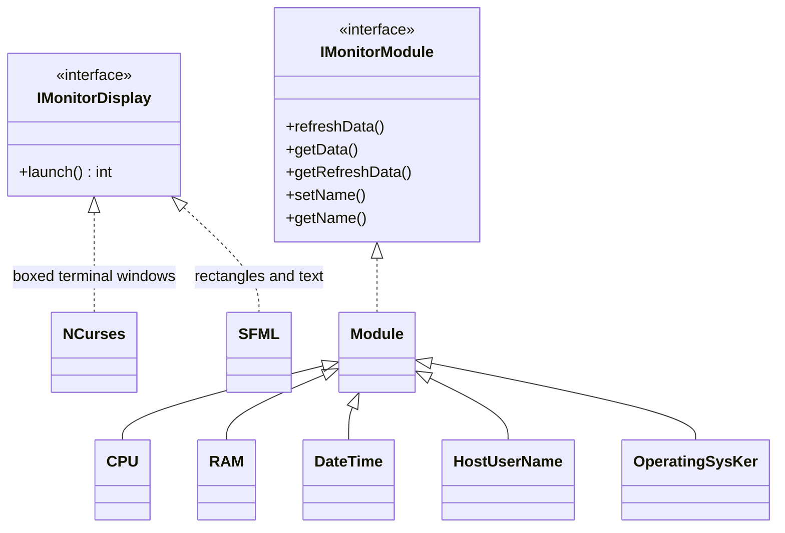
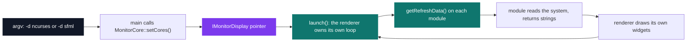

# C++ Rush 3 — MyGKrellm

[](https://antoinepoisson.github.io/Old-School-Projects/projects/cpp-rush3-2019)

   

[Tek2](../../README.md) / [CPPool](../README.md) / **cpp_rush3_2019**

*Team project · C++ Seminar (B-CPP-300) · January 2020 · 1 afternoon · Grade B*

MyGKrellm reports live machine state — host, kernel, clock, memory, processor load — through two
renderers that share no drawing code. ncurses stacks boxed 32-column sub-windows and repaints about
ten times a second; SFML paints 250 × 170 px cards into a 261 × 950 px window, refreshed once a
second inside a 60 fps event loop.

Everything a renderer gets back from a module is a `std::vector<std::string>`. The display contract
is one method — `launch()` — and the measurement code never learns which technology is drawing it.



**Five modules, five different places to look.** No two metrics come from the same source, and the
shared `Module` base hides that behind one `refreshData()` call.

| Module | Read from | What lands in `_data` |
| --- | --- | --- |
| `HostUserName` | `gethostname()`, `getlogin_r()` | host, user |
| `OperatingSysKer` | `uname()` | kernel release, system name |
| `DateTime` | `time()`, `ctime()` | date, `hh:mm:ss` |
| `RAM` | `sysinfo()`, plus the `free` command | total bytes, used percent |
| `CPU` | `/proc/stat` | previous sample, load percent |

`RAM` is the blunt one. `sysinfo()` hands over the byte total, but the used percentage comes from
`std::system("free | grep 'Mem:' > /tmp/.123456789")` and two `substr` slices taken at fixed column
offsets 12 and 24 of the line that lands in the file.

The renderer pulls; the modules never push. `main` parses `-d`, takes the module list from
`MonitorCore::setCores()`, picks an implementation once, and from then on talks only through an
`IMonitorDisplay *`.



Because the loop belongs to the renderer, each one picks its own cadence — a `usleep(100000)` in the
terminal, a one-second `sf::Clock` gate in the window — without the modules knowing or caring.

**CPU load is not a number you can read.** `/proc/stat` only exposes monotonic tick counters, so the
module keeps the previous sample and divides the delta of busy ticks (user, nice, system) by the
delta of total ticks. That state lives in the same string vector the display consumes: slots 0 and 1
hold the last sample, slot 2 the percentage that gets drawn.

```cpp
if (std::stoi(_data[0]) != 0) {
    int workF = work - std::stoi(_data[0]);
    int totalF = total - std::stoi(_data[1]);
    int res = ((double)workF / (double)totalF) * 100;
    _data[2] = std::to_string(res);
}
_data[0] = std::to_string(work);
_data[1] = std::to_string(total);
```

The module's own name is the row selector: `refreshData()` walks `/proc/stat` for a line whose first
token equals `_name`, and the core builds `CPU("cpu")`. Per-core monitoring looks like a constructor
argument away, and it is not — the `std::stringstream` the lines are fed into is never cleared, so
from the second row on the reader pulls leftover tick counts instead of row names. `CPU("cpu0")`
never matches; the aggregate row works only because it comes first.

**The forbidden list removed the easy path.** `*alloc`, `free`, `*printf`, `open`, `fopen` and the
`using namespace` keyword are all out, which is why `/proc/stat` goes through `std::ifstream` and
every character on screen is placed by the ncurses `mvprintw` / `mvwprintw` family.

The binary name is imposed too — a single `MyGKrellm` — so the mode has to be resolved from `argv`
rather than at link time. `src/MainText.cpp` and `src/MainGraphical.cpp` survive from an abandoned
two-binary layout: single-statement forwarders the Makefile's source list no longer mentions.

Here is what the terminal renderer paints for the last two modules, reconstructed column by column
from `NCurses::doRAM` and `NCurses::doCPU` — 32 columns wide, one boxed `WINDOW` per module, the
five of them stacked top to bottom:

```text
┌──────────────────────────────┐
│            RAM :             │
│                              │
│[||||||||||                  ]│
│    used RAM : 41.226841%     │
│    size RAM : 16G            │
└──────────────────────────────┘
┌──────────────────────────────┐
│            CPU :             │
│                              │
│ |||||                       ]│
│              23%             │
└──────────────────────────────┘
```

**The price of a stringly-typed contract.** Handing the renderer `vector<string>` is what lets two
unrelated toolkits consume one model, but it pushes every formatting decision downstream. ncurses
runs `atof` then `trunc` on the byte total to print `16G`; SFML reads the *length* of that same
stringified float — 17 characters means one digit, 18 means two — and slices the front off it. One
string, two decoders.

The abstraction is one-directional: modules ignore displays, but both displays `dynamic_cast` to
every concrete module type to pick a widget. Level 1 of the subject asks for modules addable and
removable at runtime, and the pieces are in place — `setModule` and `unSetModule` mutate a live
core, the terminal loop already gates each widget on a per-module flag — but nothing is wired to an
input, and the delivered composition stays hard-coded in `MonitorCore::setCores()`.

Twenty-four source files, 1,210 lines, an afternoon.

## Beyond the baseline

- The subject asks for a histogram where a number will not do, and both modes draw one: the terminal
  fills a 28-cell bar for RAM and CPU, the window grows a 90 px column that turns yellow above 50%
  and red above 80%.
- The font travels with the project (`src/font/Arial.ttf`) and is loaded at startup — `exit(84)` if
  it is missing — so the graphical mode does not depend on the host's installed fonts.
- The terminal mode measures `COLS` and `LINES` before every frame and puts up a bold red warning
  instead of a garbled grid when the window is too narrow for a 32-column core.
- The interface / implementation split is the same pattern reused a semester later for Arcade's
  runtime-swappable renderers.

## Technical stack

C++ · SFML, ncurses · Makefile, g++, Git.

## Build & run

```bash
make                      # g++ -I./includes, links ncurses + sfml-graphics/window/system
./MyGKrellm -d ncurses    # terminal mode; ESC quits
./MyGKrellm -d sfml       # graphical mode
```

`-d` is case-insensitive and falls back to ncurses when absent or unrecognised. The SFML mode loads
its font from `./src/font/Arial.ttf`, so launch it from the project root. `/proc/stat`, `sysinfo()`
and the `free` shell-out make the binary Linux-only.

---

[Tek2](../../README.md) / [CPPool](../README.md) · [⌂ All projects](../../../README.md)
