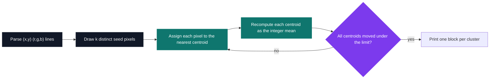
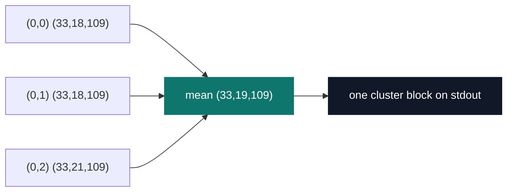

# Image Compressor — k-means in Haskell

[](https://antoinepoisson.github.io/Old-School-Projects/projects/fun-imagecompressor-2019)

  

[Tek2](../../README.md) / [Functional](../README.md) / **FUN_imageCompressor_2019**

*Epitech project · Functional programming (B-FUN-400) · April 2020 · 2 weeks · Grade A*

> Reducing a photograph to sixteen dominant colours, by unsupervised learning, without a single
> mutable variable.

k-means is a loop built around a mutable accumulator: `k` centroids that shift a little on every
pass, until they stop shifting. Haskell offers nowhere to put them.

So the loop becomes a recursion that carries the centroid list from round to round, and
"has it converged?" stops being an implicit property of a variable. It becomes an explicit
comparison between the list you had and the list you just computed — a value you can print, test
and reason about.



**The convergence limit is a parameter you have to defend.** Centroids are *integer* means —
`calcMeans` sums a group and closes with `div` — so a centroid only ever lands on a whole RGB
triple, and the smallest non-zero move it can make is a distance of exactly `1`.

A limit of `1` or below therefore asks for movement the arithmetic cannot express: the loop then
stops only once every centroid has stopped moving altogether. Set it too high instead and the run
ends on a palette that still visibly bands. There is no safe default, which is why the subject
makes it an argument rather than a constant.

**One flat row type carries everything.** Pixels, centroids and cluster members are all `[[Int]]`,
six slots per row, hand-packed and read back by position.

| Slot | Holds | Rewritten by |
| --- | --- | --- |
| `0` | cluster id (the seed pixel's file index) | `compareListToRef`, on every pass |
| `1`, `2` | `x`, `y` | never |
| `3`, `4`, `5` | `r`, `g`, `b` | `handleMeans`, integer mean of the group |

The cluster id is not `0..k-1`: it is the position in the file of the pixel that seeded the group.
`indexing` stamps that position onto every row as the file is parsed, which is what lets
`finderCloser` hand a cluster's identity back as a plain `Int` and `getSameIndex` regroup by it.
`selectReference` then draws `k` seeds by rejection sampling — a whole row already taken compares
equal and is redrawn.

**The distance, and what a positional row costs you.** `calcDistance` reads slots 2, 3 and 4:

```haskell
calcDistance :: [Int] -> [Int] -> Float
calcDistance [] [] = 0
calcDistance a b = sqrt (fromIntegral ((((a!!2)-(b!!2))^(2::Int)) + (((a!!3)-(b!!3))^(2::Int)) + (((a!!4)-(b!!4))^(2::Int))))
```

With colour starting at slot 3, those are `y`, `r` and `g`. The pixel's vertical position is
weighted like a colour channel, and blue reaches neither the assignment nor the convergence test —
both call this one function. One slot off, on a row layout the type checker knows nothing about; a
record with named fields, or a `data Pixel`, makes the mistake unrepresentable. That is the
argument for them, in three lines.

**What the output looks like.** Each cluster prints a `--` separator, its mean colour, a `-`, then
its pixels.



Those three pixels, `k = 1`, limit `0.8`, printed exactly as `displayResult` and `displayList`
emit them. The header green is `(18 + 18 + 21) div 3 = 19`, and whichever of the three the seed
draw lands on, the block comes out identical:

```text
--
(33,19,109)
-
(0,0) (33,18,109)
(0,1) (33,18,109)
(0,2) (33,21,109)
```

**Nothing reaches the loop unchecked.** Three validators run before the first draw, and any failure
prints a message and exits `84`:

| Check | Rejects |
| --- | --- |
| `checkargs` | an empty colour count or limit, or one containing anything but digits and `.` |
| `checkopen` | any token in the file outside `0-9`, `,`, `(`, `)` |
| `check_k` | `k = 0`, or `k` larger than the number of pixels |

The last one matters: without it, `selectReference` would loop forever looking for a `k`-th
distinct seed in an image that has fewer than `k` pixels.

**The known failure mode is visible in the code.** When a group loses every pixel,
`getSameIndex` returns `[]`, `calcMeans []` returns `0`, and that centroid collapses to `(0,0,0)` —
it parks in the corner of the colour cube and pulls in the darkest pixels on the next pass. Classic
k-means: the result depends on the initial draw, and this implementation lets you watch it happen.

**230 lines, one file.** `app/Main.hs` holds the whole program: 29 top-level functions, no
mutation anywhere, and a single impure step inside the algorithm — the `IO` draw of the seeds, with
the file read and the printing bracketing it. Outside `base`, it imports exactly one thing,
`System.Random`; the `src/Lib.hs` that `stack new` generated is still its `someFunc` skeleton,
linked into the executable and imported by nothing.

The executable is linked threaded with every core made available (`-threaded -rtsopts
-with-rtsopts=-N`), and `parallel` sits in the dependency list unused. The assignment pass — the
obvious place to split the work across those cores — stays a plain recursion.

## Technical stack

Haskell (GHC, `Haskell2010`) · Stack with hpack — `package.yaml` generates `imageCompressor.cabal`
· resolver `lts-14.11`, no `extra-deps` · Makefile wrapper · Git.

## Build & run

```bash
make                                # stack build --copy-bins, then renames the binary
./imageCompressor 16 0.8 pixels.txt
```

| Argument | Meaning |
| --- | --- |
| `16` | number of colours in the final image (`k`) |
| `0.8` | convergence limit |
| `pixels.txt` | one `(x,y) (r,g,b)` pixel per line |

`stack build` drops the executable in a system-dependent directory, so the Makefile copies it out
with `--local-bin-path ./test/` and renames `imageCompressor-exe` to the imposed name
`imageCompressor`.

## Original documentation

The [upstream README](./README.upstream.md) is a single title line — the original repository shipped
no usage notes, so the argument order above is read straight from `main`.

---

[Tek2](../../README.md) / [Functional](../README.md) · [⌂ All projects](../../../README.md)
