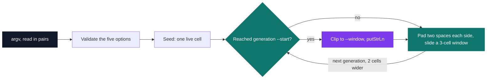
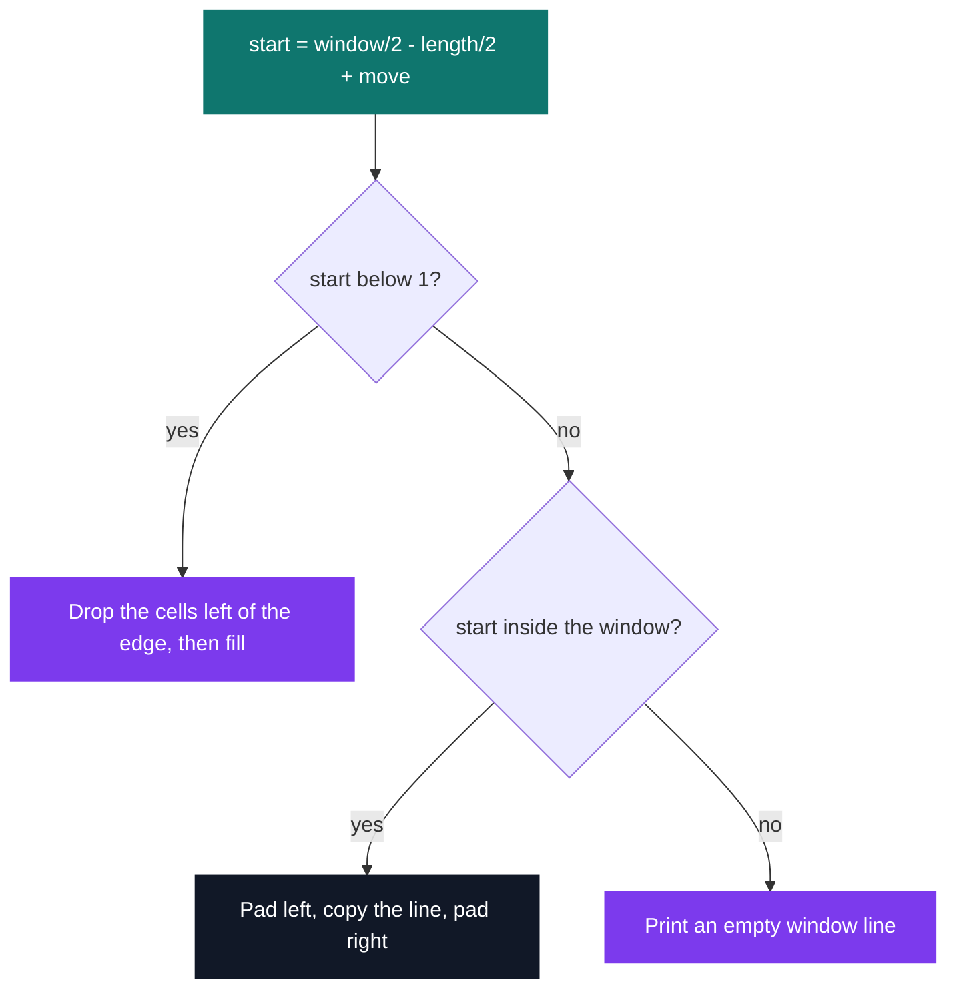

# Wolfram — cellular automaton

[](https://antoinepoisson.github.io/Old-School-Projects/projects/fun-wolfram-2019)

 

[Tek2](../../README.md) / [Functional](../README.md) / **FUN_wolfram_2019**

*Epitech project · Functional programming (B-FUN-400) · March 2020 · 2 weeks · Grade A*

> Patterns of surprising complexity, generated by a rule that fits in eight bits.

The automaton lives on a line that is infinite to the left, to the right and downwards. The
terminal shows 80 columns of it by default, and what appears at the left edge now depends on
cells that sat ten columns off-screen ten generations ago.

So the window is never allowed to become the state. Each generation is computed two cells wider
than the last — one on each side — whatever `--window` says, and clipping happens once, at print
time. Generation *g* is `1 + 2g` cells wide and the display only ever borrows a slice of it.

Real output of `./wolfram --rule 30 --lines 16 --window 41`:

```text
                    *
                   ***
                  **  *
                 ** ****
                **  *   *
               ** **** ***
              **  *    *  *
             ** ****  ******
            **  *   ***     *
           ** **** **  *   ***
          **  *    * **** **  *
         ** ****  ** *    * ****
        **  *   ***  **  ** *   *
       ** **** **  *** ***  ** ***
      **  *    * ***   *  ***  *  *
     ** ****  ** *  * *****  *******
```

**The rule number is the transition table.** A cell sees three cells — itself and its two
neighbours — which gives eight possible neighbourhoods, one output bit each: eight bits, 256
rules. Read a column below from top to bottom and you get the rule number in binary.

| Neighbourhood | Rule 30 | Rule 90 | Rule 110 |
| --- | --- | --- | --- |
| `***` | 0 | 0 | 0 |
| `** ` | 0 | 1 | 1 |
| `* *` | 0 | 0 | 1 |
| `*  ` | 1 | 1 | 0 |
| ` **` | 1 | 1 | 1 |
| ` * ` | 1 | 0 | 1 |
| `  *` | 1 | 1 | 1 |
| `   ` | 0 | 0 | 0 |

`*` is a live cell, a space is a dead one — the same two characters the program prints.

Because the table *is* the rule, each of the three required rules is a handful of guards and no
arithmetic at all. Rule 30 in full, straight from `src/wolfram.hs`:

```haskell
ruleFirst :: [Char] -> Char
ruleFirst xs
    | (xs == "*  ") = '*'
    | (xs == " **") = '*'
    | (xs == " * ") = '*'
    | (xs == "  *") = '*'
    | otherwise     = ' '
```

One generation is a pure function of the previous one, with nothing mutable anywhere in the loop.
Padding the line with two spaces on each side is what makes the automaton grow: a line of *n*
cells becomes `n + 4` characters, which yields `n + 2` three-cell windows.



**Printing a slice.** `displayLine` centres the generation on the window, shifts it by `--move`,
and then has three cases to handle: the line starts left of the window, it fits, or it has walked
off the screen entirely. The third case prints an all-space line, and the automaton behind it
keeps running.



The subject asks that an even window put the central cell one column to the right, and integer
division already does it: `window/2 - length/2` biases right whenever the generation has odd
length. `startedIndex` still carries a guard for an even-length generation — dead code, since the
seed is one cell and every step adds two.

Rule 90 in a window too narrow for it, `./wolfram --rule 90 --lines 12 --window 20` — from line 11
the Sierpiński triangle is wider than the screen, and the cells outside keep feeding the ones
inside:

```text
          *
         * *
        *   *
       * * * *
      *       *
     * *     * *
    *   *   *   *
   * * * * * * * *
  *               *
 * *             * *
*   *           *
 * * *         * * *
```

**Options, parsed by hand.** `getopt` is banned, so `argv` is walked in pairs and each value is
validated on its own, a bad or missing one exiting with code 84.

| Option | Meaning | Default |
| --- | --- | --- |
| `--rule` | 30, 90 or 110 | none, mandatory |
| `--start` | first generation displayed | `0` |
| `--lines` | lines to print | never stops |
| `--window` | cells per line | `80` |
| `--move` | signed shift of the drawn pattern | `0` |

Reading pairs with `head (tail xs)` is a partial expression and would throw on a trailing flag.
What keeps it total is the check that comes first in `main`: an odd `argv` length is rejected
before the parser ever runs, so a value is always there to read.

"When omitted, the program never stops" is encoded as a counter rather than a branch. The default
`--lines` becomes `-1`, the loop only stops on `count == 0`, and decrementing from `-1` never
reaches it — one termination test serves both the finite and the infinite case.

One audit finding: errors leave through a single `myLeave`, which exits 84 as required but writes
the message with `putStrLn`, so it lands on stdout instead of stderr. Every failure path already
funnels through that one function, which is what makes it a one-line fix.

## Technical stack

Haskell · GHC, Makefile, Git.

One module, `src/wolfram.hs`: 167 lines, 17 top-level definitions, and three imports —
`System.Environment`, `System.Exit` and `Text.Read` — all from `base`, no external package.

## Build & run

```bash
make                                          # ghc -o wolfram ./src/wolfram.hs -Wall -W
./wolfram --rule 110 --lines 20 --window 60
./wolfram --rule 30 --start 40 --move -15     # start at generation 40, drawn 15 columns left
./wolfram --rule 90 | head -30                # no --lines: it runs forever
```

`make test` compiles `src/.test_file.hs` to `b.out`: a scratch program whose `main` prints nothing
but the window-centring index, the one piece of arithmetic here that is hard to eyeball inside a
triangle.

---

[Tek2](../../README.md) / [Functional](../README.md) · [⌂ All projects](../../../README.md)
