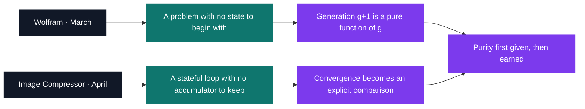

# Functional — a change of programming model

[Tek2](../README.md) / **Functional**

Two Haskell projects, each built around state that has nowhere to live. k-means is a loop wrapped
around a mutable accumulator of `k` centroids, and Haskell offers no slot to keep them in — so the
loop becomes a recursion carrying the centroid list from round to round, and "has it converged?"
turns from a property of a variable into a comparison between two values you can print. Wolfram has
the opposite problem: its line is infinite in every direction, the terminal shows 80 columns of it,
and the window must never be allowed to become the state.

| Project | What it is | Size | Grade |
| --- | --- | --- | --- |
| [Wolfram](FUN_wolfram_2019) | Elementary cellular automaton, rules 30, 90 and 110 | 2 weeks · March 2020 | A |
| [Image Compressor](FUN_imageCompressor_2019) | k-means colour reduction over an image's pixels | 2 weeks · April 2020 | A |

Neither program pulls in a framework. Wolfram is 167 lines in a single file, compiled by a direct
`ghc` call; Image Compressor is 229 lines in `app/Main.hs` under a Stack project pinned to
`lts-14.11` with no `extra-deps`, where `src/Lib.hs` is still the generated stub. Between them they
import exactly one package outside `base`: `System.Random`, for the seed draw that starts k-means.
Both walk and validate `argv` by hand — Wolfram because the subject bans `getopt`, Image Compressor
because its three arguments are positional — and both exit `84` on a bad value.

<pre>
Functional/
├── <a href="FUN_wolfram_2019">FUN_wolfram_2019/</a>          Wolfram — an elementary cellular automaton, hand-parsed CLI    · A
└── <a href="FUN_imageCompressor_2019">FUN_imageCompressor_2019/</a>  Image Compressor — k-means colour reduction, no mutation       · A
</pre>

---

[Tek2](../README.md)
