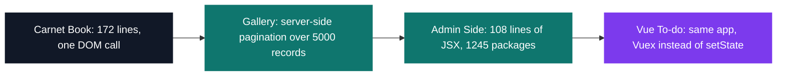

# Internship — front-end warm-up

[Tek2](../README.md) / **Internship**

Four self-directed front-end projects, August to November 2019: three in React, then the same kind
of app rebuilt in Vue with the markup and the CSS held fixed, so nothing varies but the framework.
The hard part is never the screen. It is that `render()` runs before the data exists — a blank
first paint in the contact book, and in the gallery a fetch fired from `componentDidUpdate` that
loops forever unless one comparison stops it.

| Project | What it is | Size |
| --- | --- | --- |
| [React-Carnet-Book](React-Carnet-Book) | 10 contacts from a public API, whole UI derived from a two-field state | Aug 2019 · 2 weeks |
| [React-Gallery-Site](React-Gallery-Site) | 5000 photos, one page in memory, total read from the `x-total-count` header | Sep 2019 · 2 weeks |
| [React-Admin-Side](React-Admin-Side) | Login gate over a react-admin console: 2 resources, filters, CSV export | Oct–Nov 2019 · 2 weeks |
| [Vue-To-do](Vue-To-do) | The React idioms redone with Vuex actions, mutations and getters | Nov 2019 · 2 weeks |

Each project starts from the limit the previous one hit: `null` state that cannot tell *loading*
from *failed*, then a payload too large to render in one go, then a subtree a visitor must not
reach. The fourth changes ecosystem rather than scope, and reads its counter back through a Vuex
getter instead of recomputing it inside `render()`.

Every README carries an audit finding read back out of the code: index-based list keys in the two
data-fed React apps, access control that guards the display rather than the data in the admin, and
a Vue getter that subtracts a sentinel row instead of filtering for it.

<pre>
Internship/
├── <a href="React-Carnet-Book">React-Carnet-Book/</a>  1st React project — a contact book fed by a public API
├── <a href="React-Gallery-Site">React-Gallery-Site/</a> 2nd React project — a paginated photo gallery, thousands of images
├── <a href="React-Admin-Side">React-Admin-Side/</a>   3rd React project — a login-gated admin dashboard via react-admin
└── <a href="Vue-To-do">Vue-To-do/</a>           4th project — the same kind of app, redone in Vue.js on purpose
</pre>

---

[Tek2](../README.md)
