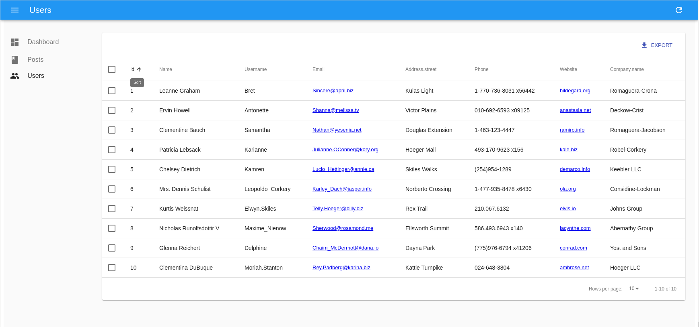
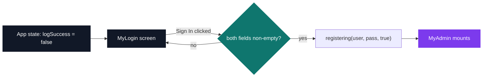
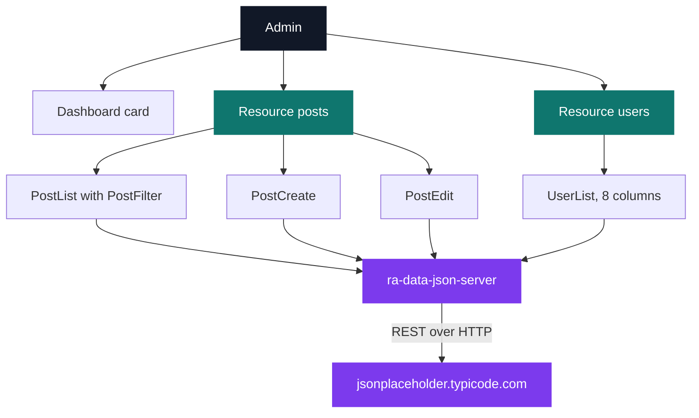

# React Admin Side

[](https://antoinepoisson.github.io/Old-School-Projects/projects/perso-react-admin-side-2019)

   

[Tek2](../../README.md) / [Internship](../README.md) / **React-Admin-Side**

*Personal project · October–November 2019 · 2 weeks*

An administration console behind a login gate: two resources, sortable lists, create and edit
forms, a search filter and a CSV export. Third React exercise of the series, and the first one
with a room the visitor is not allowed into.

The whole console is **108 lines of JSX**. The login screen alone, hand-written with Material-UI,
is **103**. That ratio is the finding of the project: everything behind the gate is *declared*
rather than written, and the interesting decision was to declare it.

<p align="center">
  
  
</p>

**The gate.** `App.js` is 31 lines and holds the entire access rule. The login screen never
navigates anywhere — it calls back up into `App`, which flips a flag and swaps the whole subtree.



The consequence is worth stating plainly: the admin is not a URL you can guess your way onto,
because until the flag flips that branch of the tree does not exist and its router never mounts.

```jsx
{ this.state.logSuccess === false ? <MyLogin registering={this.registering}/> :
   <MyAdmin/>
}
```

What that ternary enforces is access control over the *display*. The check is client-side and the
data provider is unauthenticated, so the condition is the seam: a server answer replaces one
expression, in one 31-line file, and nothing else moves.

**Two resources, four views.** The console is not a set of screens. It is a `<Resource>` per
collection, naming the components that render its list and — for `posts` only — its create and
edit forms; react-admin derives the sidebar, the routes, the pagination, the sorting, the
`Dashboard` landing card and the export from that.



| Resource | Views declared | Fields on screen |
| --- | --- | --- |
| `posts` | list + filter, create, edit | id, user, title, body |
| `users` | list | id, name, username, email, address.street, phone, website, company.name |

**The part a generic description misses.** Two of those eight user columns are not top-level
fields of the record, and the posts list shows an author's name that `/posts` never returns.

```jsx
<ReferenceField source="userId" reference="users">
    <TextField source="name" />
</ReferenceField>
```

`ReferenceField` is a client-side join: react-admin reads the `userId` values on the visible page,
issues one extra request to `users`, caches the result and renders `Leanne Graham` where the JSON
carried `1`. `<TextField source="address.street" />` walks a dot path into the nested record.

Neither costs a line of fetching, mapping or state code. The same mechanism drives the filter — a
`q` text input marked `alwaysOn` next to a user dropdown fed by the `users` resource — which
`ra-data-json-server` turns into query-string parameters on the list request.

**What adopting a framework actually cost.** `package.json` declares 8 direct dependencies;
`package-lock.json` resolves **1245 packages**. react-admin 2.9.5 arrives with its own router
(react-router 4.3.1), its own store (redux 3.7.2) and its own side-effect layer (redux-saga 0.16.2).

That is the trade the previous two React exercises did not have to make. Hand-rolling the console
would have meant writing pagination, sorting, forms and export by hand; adopting react-admin means
inheriting an architecture, and arguing with it for any screen that is not a list or an edit form.

Small detail visible in the screenshot: the login background is fetched live from
`source.unsplash.com/random/1920x1080`, so the screen is a different photograph on every reload —
an unused `src/resources/login_background.jpg` is still in the tree, imported by nothing.

## Technical stack

JavaScript, HTML, CSS · React 16.8, react-admin 2.9, Material-UI 4.2 · npm, create-react-app, Git.

7 JavaScript files, 247 lines. No test suite: this is a self-study exercise written ahead of an
internship, with no imposed subject and no grade.

## Build & run

```bash
npm install
npm start
```

Two things to know before running it. The mount point is `<div id="app">`, not create-react-app's
usual `root` — `public/index.html` and `index.js` were both changed to match. And the stylesheet
link in that same file reads `rel"stylesheet"`, missing its `=`, so the `margin: 0` body reset in
`public/style.css` never loads; the login background is `position: fixed` and covers the default
margin anyway, which is exactly why the typo survived.

## Original documentation

The [upstream README](./README.upstream.md) preserves the original Create React App instructions.

---

[Tek2](../../README.md) / [Internship](../README.md) · [⌂ All projects](../../../README.md)
