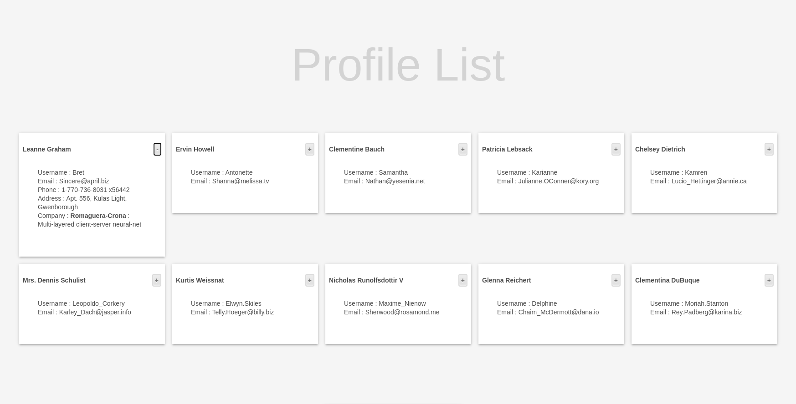
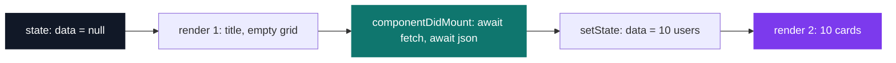
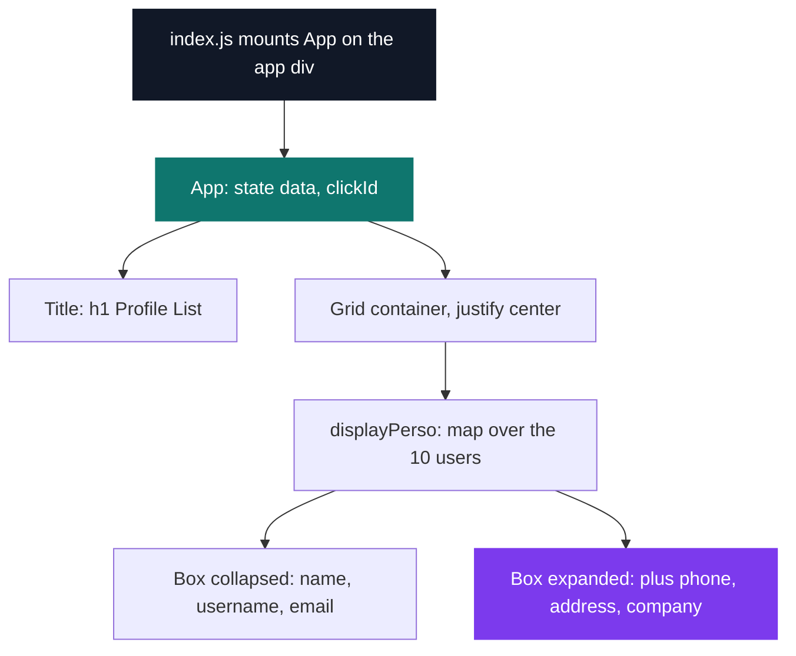

# React Carnet Book

[](https://antoinepoisson.github.io/Old-School-Projects/projects/perso-react-carnet-book-2019)

  

[Tek2](../../README.md) / [Internship](../README.md) / **React-Carnet-Book**

*Personal project · August 2019 · 2 weeks*

> A contact book fetched from a public API — and the first program here whose screen is a return
> value rather than a sequence of instructions.

`render()` runs before the data exists. That is the real difficulty of a first React app, and you
do not see it coming: the component paints once with nothing in hand, the network answers a few
hundred milliseconds later, and the second paint has to come out of the same function.

Everything else follows from accepting that. The ten users the public `jsonplaceholder` test API
serves are drawn as cards, and the whole interface is derived from a two-field state object instead
of being assembled node by node.

The proof is a grep. One line in the entire application touches the DOM, and it is the mount point:

```console
$ grep -rn "document\." src/
src/index.js:5:ReactDOM.render(<App />, document.getElementById('app'));
```



**The gap between the two paints.** `componentDidMount` is declared `async` and awaits `fetch`, then
awaits `.json()`, so React has already committed a first render by the time the users array arrives.
`data` starts at `null`, `displayPerso()` guards on it and returns nothing, and the grid below the
title stays empty until `setState` runs.



That single `null` is doing two jobs: *the response has not arrived* and *the response never will*.
A rejected `fetch` paints exactly the same blank grid as a slow one, so two of the three network
states share one representation and nothing in the app can tell them apart — splitting them into
`loading` and `error` is what this code needs next, and the reason the project after it starts
there.

**The accordion is a data-shape trick, not logic.** Which card is open is stored as one integer,
`clickId`, initialised to `-1`, and the click handler is a single ternary:

```jsx
   changeMoreInfoId(index) {
      this.setState({
         clickId: (this.state.clickId === index) ? -1 : index
      })
   }
```

Two behaviours fall out of that expression for free. Clicking the open card writes `-1` and closes
it; opening a second card overwrites the first, so "at most one card expanded" is never checked
anywhere because an integer cannot hold two positions. The alternative — a boolean per contact —
would have needed an explicit pass to close the others.

`displayPerso()` branches on `clickId` and returns a different card entirely: fields, button glyph
and box height all swap together.

| Card state | Fields shown | Button | Box size |
| --- | --- | --- | --- |
| Collapsed | `name`, `username`, `email` | `+` | `19rem` × `10rem` |
| Expanded | + `phone`, `address` (3 parts), `company` (2 parts) | `-` | `19rem` × `16rem` |

One record from the endpoint, trimmed to the nine leaf fields the card reads and ordered as the card
prints them — note the two nested objects the expanded view has to walk into:

```json
{
  "name": "Leanne Graham",
  "username": "Bret",
  "email": "Sincere@april.biz",
  "phone": "1-770-736-8031 x56442",
  "address": { "suite": "Apt. 556", "street": "Kulas Light", "city": "Gwenborough" },
  "company": { "name": "Romaguera-Crona", "catchPhrase": "Multi-layered client-server neural-net" }
}
```

**Index as identity.** `clickId` and the React `key={index}` both address a contact by its slot in
the array rather than by its identity. Nothing here ever re-sorts or filters the list, so it holds —
but add a search box and the expanded card would follow the position instead of the person. The
payload already carries an `id`: handing `info.id` to the handler, comparing against it and keying
on it is the whole change.

The component tree stays deliberately flat — one stateful container, one presentational title, and a
single `map` emitting one of two card shapes. Layout comes from Material-UI's `Grid` and `Box` with
the two card sizes as inline style objects; the hand-written `Style.css` is left with the button
gradient, the centred text block and an `h1` set at 100px in 15% black, which is the ghost "Profile
List" above the cards.



## Technical stack

JavaScript, HTML, CSS · React, Material-UI · npm, create-react-app (`react-scripts`), Git.

Four source files under `src/`, 172 lines in total: `App.js` (84), `Style/Style.css` (68),
`Style/Title.js` (15), `index.js` (5), plus the screenshot in `src/image/`. Two `setState` calls,
two state fields, five entries in the `package.json` dependency list.

`package.json` floors React at `^16.8.6` and Material-UI at `^4.2.0`; the committed lockfile pins
16.13.1 and 4.11.0, behind `react-scripts` 3.4.1. React 16.8 is the release that shipped hooks —
this app is written the way the docs still taught it then, as a class with a lifecycle method, which
is precisely why the two-paint sequence is visible in the source instead of hidden inside a
`useEffect`.

`public/index.html` is written by hand rather than left as the create-react-app template: twelve
lines that mount on `#app`, drop the `%PUBLIC_URL%` placeholders and pull Roboto and the Material
Icons stylesheet straight from Google Fonts.

## Build & run

```bash
npm install
npm start        # react-scripts dev server, http://localhost:3000
```

## Original documentation

The [upstream README](./README.upstream.md) preserves the original Create React App instructions.

---

[Tek2](../../README.md) / [Internship](../README.md) · [⌂ All projects](../../../README.md)
