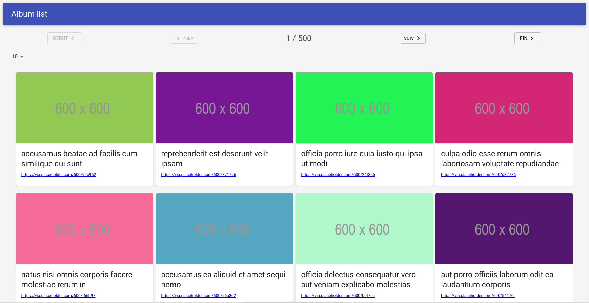
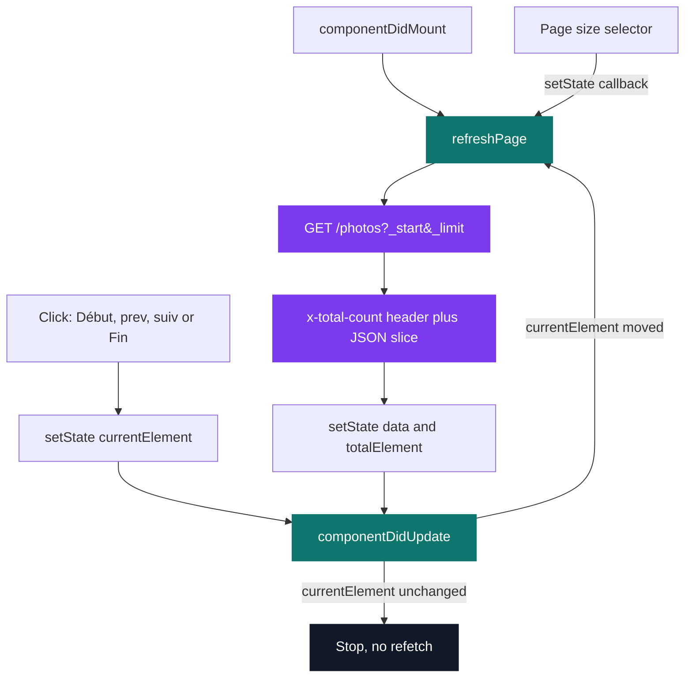
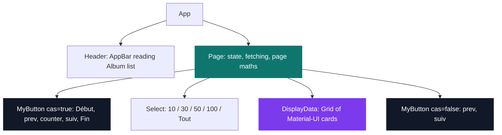

# React Gallery Site

[](https://antoinepoisson.github.io/Old-School-Projects/projects/perso-react-gallery-site-2019)

  

[Tek2](../../README.md) / [Internship](../README.md) / **React-Gallery-Site**

*Personal project · September 2019 · 2 weeks*

The `jsonplaceholder` photo endpoint answers with **5000 records**, and says so in an
`X-Total-Count` header. Fetching them all and mapping them to cards is one line of JSX — and it
puts 5000 `` tags in the DOM on the first paint.

This gallery never does that. It keeps exactly one page in memory, asks the server for the slice it
needs, and reads the total from the header it would otherwise ignore.



The screenshot is the whole design in one frame: page size 10, counter reading `1 / 500`. That
denominator is `Math.round(5000 / 10)`, computed from what the network returned rather than from a
constant someone typed in.

**Where the number comes from.** The request carries `_start` and `_limit`; the response carries
`x-total-count: 5000`. Without that header the app would know how many photos it just received but
not how many exist, and "last page" or "1 / 500" would be impossible to render.

The fetch in `src/page_body/page.js` reads the header and the body from the same response, then
commits both in a single `setState` so the grid and the counter can never disagree:

```jsx
refreshPage = () => {
    fetch(`http://jsonplaceholder.typicode.com/photos?_start=${this.state.currentElement}&_limit=${this.state.nbrElement}`)
        .then(async res => {
        const total = await res.headers.get("x-total-count");
        const info = await res.json();

        this.setState({
            totalElement: parseInt(total),
            data: info
        });
    });
}
```

**The trap this design walks into.** `refreshPage` ends with a `setState`, and `setState` fires
`componentDidUpdate`. Calling the fetch from that lifecycle hook without a guard is an infinite
request loop — every response triggers the next request.

The guard is one comparison: refetch only when `currentElement` actually moved. A page-size change
never satisfies it, so it starts its own fetch from the `setState` completion callback instead.
Three entry points, one fetch function, no loop.



Everything the app knows lives in five fields on one component. The previous React exercise kept
all of its logic in one `App.js`; here the work is split across **5 components in 6 files**, and
`page.js` — the only component that holds state — is 105 of the roughly 300 lines of JavaScript.

| State field | Role |
| --- | --- |
| `currentElement` | the `_start` offset sent to the API |
| `nbrElement` | the `_limit`, i.e. the page size |
| `totalElement` | 5000, read from `x-total-count` |
| `data` | the photos of the current page, and nothing else |
| `selectedOption` | the value displayed in the size selector |

`Page` owns all of it. Its children keep no state of their own: they receive numbers, an array and
callbacks, and render.



`MyButton` is mounted twice from the same definition, above and below the grid, with a single `cas`
boolean deciding whether that instance also shows the Début and Fin buttons and the counter. The
bottom bar is the top bar minus those three controls, not a second component to keep in sync.
`DisplayData` is rendered only once `data` has arrived, so the first paint is the bar on its own.

**One state field doing two jobs.** The last entry of the size selector is not a fixed number:
`<MenuItem value={this.state.totalElement}>` sets the page size to the total. Choosing it makes
`total === nbrElement` true, which is exactly the condition `prev` and `suiv` already test to
disable themselves; the arithmetic behind Début, Fin and the counter follows on its own. "Show
everything" turns pagination off without a single extra flag.

The two components that take props declare their contract with `prop-types`: **8 required props**
on the pagination bar, one required array on the grid. In a language with no static types, a
console warning on a mistyped callback is the cheapest reliability there is.

**Audit finding — the list keys.** `DisplayData` maps with `key={index}`, while every photo in the
payload carries a stable `id`. Because index 0 stays index 0 across pages, React reuses the same
card DOM instead of remounting it, and the previous image lingers until the new URL decodes. Keying
on `element.id` makes React swap the node instead. A separate decision pulls the other way and is
worth keeping: `data` is never cleared before a fetch, so a page change never flashes an empty grid.

## Technical stack

JavaScript, HTML, CSS · React 16.8 with no hooks — `App`, `Page` and `DisplayData` are classes,
`Header` and `MyButton` plain functions · Material-UI 4 (`AppBar`, `Grid`, `Card`, `Select`),
`prop-types` · npm, create-react-app, Git.

State lives in `Page` and flows down; the CRA template was edited to mount on `#app` rather than
the default `#root`.

## Build & run

```bash
npm install
npm start
```

## Original documentation

The [upstream README](./README.upstream.md) keeps the original project notes — purpose, screenshot
and the two setup commands — as they were first written.

---

[Tek2](../../README.md) / [Internship](../README.md) · [⌂ All projects](../../../README.md)
