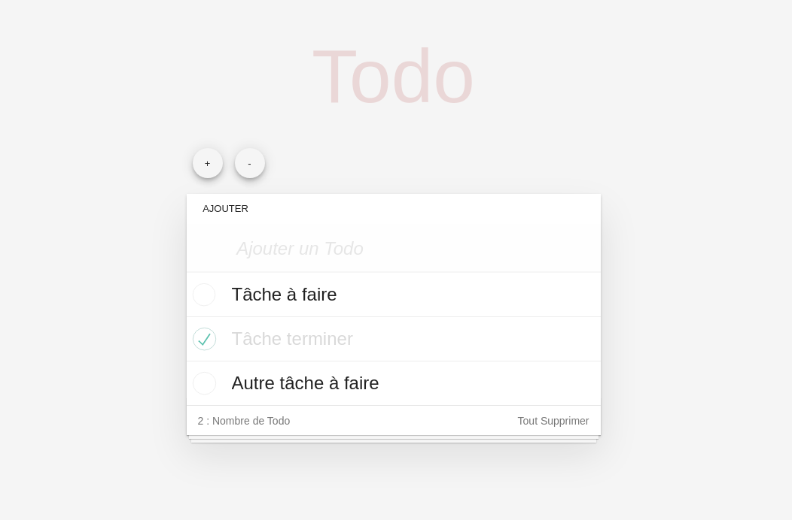
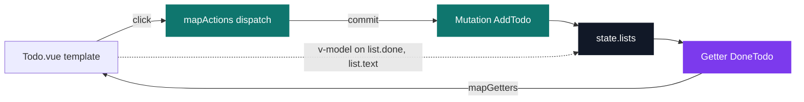
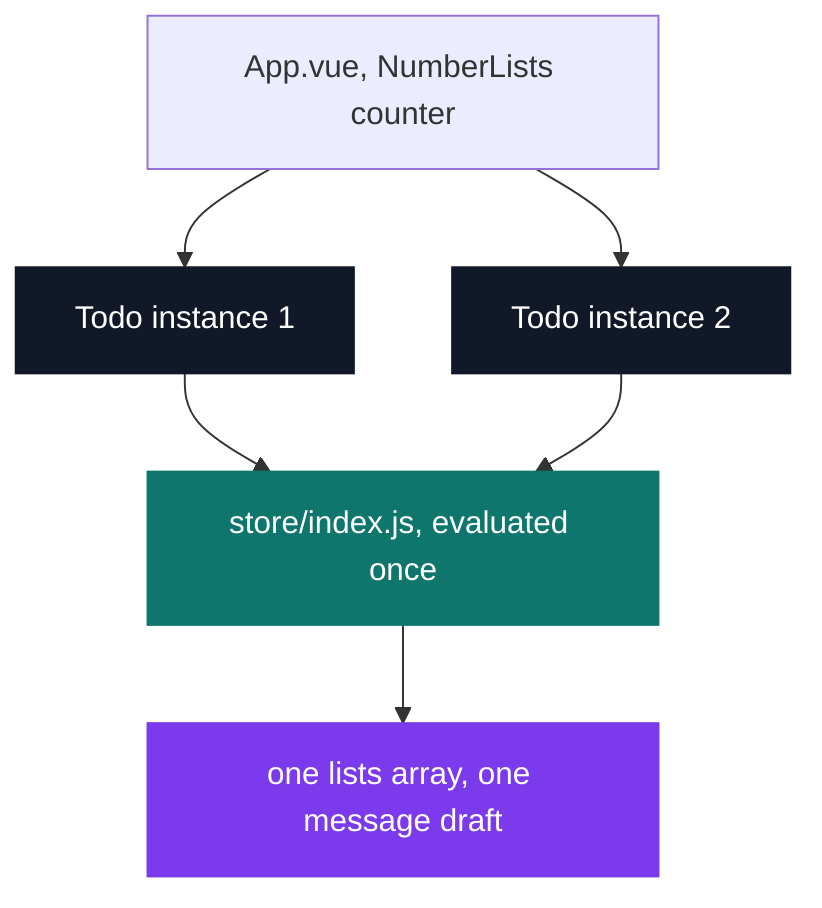

# Vue To-do

[](https://antoinepoisson.github.io/Old-School-Projects/projects/perso-vue-todo-2019)

   

[Tek2](../../README.md) / [Internship](../README.md) / **Vue-To-do**

*Personal project · November 2019 · 2 weeks*

> A working to-do list in Vue, built on TodoMVC's markup and stylesheet so that the Vue code is
> the only part of the screen that is mine — and the only part worth comparing against the three
> React projects that came before it.

The visual layer is borrowed on purpose. The 389-line stylesheet and the DOM skeleton
(`section.todoapp`, `input.new-todo`, `ul.todo-list`, `footer.footer`) come from TodoMVC, the
reference implementation every framework demo reuses. Two classes were added to that stylesheet —
`.adding-todo` and `.mangamenaddlist` — and both exist for buttons this version introduces.

What is left over is the Vue: a store, two components, and the bindings between them.



The whole application is **179 lines of script and template across five files** — `main.js`,
`App.vue`, `Todo.vue`, `store/index.js` and `plugins/vuetify.js`, the stylesheet aside. Small
enough that the two idioms can be put next to each other line for line.

| Operation | React idiom (the 3 previous projects) | Vue idiom (this one) |
| --- | --- | --- |
| Component state | `state = {…}` + `this.setState()` | `data()` returning an object, mutated in place |
| Derived value | computed inline in `render()`, `showPassword ? 'text' : 'password'` | `computed` fed by a Vuex getter |
| List rendering | `this.state.data.map((info, index) => …)` | `v-for="(list, index) in $store.state.lists"` |
| Event handling | `onClick={this.changeMoreInfoId.bind(this, index)}` | `@click.prevent="DeleteTodo(index)"` |
| Text input | `value={username}` + `onChange` → `setState` | `v-model` on the bound field |
| Markup and logic | JSX in `.js`, CSS imported at the top | one `.vue` file, `<template>` + `<script>` |

The React column is not hypothetical: every cell is copied out of `React-Carnet-Book/src/App.js`
and `React-Admin-Side/src/Login/mylogin.js`, two of the three React projects sitting beside this
one in the same folder. They are different applications — a contact book and an admin login, both
on Material-UI — so what transfers is the idiom, not the screen.

**One-way data flow, and where it stops.** A to-do list this size does not need a store. Vuex is
here for the round trip: a component dispatches an action, the action commits a mutation, and the
view reads back through a getter. Three actions (`AddTodo`, `DeleteTodo`, `DeleteAllTodo`) each
commit a mutation of the same name, and one getter derives the counter.

The template does not hold that line everywhere. `v-model="$store.state.message"`, and the two
`v-model` bindings on `list.done` and `list.text`, write into store state directly — no action, no
mutation. Vuex allows it because strict mode is never switched on, and it is exactly the shortcut
the pattern is meant to make impossible.



Seeing both arrows land on the same box is the part worth keeping: the discipline is a convention,
not a guarantee, until the store is configured to enforce it. The store itself is 58 of those 179
lines.

**The store is a singleton, and that is the lesson.** `App.vue` keeps a `NumberLists` counter and
the `+` / `-` buttons render that many `<todo>` components. But every instance does
`import store from '../store/index.js'` — the same module object, evaluated once.



So the `+` button does not give you a second list — it gives you a second *view* of the same one.
The input draft lives in the store too, so typing in one box types in both, character by character.

In React that stacking works by default, because `this.state` belongs to the instance. Centralised
state inverts the default: sharing is free, isolation is the thing you now have to design for
(a namespaced module per list, or a list id passed down as a prop). That trade-off is exactly what
the exercise was meant to surface.

**The sentinel row.** The store never starts empty:

```js
const state = {
  lists: [{
    id: 0,
    text: '',
    done: false
  }],
  count: 0,
  message: '',
}

const getters = {
  DoneTodo: (state => state.lists.filter(lists => !(lists.done)).length - 1)
}
```

That first entry has no text, so `v-if="list.text"` in the template skips it, and the getter's
`- 1` subtracts it back out of the count. The screenshot checks out: 3 rows, 1 ticked, sentinel
still in the array — `4 - 1 done - 1 sentinel = 2`, and the footer reads *2 : Nombre de Todo*.

It is a display formula coupled to a data invariant, which holds right up until something breaks
the invariant: `DeleteAllTodo` empties the array outright, sentinel included, so the next task
added counts as zero. The fix is one line — filter on `text` in the getter instead of subtracting
a magic constant — and the failure is a clean illustration of why derived values should read the
data rather than compensate for it.

## Beyond the baseline

Vuex on a to-do list is over-engineering by any product measure, and that is deliberate. The
actions/mutations/getters split is the pattern the whole front-end ecosystem reuses under other
names — Redux, NgRx, Pinia — so the cheapest place to learn it is an app small enough to hold
entirely in your head.

The other addition is the stackable lists: `App.vue` treats the list count as local component
state while the list *contents* live in the store, which is what makes the singleton behaviour
above visible instead of theoretical.

## Technical stack

| Package | Version | Role |
| --- | --- | --- |
| `vue` | ^2.6.10 | Options API, single-file components |
| `vuex` | ^3.1.1 | Store, actions, mutations, getters |
| `vuetify` | ^1.5.5 | `v-app`, `v-btn`, `iconfont: 'md'` |
| `vue-use-vuex` | ^0.2.2 | side-effect import in `main.js`; no source file calls `Vue.use(Vuex)` |
| `core-js` | ^2.6.5 | polyfills for the Babel target |

Built with Vue CLI 3, Babel (`@vue/app` preset) and ESLint (`plugin:vue/essential`) — 11 dev
dependencies behind the 5 runtime ones. JavaScript, HTML, CSS · npm · Git.

## Build & run

```bash
npm install
npm run serve
```

`vue-cli-service serve` starts the dev server with hot reload; `npm run build` emits a production
bundle to `dist/`, and `npm run lint` runs the Vue ESLint rules over the sources.

## Original documentation

The [upstream README](./README.upstream.md) preserves the original Vue CLI instructions.

---

[Tek2](../../README.md) / [Internship](../README.md) · [⌂ All projects](../../../README.md)
