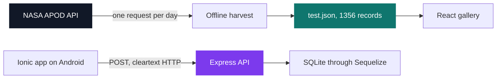
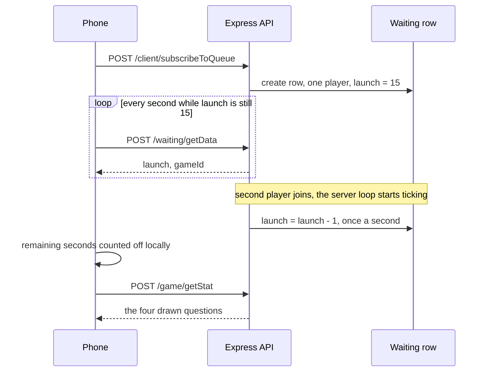

# Epitech JAM — Space

[](https://antoinepoisson.github.io/Old-School-Projects/projects/jam-space-2019)

    

[Tek2](../../README.md) / [JAM](../README.md) / **JAM_space_2019**

*Team project · Epitech JAM (G-JAM-001) · February 2020 · 1 weekend · Grade D*

The self-signed certificate still sitting in this repository is stamped **23 February 2020,
14:30 GMT**. The newest image in the shipped data snapshot is dated **22 February**. Between those
two timestamps, a JAM team put out three deliverables instead of one: a React gallery, an Android
app, and the HTTP/HTTPS API behind it.

The theme was space, so the data source was NASA's APOD endpoint — the service that publishes one
commented astronomy photograph per day.

**One call, one day, one picture.** APOD has no range query and no pagination. Filling a
twenty-tile gallery means twenty separate HTTP requests, and some days publish a video instead of
an image — so you do not know how many requests you need until you have already made them.

The first attempt walks the calendar backwards and compensates for the video days by rewinding the
loop counter:

```js
for (i = 0; i < 20; i++) {
    $.getJSON(url + date.toJSON().substr(0, 10), function(data) {
        if (data.media_type.localeCompare("image") == 0)
            pictures.push(data);
        else
            i = i - 1;
    });
    date.setDate(date.getDate() - 1);
}
count = count + 20;
```

Two things make that sketch instructive. `$.getJSON` is asynchronous, so the rewind fires after the
loop is already over and `pictures` is returned empty — the filter and the loop live in different
turns of the event loop. And `node --check getPicture.js` reports `SyntaxError: Unexpected token
'var'` on line 6, where the function body declares `static var count = 0`: `static` is a class-body
keyword, so the file never parsed anywhere.

**The decision that shipped.** Rather than repair a live fetch on Sunday afternoon, the team
harvested APOD offline and embedded the result. `test.json` holds **1356 entries covering
2015-09-18 to 2020-02-22** — 1196 distinct days out of the 1619 in that span — and every single
record carries `"media_type": "image"`. The React front imports that 1.6 MB file directly and
leaves the network call commented out.

That is the right call under a deadline: a demo that always paints beats a live API that
rate-limits on stage. The snapshot also records how it was gathered. Read in file order the dates
run downward, then jump back up twelve times — several backward passes concatenated — and one
window of the archive was clearly walked twice: all 160 duplicated dates land between 2017-08-04
and 2018-04-20, and none of them appears more than twice.



The diagram shows the honest shape of the weekend: the two front-ends never meet. The web gallery
reads the snapshot, the phone talks to the API, and no code path crosses between them.

| Surface | Stack | What it ships |
| --- | --- | --- |
| `Web/space_web/src` | React 16, Material-UI 4 | Gallery, full-size modal, title search — 640 lines of JS/JSX/CSS |
| `Mobile/space/src` | Ionic / Angular 8, Capacitor + Cordova | Two-player quiz for Android — 1021 lines of TS/HTML/SCSS |
| `Mobile/backend` | Express 4, Sequelize 4, SQLite, PM2 | 4 routes, 4 models — 373 lines of JS |

The gallery paints 24 tiles and adds 48 on every click of the chevron. The map still walks all 1356
entries on each render and emits a zero-sized `div` for everything past the cursor, so what gets
deferred is the image loading, not the traversal.

The search box is a Material-UI `Autocomplete` over 1356 titles, read from
`src/resources/caca.json` — a byte-for-byte copy of `test.json`, so the 1.6 MB payload is bundled
twice. Picking a result recovers the entry by splitting the option's DOM id
(`combo-box-demo-option-3`) and indexing the array with the number it finds, rather than reading
the value the callback is handed.

**The mobile app is not an image viewer.** `config.xml` names it *Space Quiz*: sign up with a
nickname, wait for a second player, answer four questions drawn at random. The interesting part is
that it does real-time matchmaking with no websocket and no push.

The countdown lives in a SQLite row. `launch` is set to 15 when the first player creates the
waiting row, and a server-side loop decrements it once a second as soon as a second player joins.
The phone polls `/waiting/getData` every second only until it reads a value below 15 — that drop
*is* the start signal — then stops polling and runs the remaining seconds off its own timer.



| Route (all `POST`) | Effect |
| --- | --- |
| `/client/register` | Creates a player, returns its id for native storage |
| `/client/subscribeToQueue` | Joins the open waiting row; the second player creates the game |
| `/waiting/getData` | Returns the whole waiting row — remaining seconds, game id, players |
| `/game/getStat` | Returns the four questions drawn for that game |

One phone can play both sides: `findGame()` subscribes the player and then `this.id + 1` as well,
five lines each tagged `// A ENLEVER` and still in the file. Eleven such markers survive in
`home.page.ts` — an accurate map of where the demo was propped up to run on a single device.

Two findings worth naming. `createGame` draws four distinct questions with a `do…while` whose
`isSingle` flag is set to `false` on a collision and never reset, so the first duplicate draw spins
forever — the happy path only holds while the random picks stay unique. And `jsonwebtoken` is
imported in `app.js` but never called: the four routes are open, and the app trusts a client id it
stores on the device.

The backend itself is honest reuse — its `package.json` is still named `sellerieconcept`, and it
drags in `firebase-admin`, `nodemailer` and `xlsx-to-json` from that earlier project. Starting a
weekend build from a working Express + Sequelize + PM2 skeleton is how the API existed at all by
Sunday; the cost is a dependency list that describes a different application.

## Beyond the baseline

- Three deliverables — web, mobile and backend — built in parallel over one weekend.
- The API listens on **3000 (HTTP)** and **3001 (HTTPS)** with a self-signed certificate.
- The Android build is packaged through Capacitor and Cordova, with `cordova-plugin-nativestorage`
  keeping the player id on the device between sessions.
- The app posts to a hard-coded IP over plain HTTP, and `config.xml` sets
  `android:usesCleartextTraffic="true"` so Android 9 and later allow it.
- Three third-party HTML themes under `Templates/` — Colorlib's *Cassi*, TEMPLATED's *Snapshot* and
  a space-science template — were kept as the graphical starting point.
- The NASA API keys and the TLS private key that were committed have been redacted in this archive.

## Technical stack

JavaScript, TypeScript, HTML, CSS · React, Material-UI, Angular, Ionic, Express, Sequelize,
jQuery · npm, Capacitor, Cordova, PM2, SQLite, Node.js.

## Build & run

Three independent npm sub-projects, each installed and started on its own — the backend
and the React dev server both want port 3000, so they do not run side by side unchanged:

```bash
(cd Web/space_web  && npm install && npm start)   # React gallery, port 3000
(cd Mobile/space   && npm install && npm start)   # Ionic dev server, ng serve
(cd Mobile/backend && npm install && npm start)   # Express through PM2, ports 3000/3001
```

The backend needs a regenerated `key.pem` / `cert.pem` pair, and any live APOD call needs a fresh
key from `api.nasa.gov` — both were removed from this archive.

---

[Tek2](../../README.md) / [JAM](../README.md) · [⌂ All projects](../../../README.md)
