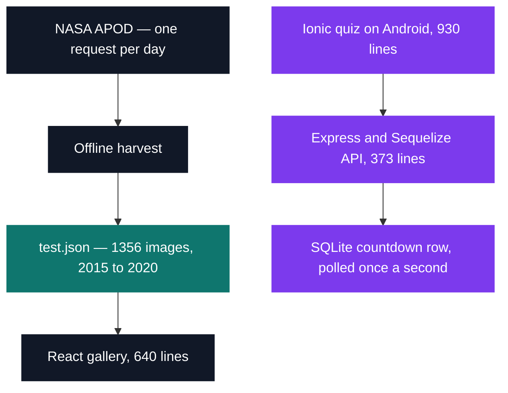

# JAM — 48-hour game jam

[Tek2](../README.md) / **JAM**

One weekend, an imposed theme, and three surfaces shipped where the format asks for one: a React
gallery, an Android app, and the HTTP/HTTPS API behind it.

The theme was space, so the data came from NASA's APOD endpoint — and APOD hands back exactly one
picture per request, keyed by a single date. No range query, no pagination, and some days publish a
video instead of an image, so a twenty-tile grid costs twenty round trips and you cannot know how
many you need until you have already spent them.

| Project | What it is | Size | Grade |
| --- | --- | --- | --- |
| [Epitech JAM — Space](JAM_space_2019) | React gallery, Android quiz and the Express API behind it, over NASA's APOD data | 1 weekend · Feb 2020 · team | D |

The answer to the request problem was to stop making requests at run time. APOD was harvested
offline into `test.json`, and `App.js` imports it as a module — the live fetch still sits a few
lines below the import, commented out line by line.

The two branches never meet: the web front reads the snapshot, the phone talks to the API, and
nothing crosses between them.

<pre>
JAM/
└── <a href="JAM_space_2019">JAM_space_2019/</a>   Epitech JAM — Space: web gallery, mobile quiz and backend, built around NASA's APOD API   · D
</pre>

Three details make it worth opening:

- **The snapshot is the deliverable.** `test.json` holds 1356 records running from 2015-09-18 to
  2020-02-22, every one of them `"media_type": "image"`. It also keeps a fingerprint of how it was
  collected: 1196 distinct dates for 1356 entries, because the harvesting cursor advanced by a
  fixed 20 while the day-by-day walk consumed more days than that.
- **The mobile app is not the gallery.** It is a two-player quiz that does real-time matchmaking
  with no websocket and no push — the server writes a countdown of 15 into a SQLite row, decrements
  it once a second, and the phone polls for the number. Latency is bounded by the poll interval,
  and the queue survives a restart because it was never held in memory.
- **The API is honest reuse.** Its `package.json` is still named `sellerieconcept`, carried over
  from an earlier build; that skeleton is why an Express + Sequelize + PM2 service existed at all by
  Sunday. Its self-signed certificate is stamped 23 February 2020, 14:30 GMT — the weekend, in the
  file metadata.

---

[Tek2](../README.md)
