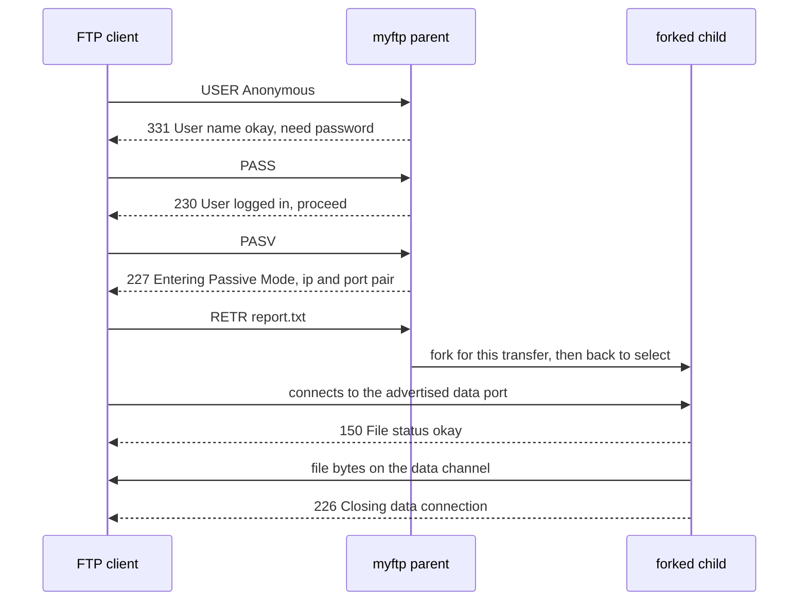
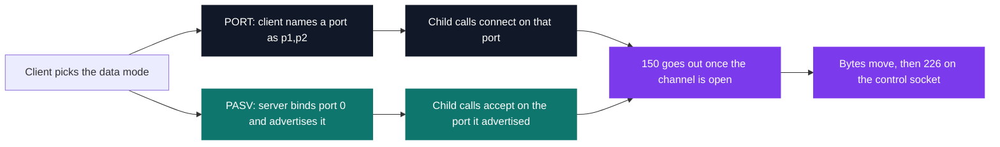

# myFTP — FTP server

[](https://antoinepoisson.github.io/Old-School-Projects/projects/nwp-myftp-2019)

  

[Tek2](../../README.md) / [Network](../README.md) / **NWP_myftp_2019**

*Epitech project · Network Programming (B-NWP-400) · March–April 2020 · 2 weeks · Grade A*

An FTP server a real client can drive end to end: connect, log in as `Anonymous`, list a directory,
pull a file down, push one back up, several clients at once. RFC 959 was published in 1985 and is
still the standard in force, and the subject's instruction is to test against commercial clients
rather than against the school's autograder alone — third-party software reads the three-digit
replies literally and cannot be talked around.

1,620 lines of C across 24 source files and one header, no library beyond libc.

**Two connections, not one.** The control channel stays open for the whole session, while every
single transfer opens its own separate data channel — and the client, not the server, decides which
way that channel opens.



The order of that last group is the implementation's own: `150` goes out only once the data channel
is up, because the child writes it after `accept()` returns, where RFC 959 puts it ahead of the
connection. `226` follows on the same control socket, inherited across the `fork()`. The parent had
already closed its copy of the data socket and gone back to `select()` before either was written,
so a client pulling a large file never freezes the other sessions.

**Both directions, when one would have passed.** The subject accepts active *or* passive; both are
here.



`PASV` encodes its port the way 1985 did: `p1,p2` with `port = p1 * 256 + p2`, dots in the IP
rewritten as commas, giving `227 Entering Passive Mode (127,0,0,1,211,129).` Get the arithmetic
wrong and the client dials a port nobody is listening on. `PORT` reads that same pair and only that
pair — the six-field `PORT 127,0,0,1,196,54` of the RFC is answered `501`, and the outgoing
`connect()` targets `INADDR_ANY`. Active mode here is a loopback path, not the NAT-crossing one.

**Commands.** 33 commands sit in one static dispatch table in `includes/server.h`. 14 carry a real
handler; the other 19 point at `nothing()`.

| Area | Commands |
| --- | --- |
| Auth | `USER`, `PASS` |
| Navigation | `CWD`, `CDUP`, `PWD` |
| Data channel | `PORT`, `PASV` |
| Transfer | `LIST`, `RETR`, `STOR` |
| Files | `DELE` |
| Session | `NOOP`, `HELP`, `QUIT` |

RFC 959 keeps `500` for an unrecognised command and `502` for a recognised one left unimplemented.
`502` sits in the reply table, unused: `nothing()` answers `500` for all 19, so a client probing
`SYST` or `MKD` still reads a final reply, crosses the command off and carries on. Silence would
have stalled it. Before login, only `USER`, `PASS`, `QUIT`, `NOOP` and `HELP` are dispatched at all;
everything else short-circuits to `530 Not logged in`.

**One process, one real working directory, N clients.** Each session keeps its own `path_current`,
but the process has a single CWD. Seven commands are flagged `change_directory` in the table, and
the dispatcher swaps the process into the client's directory around the call, then back out.

```c
/* src/management_client.c — the CWD is borrowed for the duration of one command */
static bool switch_directory(int index_cmd, char *path_client,
    char *path_server, bool before)
{
    if (list_commands[index_cmd].change_directory == false)
        return (false);
    if (before && chdir(path_client) == -1)
        return (true);
    if (!before && chdir(path_server) == -1)
        return (true);
    return (false);
}
```

That is what lets every handler use plain relative paths — `cwd()` is little more than a `chdir()`
and a reply. The alternative, rebuilding an absolute path in each one, is where traversal bugs live.

The subject asked for `poll()`; this loop is `select()`, and the difference is visible in the code:
`init_bind_listen` refuses a listening socket at or past `FD_SETSIZE`, and `create_data_socket`
makes the same check on every `PASV` socket it opens. With `select()` that ceiling is real, and it
is cheaper to fail at `bind` than to write past the end of an `fd_set`.

**A command is not a packet.** TCP is a byte stream, so `NOOP` can arrive as `NO`, then `OP\r\n`.
Each client carries a `buff_cmd` accumulator: bytes are appended and nothing is parsed until `\r\n`
shows up, so the two reads become one command. The reverse case is not covered — a single read
carrying `NOOP\r\nNOOP\r\n` is truncated at the first `\r\n` and the second command is dropped.

**Replies.** 38 codes are centralised as `printf`-style templates in one table, looked up by number;
19 of them are actually emitted, the rest carry the RFC's vocabulary in full. The lookup refuses to
send a template containing `%s` when no argument was supplied, so a raw format specifier can never
reach the wire.

| Family | Codes | Examples |
| --- | --- | --- |
| 1xx preliminary | 3 | `150 File status okay; about to open data connection.` |
| 2xx complete | 15 | `226 Closing data connection.` · `227 Entering Passive Mode` |
| 3xx intermediate | 3 | `331 User name okay, need password.` |
| 4xx transient | 6 | `425 Can't open data connection.` |
| 5xx permanent | 11 | `530 Not logged in.` · `550 Requested action not taken.` |

A control session as the server actually writes it, `C:` for client lines, `S:` for replies:

```text
S: 220 Service ready for new user.
C: USER Anonymous
S: 331 User name okay, need password.
C: PASS
S: 230 User logged in, proceed.
C: PASV
S: 227 Entering Passive Mode (127,0,0,1,196,54).
C: RETR report.txt
S: 150 File status okay; about to open data connection.
S: 226 Closing data connection.
C: SYST
S: 500 Syntax error, command unrecognized.
C: QUIT
S: 221 Service closing control connection.
```

**Audit.** `LIST` does not walk the directory itself — it builds `ls -l <arg>` and runs it through
`popen()`, rewriting each `\n` into `\r\n` on the way out, which is exactly the listing format
client parsers expect.

The bill arrives on the same line. The argument is screened only by `stat()`, so a file named
`x;id` turns `LIST x;id` into a shell running `id` and sending its output down the data channel.
`path_root` is stored per client and never read back, so `CWD /etc` answers `250` and walks out of
the served directory. Neither is reachable from a client that behaves, which is how both went unnoticed.

## Beyond the baseline

Active (`PORT`) and passive (`PASV`) data connections are both implemented, where either one alone
would have satisfied the subject.

`HELP <command>` returns a distinct one-line description instead of a generic banner — one for each
of the 14 implemented commands, its argument matched with `strcasecmp`, so `HELP pasv` answers
`214 Enable "passive" mode for data transfer.` Bare `HELP` falls back to `214 Help message.`

## Technical stack

C · Makefile, gcc, Git.

No external library: POSIX sockets, `select()`, `fork()`, `chdir()` and `popen()`. Built with
`-W -Wall -Wextra`.

## Build & run

```bash
make
./myftp 2121 /srv/ftp        # port, then the Anonymous home directory
./myftp --help               # usage
```

Produces `myftp`. Log in as `Anonymous` — the name is compared case-sensitively — with an empty
password.

---

[Tek2](../../README.md) / [Network](../README.md) · [⌂ All projects](../../../README.md)
