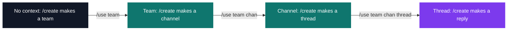
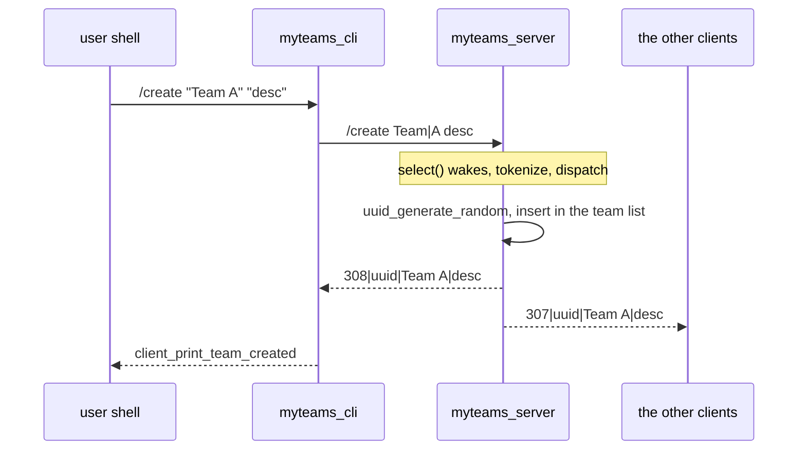
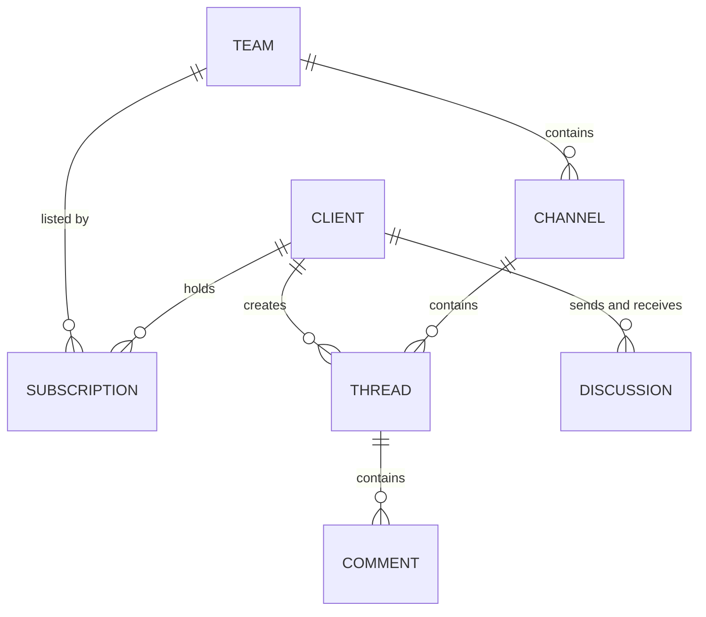

# myTeams — collaborative messaging

[](https://antoinepoisson.github.io/Old-School-Projects/projects/nwp-myteams-2019)

   

[Tek2](../../README.md) / [Network](../README.md) / **NWP_myteams_2019**

*Team project · Network Programming (B-NWP-400) · May–June 2020 · 2 weeks · Grade A*

A Microsoft Teams clone in C — teams, topic channels, discussion threads, replies and private
messages — as a server and a CLI client that speak a protocol invented for the project:
**3,260 lines across 76 C files**, 14 commands, 38 reply codes, graded A.

Nothing on the wire is given. The school supplies one shared library whose **40 logging
functions** fix exactly what the server and the client are allowed to print — and stops there.
The byte format between the two processes is yours to invent and to document as an RFC.

`fork()` and threads are forbidden on top of that. A single process holds every session at once:
which user is behind each socket, and which team / channel / thread that user is currently
pointing at.

**The wire format.** One server frame is one line: a three-digit code, a `|`, then `|`-separated
payload fields. The ranges are lifted from FTP, so the client routes on the first digit alone
before it has parsed anything else.

```text
266|Service Ready                    session opened, socket accepted
300|<user_uuid>|<name>               a user logged in
308|<team_uuid>|<name>|<desc>        the team YOU just created
307|<team_uuid>|<name>|<desc>        a team SOMEONE ELSE created
402|<team_uuid>                      unknown team
500|Command not found                no such command
```

`2xx` session, `3xx` data for the client, `4xx` client-side failure, `5xx` server error. Exactly
two frames carry no payload — `400` (already exists) and `405` (not logged in) — and the client
matches those two by exact string before it splits anything on `|`.

A `3xx` or `4xx` frame goes to a 30-entry dispatch table that maps its code straight onto one
logging function, so no formatting decision is left to that path; the thirty entries between them
cover every code the imposed library has an output for. `2xx` and `5xx` frames fall through to a
plain echo of their fields.

Note the `308` / `307` pair. Every creation ships under **two codes — one for the author, one for
everyone else entitled to see it** — which is what lets the client print "you created a team" or
"Alice created a team" without tracking who asked for what. A new team is announced to every other
connected client; channels, threads and replies (`311`, `315`, `319`) reach only the clients
subscribed to the team, as the subject demands.

| Command | Effect | Replies |
| --- | --- | --- |
| `/help` | point at the protocol document | `200` |
| `/login "name"` | attach the socket to a user, new or returning | `300` · `400` |
| `/logout` | detach, broadcast to everyone | `301` |
| `/users` | every known user | `309` |
| `/user "uuid"` | one user and its online flag | `302` · `401` |
| `/send "uuid" "body"` | private message | `303` · `401` |
| `/messages "uuid"` | the whole conversation with a user | `304` · `401` |
| `/subscribe "team"` | join a team and its event feed | `305` · `402` |
| `/subscribed ?"team"` | your teams, plus a team's members when given one | `324` · `309` · `402` |
| `/unsubscribe "team"` | leave | `306` · `402` |
| `/use ?team ?chan ?thread` | move the session context | `402` · `403` · `404` |
| `/create` | create the sub-resource of the context | `308` `312` `316` `320` |
| `/list` | list the sub-resources of the context | `310` `313` `317` `321` |
| `/info` | describe the context | `314` `318` `322` · `302` |

**Context, not arguments.** The last three commands have no fixed meaning. `/use` walks the
session down a ladder, and `/create` and `/list` read whichever rung it is standing on. Fourteen
commands cover four levels of hierarchy because the state lives server-side.



`/use` also doubles as access control: entering a team is refused with `402` unless the client's
own subscription list already contains that UUID, so authorisation is one list walk instead of a
separate permission model.

**A round trip.** The subject asks for correct multiplexing on writes as well as reads, so every
write to a client is preceded by a 3-second `select()` on writability. One client with a full
receive buffer then stalls the single loop for three seconds at worst instead of forever — the
failure mode `fork()` would have papered over.



**The `|` trick.** Team names contain spaces; the server splits commands on spaces. `/create` is
the only command whose first field can contain spaces *and* be followed by another one — `/login`
joins all its arguments into a single name, `/send` takes a space-free UUID and joins the rest — so
rather than write a quoting parser on both ends, the client rewrites the spaces inside `/create`'s
first quoted argument as `|`, a byte the tokenizer never splits on, and the server maps them back.

```c
/* client: inside /create's first quoted argument, spaces become '|' */
for (int i = 0; cmd[i] && cmd[i] != '\n'; i++) {
    if (cmd[i] == '"')
        nbr++;
    if (nbr == 1 && (cmd[i] == ' ' || cmd[i] == '\t'))
        cmd[i] = '|';
}

/* server: after the space tokenizer, '|' becomes a space again */
for (int i = 0; name && name[i]; i++)
    if (name[i] == '|')
        name[i] = ' ';
```

TCP also gives no message boundaries, so a single `read()` can return two frames glued together.
Both ends run the same `management_multi_cmd()` splitter — one file copied into each binary — to
cut the buffer on `\n` before anything is interpreted. It splits, it does not buffer: a frame torn
across two reads is the case this design still does not cover.

**The model.** Six linked lists. Five of them key their rows with an uppercase UUID from
`libuuid`; a private-message row carries no id of its own, only a sender and a receiver. Every
child names its parent by UUID rather than by pointer — which is what makes a reload possible.



One arrow is missing from that diagram on purpose: `comment_t` carries no author field. The live
`320` / `319` events do carry the right sender, but nothing stores it, so `/list` inside a thread
replays every reply under the thread creator's name.

**Persistence.** On shutdown each list is dumped record by record into its own file under
`.data_base/`, behind a magic line and a record count. The dump is the raw struct, `next` pointer
included — so the reload deliberately ignores that field and rebuilds the chain through the normal
insert functions. A stale address is never dereferenced, and if any of the six files fails its
magic check the whole database is dropped rather than half-loaded.

`SIGINT` is handled the same way: the handler only bumps a counter that the loop tests, so the
save runs on the main path instead of inside a signal context. The loop also exits after 60
idle seconds, which makes an unattended server persist itself rather than be killed.

## Build & run

```bash
make
./myteams_server <port>
./myteams_cli <ip> <port>       # one per user
```

The client reads commands from standard input; `/help` answers with a single `200` frame pointing
at the protocol document, of which the table above is the short version.

## Beyond the baseline

- The complete hierarchy and the private-message history survive a server restart.
- Criterion tests and a fixture that drives the read path without a socket.

## Technical stack

C · Makefile, gcc, Criterion, gcovr, libuuid, the imposed `libmyteams` logging library, Git.

## Verification

Six Criterion tests (`make tests_run`, coverage through `gcovr`) aimed at the layer under the
commands: socket setup and teardown, the reply formatter's argument guard, the word tokenizer and
the multi-command splitter — the last two being where a malformed frame turns into a crash.

The neatest one opens `tests/input.txt` as the client's socket descriptor. The read path only ever
calls `read()`, so a regular file substitutes for a peer and the whole receive path runs with no
network at all.

## Original documentation

The [upstream README](./README.upstream.md) keeps the full client command reference.

---

[Tek2](../../README.md) / [Network](../README.md) · [⌂ All projects](../../../README.md)
