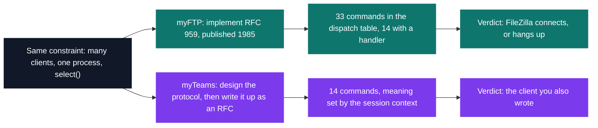

# Network — sockets & protocols

[← Tek2](../README.md) · [⌂ All projects](../../README.md)

Two servers written straight onto POSIX sockets, March to June 2020, with no framework under
either. myFTP has to obey a standard published in 1985 closely enough that FileZilla never notices
it is talking to a student's program; myTeams has no standard to obey, so the wire format was
invented, written up as an RFC, and then lived with. Both hold every session in one process —
`select()` picks who is served next — and myTeams is denied `fork()` and threads on top of that.

| Project | What it is | Size | Code | Grade |
| --- | --- | --- | --- | --- |
| [myFTP](NWP_myftp_2019) | RFC 959 server: control channel on `select()`, one forked child per transfer | 2 weeks | 1,620 lines of C | A |
| [myTeams](NWP_myteams_2019) | Teams clone over a line protocol of its own design | 2 weeks · team | 3,260 lines of C | A |

Both answer in three-digit codes, and both ended up with 38 of them — myFTP because RFC 959 lists
them, myTeams because it borrowed the scheme and then had to wire 30 codes into its own client's
dispatch table.

## Projects (2)

- **[myFTP — FTP server](NWP_myftp_2019)** — *2 weeks · Grade A*
  An RFC 959 server real FTP clients connect to, in active (`PORT`) and passive (`PASV`) mode.

- **[myTeams — collaborative messaging](NWP_myteams_2019)** — *2 weeks · Team · Grade A*
  A Microsoft Teams clone in C: teams, channels, threads and private messages, persisted across restarts.
