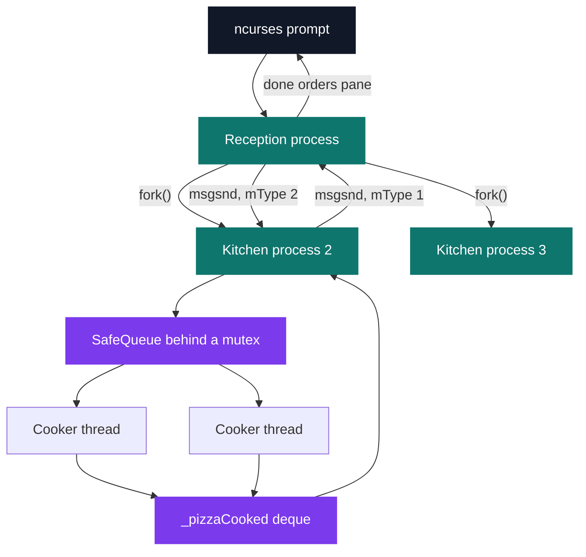
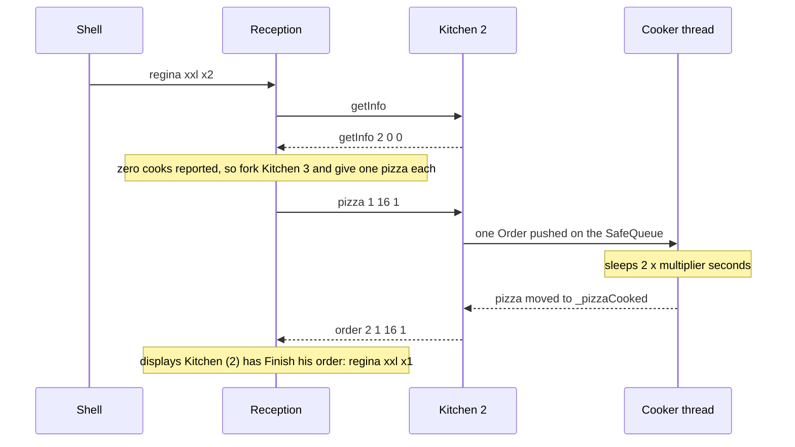

# Plazza — concurrent pizzeria

[](https://antoinepoisson.github.io/Old-School-Projects/projects/ccp-plazza-2019)

   

[Tek2](../../README.md) / [OOP](../README.md) / **CCP_plazza_2019**

*Team project · Concurrent Programming (B-CCP-400) · April–May 2020 · 2 weeks · Grade A*

Plazza runs two models of parallelism inside one program. A kitchen is a `fork()`ed process that
talks to the rest of the world only through a System V message queue. Inside that process a cook is
a thread, and every cook of a kitchen pulls from the same `SafeQueue` behind a mutex.

An order typed at the prompt has to cross both boundaries and find its way back. The reception never
sees a cook — it sees three numbers inside a 100-byte message, and decides from them alone whether
to spread the order over the kitchens it already runs or spend a `fork()`.

While it decides, a kitchen that has been idle for five seconds is allowed to shut itself down. The
set of processes the reception reasons about can shrink between two orders.



**The shell.** An order is a triplet — type, size, count — and several triplets chain on one line
with `;`, exactly the grammar the subject imposes: `regina xxl x2 ; margarita m x1` is one command.
`status` is not a fourth rule. The parser only knows triplets, so the shell rewrites the bare word
into `status s x2` before parsing and steps over the two padding tokens when it executes the line.

The ncurses view splits the terminal in three. The top half animates a banner one frame per second,
the bottom-left pane keeps the command history, the bottom-right pane collects finished orders and
`status` replies. Both lists are cleared and reprinted whole, throttled to one redraw per 250 ms.

```text
top pane      WELCOME -> TO -> THE -> PLAZZA -> RESTAURANT, one frame per second

bottom-left   --- List of Command: ---
              Plazza -> How can I help you ?
              You -> regina xxl x2
              Plazza -> Your Commande: regina, xxl, x2 is on preparation.
              You -> margarita m x1
              Plazza -> Your Commande: margarita, m, x1 is on preparation.
              You -> status

bottom-right  --- List of Done Order: ---
              Kitchen (2) has Finish his order: regina xxl x1
              Kitchen (3) has Finish his order: margarita m x1
              n°1 Kitchen (id: 2) has 1/4 cook free and 1 pizza in preparation.
              n°2 Kitchen (id: 3) has 0/4 cook free and 0 pizza in preparation.
```

| Pizza | Ingredients | Bake time |
| --- | --- | --- |
| `margarita` | doe, tomato, gruyere | 1 × multiplier |
| `regina` | doe, tomato, gruyere, ham, mushrooms | 2 × multiplier |
| `americana` | doe, tomato, gruyere, steak | 2 × multiplier |
| `fantasia` | doe, tomato, eggplant, goat cheese, chief love | 4 × multiplier |

Each recipe is a `Pizza` subclass holding its ingredient list, but a cook only ever reads the bake
time: the ingredient stock the subject describes — five units of each, one regenerated every N
milliseconds — stayed at the model stage, and the third command-line argument that carries N is
parsed, stored and never read again.

**Distribution.** The reception asks every kitchen for a cook count, sizes the job at two pizzas per
counted cook, and forks another kitchen for as long as the pizzas already in flight plus the new
ones exceed that. It then hands pizzas out one at a time to whichever kitchen carries the smallest
load, so a batch is spread over every process already open instead of landing on one of them.

What crosses the wire is not the free-cook count the field name promises. A kitchen computes
`busyCook` as its cook count minus the pizzas in the oven, then `freeCook` as the complement of
that — so the number it reports is the count of cooks *at work*. An idle kitchen announces zero, and
the reception forks a fresh process instead of reusing it.

The error falls on the safe side, and only on the safe side: a kitchen rechecks the ceiling itself
when the order lands, refusing the whole batch if the total would pass two pizzas per cook, and
nothing tells the reception it did. Over-forking is recoverable; over-filling a kitchen would not be.



**The wire.** Direction is carried by the message queue's `mType` field: the reception listens on
channel 1 and kitchen *n* on channel *n*, its counter starting past the reception so that the first
kitchen forked is number 2. Both ends read with `IPC_NOWAIT`, so neither can block on the other —
the reception polls its kitchens from the same loop that polls the keyboard.

Every `QueueMessage` keys itself with `ftok()` on a path under `./.ipc/` that nothing ever creates,
so the key resolves to `-1` and reception and kitchens all land on the same queue. `mType` is not a
routing convenience here, it is the entire addressing scheme. The reception opens and immediately
destroys that queue at startup, which is what clears anything a previous run left behind.

Payloads live in a fixed 100-byte field and are XOR-ed with their own length before `msgsnd`, which
is why `Encrypt::unpack()` is a single call to `Encrypt::pack()`.

| Direction | Message | Meaning |
| --- | --- | --- |
| reception → kitchen | `getInfo` | report load before a distribution |
| reception → kitchen | `status` | report load for the shell command |
| reception → kitchen | `pizza <type> <size> <n>` | queue n pizzas, type and size as enum values |
| kitchen → reception | `Kitchen (2) is Open` | sent on the first loop turn |
| kitchen → reception | `getInfo <id> <cooks> <n>` | cook count, pizzas accepted and not yet returned |
| kitchen → reception | `status <id> <cooks> <n>` | same numbers, routed to the shell display |
| kitchen → reception | `order <id> <type> <size> 1` | one pizza is out of the oven |
| kitchen → reception | `Close` | five seconds idle, asking to die |

**The cooks.** A cook thread never blocks. `tryPop` takes the mutex with `trylock` and gives up if
another cook got there first; the thread sleeps 200 ms and tries again.

```cpp
void Plazza::Cooker::cooking()
{
    Plazza::Order temp;

    while (!_stop) {
        if (_order.tryPop(temp)) {
            makePizza(temp.getType(), temp.getSize());
        }
        std::this_thread::sleep_for(std::chrono::milliseconds(200));
    }
}
```

The `ConditionVariable` wrapper that would let a cook wait instead of poll is written and sits in the
tree, outside the Makefile's source list — 19 of the 21 `.cpp` files are compiled. Trading 200 ms of
latency per pizza for a cook loop that cannot deadlock is a defensible call; the sharper audit note
is that `SafeQueue::push` stays outside the mutex `tryPop` takes, so the kitchen thread writes to the
deque while a cook may be reading it.

**Shutdown.** Idle detection is deliberately doubled. After five seconds with no pizza a kitchen
sends `Close`, and the reception answers with `SIGQUIT` and forgets it. If no answer comes, the
kitchen counts its own unanswered notices and calls `exit(0)` once the third has gone out — an
orphaned kitchen cannot keep running in silence.

2,677 lines of C++ over 48 files, five interfaces (`IThread`, `IMutex`, `IConditionVariable`,
`IIPC`, `IGraphics`), four pizzas and nine ingredients.

## Beyond the baseline

- An ncurses interface showing every kitchen's state live, on top of the required shell.
- Inter-process messages packed with a homemade XOR rather than sent as raw structs.
- Concurrency primitives wrapped behind their own interfaces (`IThread`, `IMutex`,
  `IConditionVariable`) instead of calling `pthread` directly.

## Technical stack

C++ · ncurses · Makefile, g++, Git.

## Build & run

```bash
make                  # also: clean, fclean, re
./plazza 2 5 2000     # multiplier, cooks per kitchen, restock period in ms
```

Produces `plazza`. It accepts exactly three unsigned integers, the cook count non-zero; anything
else prints the binary's own usage line and exits 84. Each run also writes a `.log` transcript of
every message that crossed the queue, which is where the reception's trace and the kitchens'
interleave.

---

[Tek2](../../README.md) / [OOP](../README.md) · [⌂ All projects](../../../README.md)
