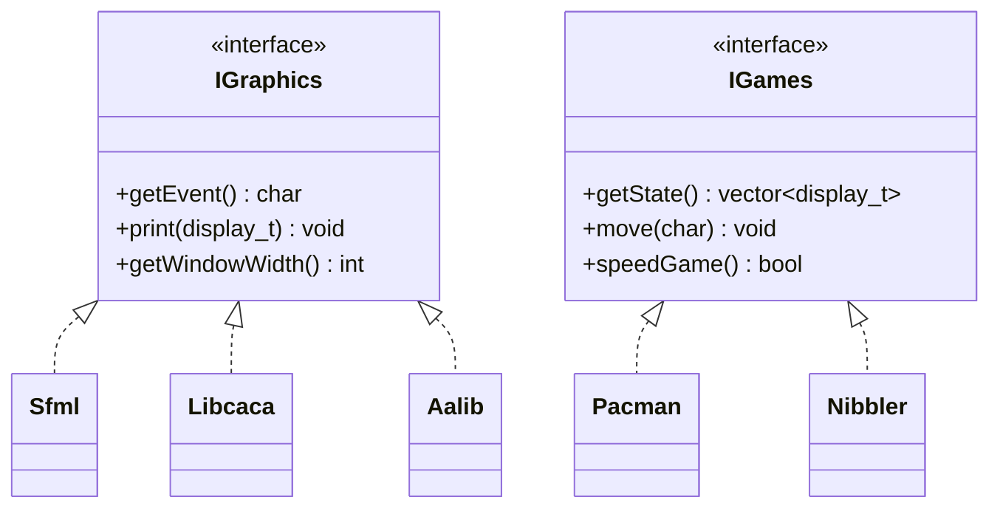
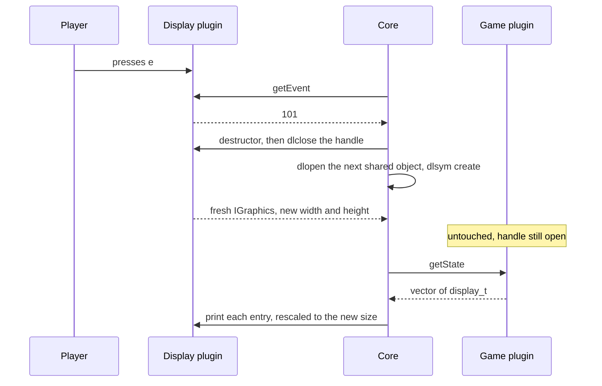
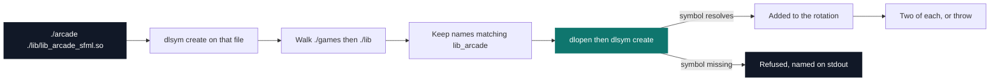

# Arcade — retro gaming platform

[](https://antoinepoisson.github.io/Old-School-Projects/projects/oop-arcade-2019)

   

[Tek2](../../README.md) / [OOP](../README.md) / **OOP_arcade_2019**

*Team project · Object-Oriented Programming (B-OOP-400) · March–April 2020 · 2 weeks · Grade B*

Press `e` while Pac-Man is halfway through the maze. The SFML window closes, an ASCII canvas opens
in the terminal, and Pac-Man is on the same tile, with the same pellets gone and the same six
ghosts around him. The binary that did it links `-ldl` and nothing else — it has never included a
line of SFML, of libcaca, or of Pac-Man.

That is the whole subject. A core that knows no concrete class can only speak to its plugins
through an interface, and this one has to describe an 1800×1000 SFML window and a 170×55 libcaca
canvas using the same words. The answer, in `lib/IGraphics.hpp`, is one struct of seven fields,
repeated character for character in `games/IGames.hpp` and `core/Core.hpp` behind a `DISPLAY_T`
guard so both sides of the boundary compile the same layout:

```cpp
typedef struct display_s {
    std::string ascii;
    std::string foreground;
    std::string background;
    std::string image;
    float x;
    float y;
    bool isPrint;
} display_t;
```

A game hands back a `std::vector<display_t>`, a score and a status — nothing about pixels or
character cells travels the other way. Each renderer honours the field it can: SFML loads `image`
as a texture and falls back to drawing `ascii` when the file will not open, libcaca and aalib only
ever put `ascii` at a character cell. Put a sprite handle or a pixel rectangle in that struct and
the terminal backends stop being implementable at all.

`x` and `y` are normalised floats in `[0, 1]`; Pac-Man lays its grid out at `cellSize = 0.05f`.
`Core::positionToDisplay()` multiplies them by whatever `getWindowWidth()` the *current* backend
reports, and each terminal backend then rescales on its own — `x / 7` in libcaca, `x * 3.5` in
aalib — because the size those two report back is not a count of character cells. The fudge factor
lives in the plugin, which is the point: the game never learns who is drawing it.

Pac-Man lays that grid out as twenty string literals — map on the left, legend on the right:

```text
.W..W...W..W..W...W.      W  wall          169 cells
...WW.WWW....WW.WWW.      .  pacgum        220 cells, 2 points
.W..W....W*W..W....W      *  power pellet    4 cells, 6 points
WWW....W.WWWW....W.W      G  ghost start     6 cells
.W..WW.W.W.W..WW.W.W      P  player          1 cell
.W.....W...W.....W..
.W.WWWWW.....WWWWW.W      A perfect clear is worth 464 points.
.W.................W
WWWWW.W.WWWWWWW.W.WW      Ghosts sit in the pen for ten seconds, then
..W...W.WGGGW...W*W.      pick uniformly at random among their legal
.W..W.W.WGGGW.W...W.      moves rather than chasing; the arcade original
...WW.W.WWWWW.W.WWW.      gives each ghost a distinct target tile, which
.W..W.....P...W....W      is what makes the pack feel coordinated.
WWW....W.WWWW....W.W
*W..WW.W.W.W..WW.W.W
.W.....W...W.....W..
.W.WWWWW.W.W.WWWWW.W
.W.......W*W.......W
WWWWW.W.WWWWWWW.W.WW
..W...W.W...W...W.W.
```

Two pure-virtual classes carry the contract, seven methods each, and every implementation is
reached through a `create` factory exported with C linkage so `dlsym` finds it unmangled.



Keeping the run alive across a swap is a matter of what `changeLib()` deliberately does *not*
touch: it destroys the graphics object, `dlclose`s its handle and loads the next one, while
`currentGameHandle` and the `IGames *` stay exactly as they were.



The frame clock sits on the game side: `IGames::speedGame()` gates every tick — `450 - score * 0.1`
ms in Pac-Man, `450 - score * 0.3` in Nibbler, so both accelerate as they empty. A display-driven
clock would have run the same game at two different speeds.

`clockDisplay()` is in `IGraphics` all the same, implemented three times and never called by the
core; `foreground` and `background` are dead the same way, read by no renderer. The interface was
negotiated with a second team, and a negotiated contract carries slack.

## Beyond the baseline

The core checks the library named on the command line first, then walks `./games` and `./lib`,
keeps every entry matching `lib_arcade_\S+.so`, and `dlopen`s each one to confirm `create` resolves
before adding it to the rotation. The command-line library is skipped during the walk and appended
afterwards, so it shows up exactly once. Fewer than two conformant games — or two conformant
displays besides the one given — and the loader throws instead of opening a half-empty menu.



That check is not theoretical — the repository's own build exercises it every run:

| Plugin | Kind | What it is |
| --- | --- | --- |
| `lib_arcade_sfml.so` | display | 1800×1000 window, 60 fps cap, PNG sprites |
| `lib_arcade_libcaca.so` | display | 170×55 ASCII canvas |
| `lib_arcade_aalib.so` | display | 175×65 ASCII canvas |
| `lib_arcade_pacman.so` | game | 20×20 maze, 6 ghosts, 10 s power-up |
| `lib_arcade_nibbler.so` | game | 10×10 board, growing snake, 25 points a fruit |
| `qix`, `centipede`, `solarfox` | game | 16-line scaffolds, no `create`, refused at load |

Three of the eight shared objects export no factory. The loader names each one on stdout —
`doesn't have create methode.` — and drops it, leaving three displays and two games in the menu;
calling `create` blind would jump through a null pointer.

- A high score shared by every game in `core/.score`: one `name=value` line — the file committed
  here reads `garen_ap=175` — matched against `\S+=\d+` at startup and rewritten whenever a run
  beats it.
- Interfaces negotiated with a second three-person group, so each team's games ran in the other's
  launcher, which is why the contract is a plain struct. The guide for plugging in a new library
  ships in `./doc`.

## Technical stack

C++ · SFML, libcaca, aalib · `dlopen` / `dlsym` / `dlclose` · Makefile, g++, Git.
26 source files, 2344 lines, 12 Makefiles: one per plugin, one for the core, three that recurse —
so every `.so` builds on its own.

## Build & run

```bash
make
./arcade ./lib/lib_arcade_sfml.so
```

`make` produces `arcade`, `lib/*.so` and `games/*.so`. The binary takes one graphics library on the
command line; everything else is found at runtime.

| Key | Action |
| --- | --- |
| `a` / `e` | previous / next graphics library |
| `o` / `p` | previous / next game |
| `1`–`9` / `n` | pick a game from the menu / enter a score name |
| `r` / `m` | restart / back to the menu |
| `z` `q` `s` `d` / `Esc` | move / quit |

---

[Tek2](../../README.md) / [OOP](../README.md) · [⌂ All projects](../../../README.md)
