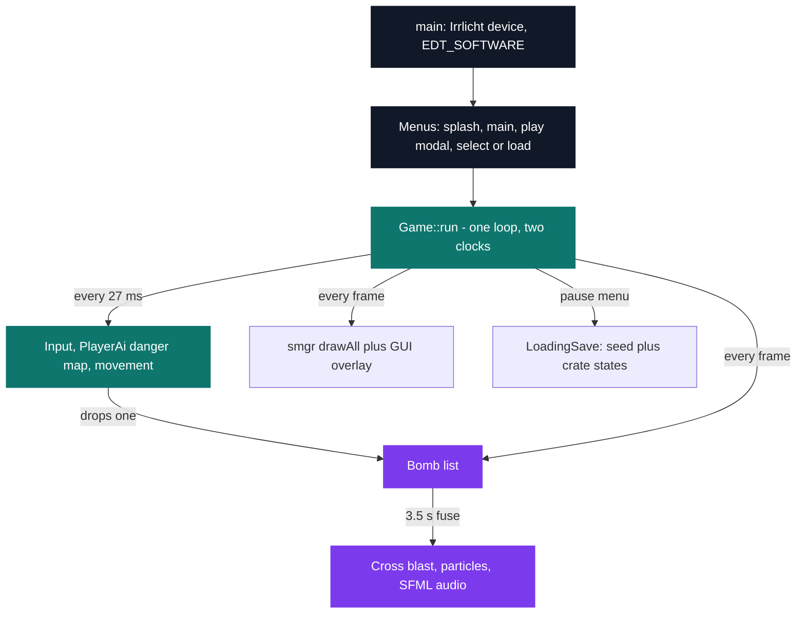
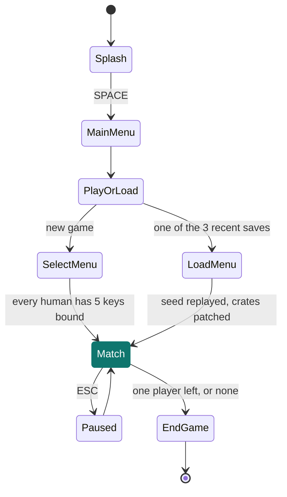

# Indie Studio — 3D Bomberman

[](https://antoinepoisson.github.io/Old-School-Projects/projects/yep-indie-studio-2019)

   

[Tek2](../../README.md) / [OOP](../README.md) / **OOP_indie_studio_2019**

*Team project · Year-End Project — Indie Studio (B-YEP-400) · May–July 2020 · 3 weeks · Grade A*

A four-player 3D Bomberman with bots that survive their own bombs, procedurally generated maps, a
save that resumes, and one source tree that builds on Linux and on Windows. It is the second year's
end-of-year project, and the first in the curriculum required to compile on two operating systems.

A bomb is exactly as lethal to the player who dropped it as to the other three, and it resolves
3.5 seconds after it lands. A bot that places one without already knowing its way out dies to its
own bomb — so `PlayerAi` never plans against the raw grid. On every logic tick it rewrites a
**danger map** of the whole board, propagating each live bomb's blast until a wall or a crate stops
it, and only then decides whether to flee, hunt or attack.

| Area | Numbers |
| --- | --- |
| Team's own C++ | 4,762 lines, 70 files, 40 classes |
| With vendored Irrlicht + SFML | 67,828 lines across 352 files |
| Screens | 8 menus plus an in-game pause overlay |
| Assets | 109 UI images, 6 sounds, 9 meshes |
| Players per match | 4, any mix of human and AI |

That total makes this the largest C/C++ tree in the archive, nearly six times the next one. The
rest of this page is about the 4,762 lines that are ours.

**Two clocks, one loop.** `Game::run()` draws as fast as Irrlicht will go, but gates input, AI and
movement behind `clockEvent.getElapsedTime() >= 1000 / MOVE_PER_SECONDS` — integer division on
`MOVE_PER_SECONDS = 36`, so one logic tick per 27 ms. Bomb fuses and drawing stay on the frame
path; how fast a body walks stops depending on how fast the machine renders.



**Discrete logic, continuous bodies.** The map is a `vector<vector<mapElement_t>>` of cells, 30
world units each. A body's speed field starts at 2.8, but `APlayer::move` rounds the new integer
position, so at base speed it advances exactly 3 units per tick — ten ticks to cross a cell.

Turning is what breaks in the gap between two centres. `Map::checkCanMove` allows movement along one
axis only when the offset on the *other* axis lies between `SMALL_BORDER` and `HIGH_BORDER`, the
middle 40 % of the cell. Without that corridor, a body straddling two rows clips the corner of a
wall.

**The danger map.** Each bot keeps a `std::map<std::pair<int, int>, int>` of the board, one
character code per cell, rewritten every tick because bombs, crates and power-ups all move under it.

```text
xxxxxxxxxxxxx     x   wall or border - stops a blast
x  z o   p  x     z   crate - absorbs one blast tile, may drop a power-up
x x xox x x x     p   power-up lying on the floor
x  ooooAz   x     o   inside a live blast
x x xox x x x     ' ' free floor
x z  o   z  x
x xzx x x x x     A   the bot, standing on an 'o' cell: it must move now
x   z       x         (players are never written into the map)
xxxxxxxxxxxxx
```

Propagation is deliberately not a flood fill: each bomb walks its four axes outward, and a crate
absorbs the blast on its own tile and stops it — the same rule `Bomb::isExplosion` applies, so the
bot's model and the real blast agree.

```cpp
_map[std::make_pair(x, y)] = 'o';
for (int a(1); a < bomb->getRangeBomb() + 1; a++) {
    if (!stop[0] && _map[std::make_pair(x + a, y)] != 'x')
        { if (_map[std::make_pair(x + a, y)] == 'z') stop[0] = true; _map[std::make_pair(x + a, y)] = 'o'; } else stop[0] = true;
    // three more branches, one per remaining axis
}
```

**Choosing the way out.** Standing on `o`, `checkBomb()` scans the four lanes and counts cells to the
first safe tile. A lane that hits a wall or a crate before leaving the blast is no escape at all, so
it scores `10000` instead of a distance — a sentinel that never wins a `min_element`, which saves
carrying a second "is this lane usable" flag.

On the board above, the bot has a crate to its right (unusable), four blast cells to its left before
the floor clears, and one clean step on either perpendicular lane. It takes the step.

**One decision per cell.** `_moves++ < MULTIPLICATOR` short-circuits `checkPlayers` straight back to
the previous `_direction` for ten ticks, and ten ticks is exactly one 30-unit cell at base speed. So
the bot moves in whole-cell steps without ever storing a cell-aligned position, and cannot oscillate
between two directions at a junction.

Attacking is gated the same way: a bomb goes down only when a target is aligned within range, the
pouch is not empty, and `_wait.getElapsedTime() >= 2000` clears a two-second cooldown.

*Audit note:* when all four lanes are blocked and every obstacle is adjacent, the urgency list is
filtered empty and `min_element` runs on an empty range — undefined by the standard, still present
in the delivered code, and one emptiness check away from closed.

| Power-up | Effect | Odds per crate |
| --- | --- | --- |
| `PowerMoreBomb` | refills the pouch to 10 | 1 in 8 |
| `PowerUpRangeBomb` | +1 cell of blast range | 1 in 8 |
| `PowerSpeedUp` | +0.35 on the speed field | 1 in 8 |
| `PowerPassBox` | walk through crates | 1 in 8 |

Half of all destroyed crates drop nothing, and the pouch refills one bomb per twelve seconds up to
ten. Speed runs into the same rounding as movement: 2.8 becomes 3.15 with the first bonus, which
still lands on a 3-unit step, so the effect arrives in whole units or not at all.

## Beyond the baseline

**Saving without serialising the map.** Save and load were required; writing out every wall, floor
and crate was not the only way to get them. The save records the `srand` seed, replays the generator
on load, and patches in what diverged — one line per crate.

```text
1590742841        # srand seed - the entire map is rebuilt from this number
36                # crate count, then one line per crate
3                 # 3 = intact, 0 = destroyed, 8..11 = the power-up it left behind
...
2                 # human players, 14 fields each:
                  #   x y z colour alive bombs speed passBox range  left up right down bombKey
2                 # AI players, the same 9 leading fields, no key bindings
```

Bombs in flight are not restored; their writer sits commented out in `LoadingSave.cpp`. Resuming
mid-fuse means re-deriving a bomb's remaining time from a clock that no longer exists, so the cut
was to make every saved state a quiet one.

**A particle system for the explosions,** where each blast arm spawns an Irrlicht box emitter whose
particle lifetime scales with the arm's length and inversely with the measured frame rate.

**An animated splash screen and a settings menu.** Volume is a dragged slider written straight to
`.settingsAudio`; resolution and mesh quality get their own dotfiles, re-read at startup.

**A hand-written `Makefile` beside the mandatory CMake build,** so a Linux checkout compiles without
generating anything first.

## Technical stack

C++ · Irrlicht, SFML · CMake, Makefile, g++, Git.

Every screen is authored in a virtual 1920×1080 space. Irrlicht's software driver blits 2D images
1:1 and will not scale them, so `get_img()` loads each texture once, locks it, resamples every pixel
down by `R_RATIO`, blanks the leftover bands and caches the result. Three resolutions for one price:
switching one parks the game on a "restart" screen, because every cached texture was baked at the
old ratio.



Four players share one keyboard, so the event receiver keeps two maps — `buffer` for the held state
the direction keys read, `bufferRelease` for the edge state the bomb key reads — and rebinding a key
strips it from whoever else held it.

Portability is structural, not a checkbox. `CMakeLists.txt` carries a full `UNIX` branch and a full
`WIN32` branch — different SFML tree, output directory and link libraries — and both dependencies
are vendored, so neither platform depends on what the grader had installed.

## Build & run

```bash
cmake .
make
```

Produces `bomberman`. `make.sh` builds out of tree instead, drops `Irrlicht.dll` into `build/` and
runs the binary — stashing the hand-written `Makefile` in `ressources/` for the duration so the two
build systems never collide.

---

[Tek2](../../README.md) / [OOP](../README.md) · [⌂ All projects](../../../README.md)
