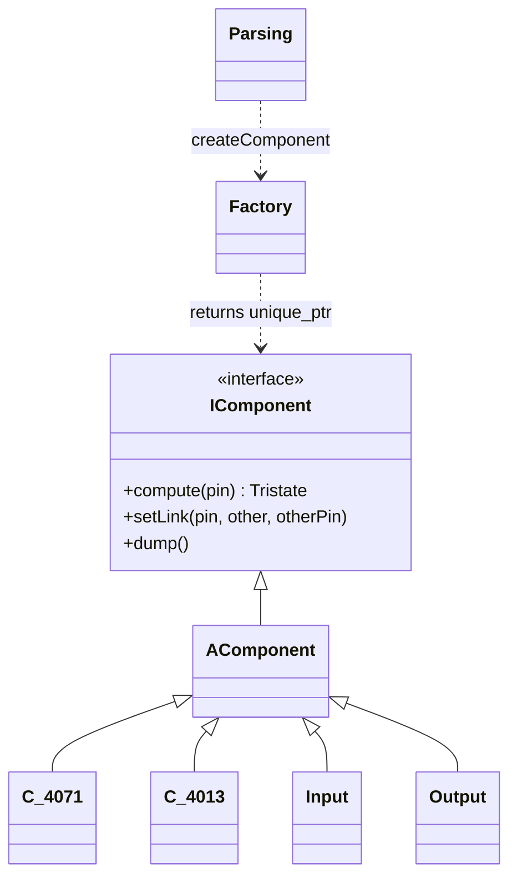
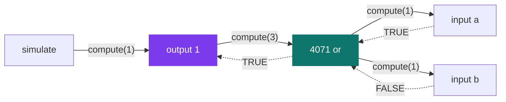

# NanoTekSpice — logic circuit simulator

[](https://antoinepoisson.github.io/Old-School-Projects/projects/oop-nanotekspice-2019)

  

[Tek2](../../README.md) / [OOP](../README.md) / **OOP_nanotekspice_2019**

*Team project · Object-Oriented Programming (B-OOP-400) · May 2020 · 2 weeks · Grade B*

`nanotekspice` reads a text description of a circuit board — which chips, wired pin to pin — and
reports what comes out of every pin. The hard part is that a wire is not a boolean.

Before a simulation settles, a pin holds a third value: *undefined*. `nts::Tristate` has three
states — `TRUE`, `FALSE` and `UNDEFINED`, that last one literally spelled `-true` — and undefined
has to travel through the circuit exactly like the other two.

That single decision costs every gate its one-liner. Each `compute` resolves its two pins first,
then runs a guard — if either side came back undefined, the answer is undefined — and only then
evaluates the boolean expression, `a || b` for the 4071, `!(a && b)` for the 4011, `a ^ b` for the
4030.

50 C++ files, 1,945 lines, 19 component classes, two weeks, in a team.

**The factory is the only construction site.** `Factory::createComponent(type, value)` is the one
function that names a concrete chip class; everything it hands back is a
`std::unique_ptr<nts::IComponent>`, and the graph stores nothing else. The parser keeps two
concrete-type habits of its own: a list of legal chip names, and a `dynamic_cast<Output*>` to find
the nodes worth evaluating.



**Evaluation is lazy and pulls backward.** Nothing is pushed forward from the inputs. `simulate`
walks the outputs only — the ones a `dynamic_cast` picks out — and each calls `compute(1)`, which
calls its neighbour, which calls its own neighbours, down to whatever terminates the chain.

`setLink` is applied in both directions when the file is parsed, so every pin knows the component
*and* the pin on the other end of its wire. That is what lets the recursion travel a netlist with
no separate direction table: an output asks its neighbour for pin 3, and pin 3 is where the gate
begins.



**The circuit format.** A `.nts` file is two sections: `.chipsets:` declares components and names
them, `.links:` wires `name:pin` to `name:pin`. This is `test_file.txt` from the repository, minus
its commented-out block — a single OR gate:

```
.chipsets:
input a
input b
4071 or
output 1

.links:
a:1 or:1
b:1 or:2
or:3 1:1
```

Feed it to the binary and you land in an interactive interpreter, inputs set on the command line
and changed at the prompt:

```console
$ ./nanotekspice test_file.txt a=0 b=0
1=0
> a=1
> simulate
> display
1=1
> exit
```

The four boolean rows below come from running that circuit on all four input pairs. The last two
come from the guard the 4071 applies once both pins are resolved — no command line can set an input
to undefined, so only a chip that *returns* `UNDEFINED` can put a `U` on a wire.

| `a` | `b` | `or:3` |
| --- | --- | --- |
| `0` | `0` | `0` |
| `0` | `1` | `1` |
| `1` | `0` | `1` |
| `1` | `1` | `1` |
| `U` | any | `U` |
| any | `U` | `U` |

**Where the tristate stops being a guard clause.** Only the 4001 tries to do better than "undefined
swallows everything". A NOR gate with one input already at `TRUE` is `FALSE` whatever the other pin
does, so it short-circuits instead of giving up:

```cpp
if (a == nts::Tristate::UNDEFINED || b == nts::Tristate::UNDEFINED
&& a != nts::Tristate::TRUE && b != nts::Tristate::TRUE)
    return (nts::Tristate::UNDEFINED);
return (static_cast<nts::Tristate>(!(a || b)));
```

`&&` binds tighter than `||`, so the shortcut fires when the `TRUE` sits on the first pin and not on
the second — feed a 4001 a `TRUE` on pin 1 and an undefined on pin 2 and it answers `0`, swap them
and it answers `U`. The rule is the right one; a pair of parentheses would make it symmetric.

Eight packages carry real pin-level logic, addressed by their actual DIP pinout — a quad gate holds
four independent gates in one chip, so `compute(3)` reads pins 1 and 2 while `compute(11)` reads 12
and 13.

| Package | Function | Pins |
| --- | --- | --- |
| `4001` | quad 2-input NOR | 14 |
| `4011` | quad 2-input NAND | 14 |
| `4030` | quad 2-input XOR | 14 |
| `4069` | hex inverter | 14 |
| `4071` | quad 2-input OR | 14 |
| `4081` | quad 2-input AND | 14 |
| `4008` | 4-bit full adder | 16 |
| `4013` | dual D flip-flop | 14 |

Six more packages — the 4017 and 4040 counters, the 4094 shift register, the 4514 decoder, the 4801
RAM and the 2716 EPROM — are classes whose `compute` returns `TRUE` for any pin in range.

The catalogue is gated twice and the two gates disagree: an 11-name whitelist in the parser, an
18-name dispatch in the factory, and only 10 names in both. `4011 gate` clears the whitelist and
then exits 84 on `In Factory: Component unknown`; the six stubs, plus `true` and `false`, exist in
the factory but never clear the whitelist. One list, owned by the factory, closes both gaps.

## Beyond the baseline

- `dump` prints each component's wiring pin by pin — the graph the parser actually built, rather
  than the one the file describes. On `test_file.txt` that is four components and six pin entries,
  one per end of each of the three wires.
- `loop` simulates continuously and installs a `SIGINT` handler that clears a flag instead of
  killing the process, so Ctrl-C drops you back at the prompt with the circuit still loaded.
- The catalogue reaches past gates into arithmetic and sequential logic: the 4008 writes its carry
  into pin 14 with `setValue` rather than returning it, and the 4013 drives its complementary
  output the same way, by setting the value of the neighbouring pin.
- Parse and pin errors travel as an `Errors : std::exception` carrying the component that raised
  them, so a bad file prints `In Parse: …` or `In C_4008: …` and `main` returns 84.

## Technical stack

C++ · Makefile, g++, Git.

`std::unique_ptr` and `std::make_unique` own every component, `dynamic_cast` picks the `Output` and
`Input` nodes out of the graph, and `<regex>` validates the `name=value` arguments and the
`name:pin` link syntax. No external library — though `Parsing.hpp` includes `<bits/stdc++.h>`,
which ties the build to GCC's headers.

## Build & run

```bash
make
./nanotekspice test_file.txt a=1 b=0
```

Produces `nanotekspice`. Every `input` and `clock` declared in the file must be given a value on the
command line, or the parser refuses to build the circuit. Inside the interpreter: `display`,
`simulate`, `loop`, `dump`, `exit`, plus `name=0` / `name=1` to drive an input.

Eleven reference circuits ship under `doc/basics/`, from a single gate to a 4-bit adder and a
Johnson decade, plus a ROM demo in `doc/advanced/` with its 2,048-byte binary image. They sit in
the repository with their line breaks stripped and the parser splits a `.nts` file on newlines, so
`test_file.txt` at the root is the circuit that runs as checked out.

---

[Tek2](../../README.md) / [OOP](../README.md) · [⌂ All projects](../../../README.md)
