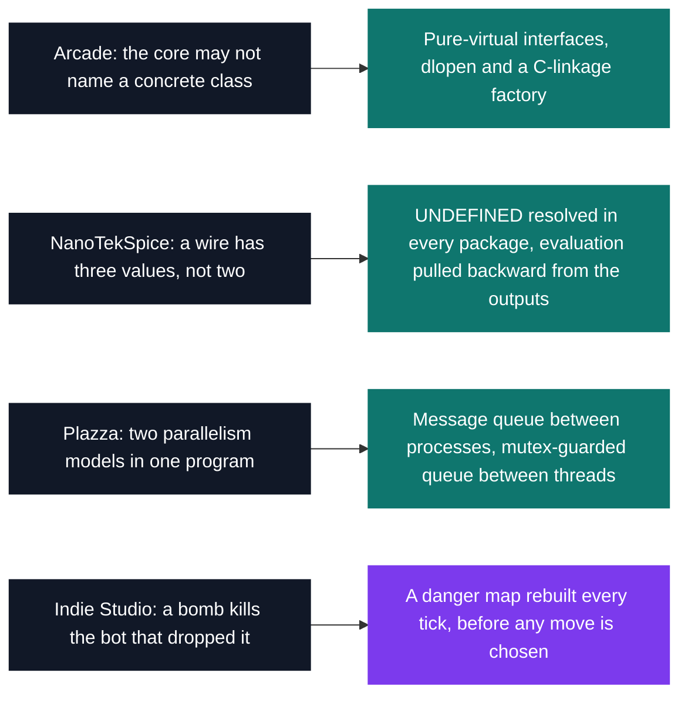

# OOP — concurrency, design & a year-end project

[Tek2](../README.md) / **OOP**

Four C++ projects, three module codes, one folder — and in each one an architecture settled by a
constraint no refactor removes. Arcade's core links against `-ldl` and nothing else, so it can never
name a game class; NanoTekSpice's wires carry three values, so `!(a || b)` stops being a NOR gate
and all 19 component classes resolve `UNDEFINED` themselves. Indie Studio closes the year as the
archive's largest C/C++ tree.

| Project | What it is | Module | Size | Grade |
| --- | --- | --- | --- | --- |
| [Arcade](OOP_arcade_2019) | Games and renderers swapped mid-run through `dlopen`, score and position intact | B-OOP-400 | 2 weeks · team | B |
| [Plazza](CCP_plazza_2019) | Pizzeria simulation: one process per kitchen, one thread per cook | B-CCP-400 | 2 weeks · team | A |
| [NanoTekSpice](OOP_nanotekspice_2019) | Circuit simulator where a wire holds `TRUE`, `FALSE` or `UNDEFINED` | B-OOP-400 | 2 weeks · team | B |
| [Indie Studio](OOP_indie_studio_2019) | 3D Bomberman, four players, AI that maps the blast before it moves | B-YEP-400 | 3 weeks · team | A |

Each subject fixes one rule you have to build around, and the rule picks the technique:

<pre>
OOP/
├── <a href="CCP_plazza_2019">CCP_plazza_2019/</a>       Plazza — a concurrent pizzeria: one process per kitchen, one thread per cook  · A
├── <a href="OOP_arcade_2019">OOP_arcade_2019/</a>       Arcade — five games and three renderers, hot-swappable via dlopen             · B
├── <a href="OOP_nanotekspice_2019">OOP_nanotekspice_2019/</a> NanoTekSpice — a logic circuit simulator with three-state signal propagation · B
└── <a href="OOP_indie_studio_2019">OOP_indie_studio_2019/</a> Indie Studio — a 3D multiplayer Bomberman with AI, the year-end project      · A
</pre>

---

[Tek2](../README.md)
