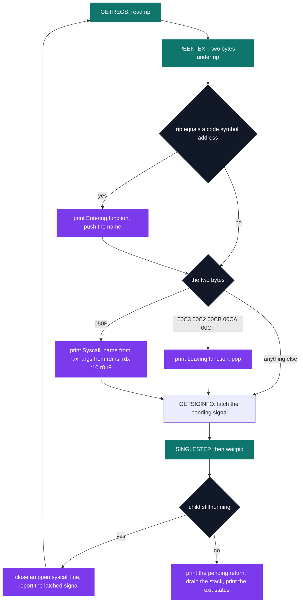

# ftrace — function call tracing

[](https://antoinepoisson.github.io/Old-School-Projects/projects/psu-ftrace-2019)

  

[Tek2](../../README.md) / [PSU](../README.md) / **PSU_ftrace_2019**

*Epitech project · Unix Prog. - Instrumentation (B-PSU-402) · May 2020 · 2 weeks · Grade A*

> Rebuilding a program's call tree from the outside, one machine instruction at a time.

`strace` has it easy: every system call crosses the kernel boundary, and the kernel will stop the
process there for you. A function call inside a program crosses nothing. No trap, no hook, no
event — just a `call` that moves `rip` somewhere else.

So the tracer has to become the event source. It runs the target under `PTRACE_SINGLESTEP` and, at
**every single instruction**, asks two questions: where is `rip` now, and what bytes are sitting
under it. Answering those two questions is the whole program.



**One read, two answers.** `PTRACE_PEEKTEXT` returns 8 bytes; the code stores them in an
`unsigned short`, so what it actually compares is the 16-bit little-endian pair at `rip`. `syscall`
is a two-byte opcode and lands exactly on `0x050F`. No instruction decoder, no length
disassembler.

The one-byte returns are tested against that same 16-bit value, so `ret` matches as `0x00C3`: it
counts only when the byte after it is zero, which puts return detection at the mercy of whatever
alignment padding the compiler left behind.

| Event | Detected by | Printed |
| --- | --- | --- |
| Function entry | `rip` equals a filtered symbol's `st_value` | `Entering function main at 0x401136` |
| Function return | `0x00C3` `0x00C2` `0x00CB` `0x00CA` `0x00CF` | `Leaving function main` |
| System call | `0x050F`, number in `rax`, return read after the step | `Syscall write(0x1, 0x402010, 0x6) = 0x6` |
| Signal | `PTRACE_GETSIGINFO`, with `SIGTRAP` ignored | `Received signal SIGSEGV` |
| Exit | `WIFEXITED` on the wait status | `+++ exited with 0x0 +++` |

Ignoring `SIGTRAP` is not optional: single-stepping raises one at every instruction, so the one
signal the tracer must stay quiet about is its own. Of the 31 signals in the table, 18 are marked
fatal and end the trace on the spot.

## Beyond the baseline

**Names come from the ELF file, not from the kernel.** Before forking, the binary is `mmap`-ed
read-only, the section headers are walked for `SHT_SYMTAB`, and `sh_link` gives the matching string
table. From then on, naming an address is a linear scan over `Elf64_Sym` entries, replayed from
the top at every instruction.


**The filter is what makes the trace readable.** A real symbol table is full of file entries,
section entries and toolchain internals. File and section symbols go first, then anything whose
section flags are not exactly `SHF_ALLOC | SHF_EXECINSTR` — in practice, anything outside `.text`.
What survives is passed through a name test:

```c
static bool check_name_symb(char *name)
{
    if (!name || strlen(name) == 0)
        return (false);
    for (int i = 0; name[i]; i++)
        if ((name[i] == '@') || (name[i] == '.') ||
            (i == 0 && name[0] == '_'))
            return (false);
    return (true);
}
```

Three characters do the work: the leading underscore throws out `_start` and `__libc_csu_init`,
the dot throws out `crtstuff.c` and gcc clones like `main.cold`, the at-sign throws out
versioned imports like `puts@GLIBC_2.2.5`. Without it the trace is a wall of runtime plumbing with
the user's own functions lost inside.

**The syscall side is reused work.** `includes/syscall.h` is the header from the earlier `strace`
project, byte for byte, with a 31-entry signal table appended: 334 of the 367 slots in `tab_64`
are filled (`write` at 1, `mmap` at 9, `brk` at 12, `exit_group` at 231), plus a 385-slot 32-bit
twin and 129 `errno` messages. 931 lines of `syscall.h` against 747 lines of tracer.

Here is the shape of a trace for a small non-PIE binary whose `main` calls `greet`, with the
loader's own start-up syscalls cut from the top:

```text
Syscall execve("./hello", ["./hello"], [/* 47 vars */]) = 0
Entering function main at 0x401136
Entering function greet at 0x401122
Syscall write(0x1, 0x402010, 0x6) = 0x6
Leaving function greet
Leaving function main
Syscall exit_group(0x0) = ?
+++ exited with 0x0 +++
```

Arguments print as 32-bit hexadecimal and are never dereferenced, so the buffer passed to `write`
shows as an address — the shape the subject asks for. The trailing `= ?` is not a glitch either:
`exit_group` never returns, so the half-printed call line is closed with an unknown return, the way
`strace` does it.

**What an audit turns up.** Symbol addresses and `rip` are compared after a cast to `int`, so the
match is on the low 32 bits — fine for the `-no-pie` targets this exercise assumes, and the reason
a PIE build resolves nothing.

The subject also asks for calls into shared libraries. Symbols are read from the target executable
alone, so those stay unnamed, and the `func_0x<address>@<binary>` fallback cannot cover them: the
scan that would emit it walks the very symbol table it is meant to stand in for, so an absent table
means an empty loop. Both follow from one decision — resolve statically against a single file
rather than track the loader's runtime mappings.

## Technical stack

C · `ptrace`, ELF structures from `elf.h`, Makefile, gcc, Criterion, Git.

The subject allows libc, libelf and libm; the parsing here is done by hand on the raw `Elf64_*`
structures over an `mmap`, so libelf is included and never called. 12 source files, 2 headers,
2 test files — 1,787 lines in all, of which `includes/syscall.h` alone accounts for 931.

## Verification

Eight Criterion tests across two files, with `--coverage` wired into the `tests_run` rule.

| File | Tests | What they pin down |
| --- | --- | --- |
| `tests/test_error.c` | 6 | No argument, `--help`, a missing relative path, a bare name with no `PATH`, `PATH=/:/`, a directory instead of a file |
| `tests/test_working.c` | 2 | A relative-path target, and a target resolved through `PATH` |

Five of the six error tests assert the imposed exit code `84`; the sixth checks that `--help`
leaves with `0`. A shared `.init` redirects both `stdout` and `stderr`, which keeps the suite
silent — including the case where `PATH=/:/` names directories that exist but hold nothing
runnable.

## Build & run

```bash
make
./ftrace ls -l          # a binary found through PATH
./ftrace ./hello        # or a relative path
./ftrace --help         # USAGE: ftrace <command>
make tests_run          # rebuilds from scratch, links Criterion, runs both suites
```

Produces `ftrace`. A bad argument prints on `stderr` and exits with `84`, and so does a file whose
ELF header will not parse.

---

[Tek2](../../README.md) / [PSU](../README.md) · [⌂ All projects](../../../README.md)
