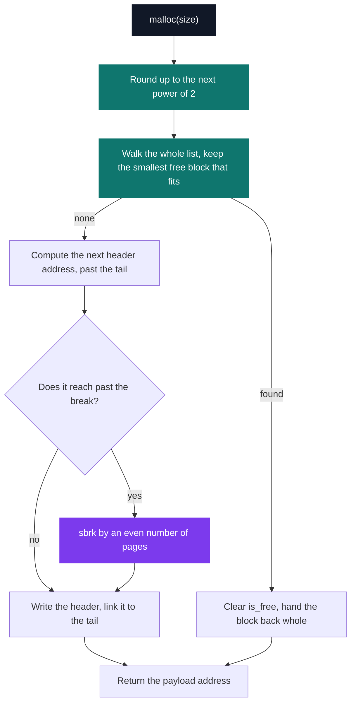

# malloc — memory allocator

[](https://antoinepoisson.github.io/Old-School-Projects/projects/psu-malloc-2019)

   

[Tek2](../../README.md) / [PSU](../README.md) / **PSU_malloc_2019**

*Epitech project · Unix Prog. - Memory (B-PSU-400) · February–March 2020 · 2 weeks · Grade A*

`LD_PRELOAD=./libmy_malloc.so ls` — and `/bin/ls` now runs on this code. It was never compiled
against it, never tested with it, and has no way to find out. Every allocation it makes, plus every
allocation libc makes on its behalf, goes through 234 lines of C across three files.

The error channel is almost non-existent by construction. The library's only two `write(2, ...)`
calls both report a failed `sbrk`, and one of them passes a length of 12 for a 17-byte string, so
it prints `Error alloc `. Everything else is silent: a header off by a few bytes hands back a
pointer into someone else's data, and the crash surfaces later, in a program that did nothing wrong.


**No safety net either.** The subject allows `brk` and `sbrk` and nothing else: `mmap`, `munmap`,
the whole `*alloc` family, `free` itself, `dlopen` and `dlsym` are all on the forbidden list. That
removes the two usual escapes — there is no second source of pages, and no way to look up the real
`malloc` and defer to it. Moving the end of the data segment is the entire supply.

The five prototypes are the libc ones, byte for byte — the loader matches on the symbol name alone,
so a signature that drifts is a silent ABI mismatch rather than a link error.

| Symbol | What it does here |
| --- | --- |
| `malloc` | rounds the size up to a power of 2, best-fit walk, otherwise appends a block |
| `free` | walks the list for the header at that address, flips `is_free` |
| `calloc` | `malloc`, then a zeroing loop over `nmemb` |
| `realloc` | keeps the block in place while the new size still fits, else allocates and copies word by word |
| `reallocarray` | rejects `nmemb * size` above `INT_MAX`, else defers to `realloc` |

**The bootstrap.** The allocator has to store its own list head somewhere, and it cannot allocate
that somewhere. The only storage that exists before the first byte of heap is a `static` pointer in
the library's own `.bss`, and the first `sbrk` fills the two pages it ends up pointing at.

```c
head_t **get_start(bool activation)
{
    static head_t *list = NULL;
    void *ptr = NULL;

    if (list == NULL && activation) {
        ptr = sbrk(SIZE_PAGE * 2);
        if (ptr == (void *)-1) {
            write(2, "Error Start\n", 12);
            return (NULL);
        }
        list = ptr;
        list->list = NULL;
        list->tail = NULL;
        list->limit = sbrk(0);
        list->nbr_page = 2;
    }
    return (&list);
}
```

`free` calls it with `activation = false`, so freeing is never a reason to bring a heap into
existence. `malloc` and `realloc` pass `true`, and whichever of them runs first pays for the two
pages.

**The strategy is imposed, not chosen.** The subject demands best fit, alignment on a power of 2,
and a break that only ever moves by a multiple of two pages. Best fit means every allocation walks
the entire list to the end — the cheap first-fit shortcut is off the table.



The rounding goes through `pow()` from libm, which is why `LDFLAGS` carries `-lm`. A shift loop
does the same job in integers, and would keep libm out of every process the library is injected
into.

The heap after a single `malloc(100)` — offsets in bytes from the first `sbrk`, on x86-64:

```text
+0      head_t      nbr_page = 2 · list · tail · limit           sizeof = 32 B
+256    node_t #1   size = 128 · is_free = false · next · prev   sizeof = 32 B
+512    payload #1  <- the pointer malloc(100) hands back
+4608   node_t #2   where the following header would land
+8192   break       two pages, grown by sbrk in even page counts
```

**One audit note.** Payload addresses are computed as `node + sizeof(node_t *)` with `node` typed
`node_t *`, so C scales the offset by `sizeof(node_t)` and the payload lands 256 bytes past its
header instead of 32. The same unit runs through the next-block address and the `free` lookup, so
headers, lookups and spacing agree and blocks never overlap: the allocator over-reserves by a wide
margin rather than under-reserving — with `/bin/ls` as caller, the right direction to be wrong in.

**Where the two imposed rules meet.** Reuse is whole-block — `free` flips one bit, and the next
best-fit walk takes the block back intact, with no splitting and no coalescing. Because every
request is rounded to a power of 2 first, sizes collapse onto a small set of classes, so a block
coming back from the same class is an exact fit rather than an approximate one. Round-up plus best
fit end up behaving like a size-class allocator.

## Beyond the baseline

The Criterion suite is the addition, and it is its own trap. `make tests_run` compiles the three
allocator sources straight into the test binary, so Criterion's own bookkeeping allocations run on
the allocator under test before the first assertion is reached. A crash in the harness *is* a test
result.

The subject names the other check itself: run existing programs on it. That is why the `LD_PRELOAD`
line at the top carries more weight than any assertion — a real binary exercises allocation
patterns no synthetic test would think to write.

## Technical stack

C · Makefile, gcc, Criterion, gcovr, Git. Built `-shared -fPIC` into `libmy_malloc.so`, linked
against libm.

## Verification

Four Criterion tests in `tests/test.c` covering `malloc(0)`, a normal `malloc`, `calloc` and
`free`, each with stdout and stderr redirected, and `gcovr` reporting coverage.

The decisive check is not there, though: it is `LD_PRELOAD` in front of a real binary. When that
fails, the debugger opens on the host program's stack, not on this one — you read the corruption
backwards to the header that caused it.

## Build & run

```bash
make                                       # -> libmy_malloc.so
make tests_run                             # Criterion + gcovr coverage

LD_PRELOAD=$PWD/libmy_malloc.so /bin/ls    # run a real program on it
```

---

[Tek2](../../README.md) / [PSU](../README.md) · [⌂ All projects](../../../README.md)
