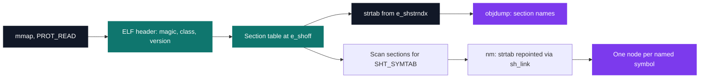
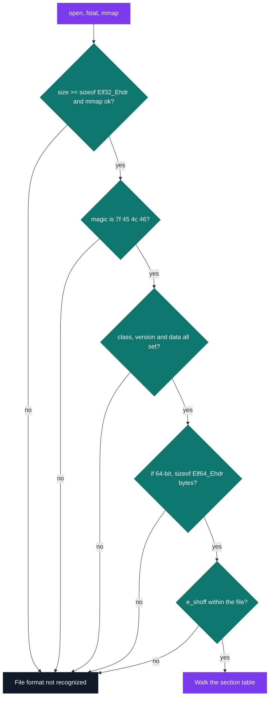

# my_nm & my_objdump — ELF exploration

[](https://antoinepoisson.github.io/Old-School-Projects/projects/psu-nmobjdump-2019)

  

[Tek2](../../README.md) / [PSU](../README.md) / **PSU_nmobjdump_2019**

*Epitech project · Unix Prog. - Memory (B-PSU-400) · March 2020 · 2 weeks · Grade A*

> Two clones of GNU binutils that open a compiled binary, walk its section and symbol tables by
> hand, and print what they find character for character like the originals.

The subject leaves no room to interpret: the display produced must be the same as the one the real
tools produce. Column widths, the blank address field, the single space between hex groups — every
one of them shows up the moment the two outputs meet in `diff`.

Shelling out is closed off as well. `exec*`, `system` and any other function that could run the
real `nm` or `objdump` are on the forbidden list, so every byte printed has to be reconstructed
from the file itself.

And the file is a hostile input. An ELF is a graph of offsets pointing back into itself: the header
names an offset to the section table, a section names an index into a string table, a symbol names
an index into another string table. Follow one of those blindly on a truncated or crafted file and
the process segfaults.

## Beyond the baseline

The subject requires both binaries and a Makefile carrying `nm`, `objdump` and `all` rules. What
goes past that line is the coverage: one code base that reads ELF32 and ELF64 alike, plus a
Criterion suite wired to `gcovr` — 9 C files, 771 lines across `src/`.

**Walking the file.** `mmap` maps the whole binary read-only, then the parser hops from one
structure to the next along the offset chain, the same route `readelf` takes through the section
headers. The `strtab` pointer is set twice: first to the section-name table, then repointed by
`nm` to the string table the symbol table links to.



**Refusing the file before touching it.** Size and magic are checked before a single header field
is read, and the rest of the identification bytes before a single offset is followed. Each
rejection reuses the wording binutils prints, because the error path gets diffed too.



The gate is deliberately narrow, and the narrowness has a cost: an `ar` archive opens with
`!<arch>\n`, never matches the ELF magic, and comes back as an unrecognised format — so the `.a`
inputs the subject lists stay outside what these two binaries read.

**One letter per symbol.** `nm` compresses a symbol's whole nature into a single character.
`type_symbole()` derives it from four values the format keeps in two different structures: the
symbol's binding and section index, and the type and flags of the section that index points at.

| Letter | Chosen when |
| --- | --- |
| `u` | binding is `STB_GNU_UNIQUE` |
| `v` | weak symbol on an `STT_OBJECT` |
| `w` / `W` | weak symbol, undefined / defined |
| `a` | `st_shndx` is `SHN_ABS` |
| `c` | `st_shndx` is `SHN_COMMON` |
| `U` | `st_shndx` is `SHN_UNDEF` |
| `b` | its section is `SHT_NOBITS` |
| `t` | `SHT_PROGBITS`, flags exactly `SHF_ALLOC` plus `SHF_EXECINSTR` |
| `d` | `SHT_PROGBITS`, flags exactly `SHF_ALLOC` plus `SHF_WRITE`, or `SHT_DYNAMIC` |
| `r` | any other `SHT_PROGBITS` |

Nothing else matches, so `SHT_INIT_ARRAY` and friends fall through to `?`; entries whose name
contains `init_array` or `fini_array` are patched back to `t` by name. The letter then passes
through `checker_up_or_low()`, which uppercases it with `c - ' '` whenever the binding is not
`STB_LOCAL`. Five characters come back untouched: `u`, `U`, `w` and `W`, whose case already
carries meaning, and `?`.

**The sort is not alphabetical.** This is where a straightforward clone diverges from `nm` on its
very first run. Every symbol carries a second, normalised name used only as the sort key:

```c
for (int i = 0; name[i]; i++)
    if (name[i] != '_' && name[i] != '@') {
        res[cp++] = name[i];
        res[cp] = '\0';
    }
```

Underscores and `@` disappear, the comparison is `strcasecmp`, and ties on the key fall back to
`strcasecmp` on the raw name. That is what lands `_init` immediately next to `init` instead of
parking every underscore-prefixed symbol ahead of the letters.

The sort is a single all-pairs pass that swaps node *payloads* rather than relinking, so no `next`
pointer is ever rewritten and the list head stays valid from the first comparison to the last.

**The dump has to be pixel-exact.** `my_objdump` prints sixteen bytes per line, grouped in fours,
then the same bytes as text with every non-printable character replaced by a dot. Short trailing
lines pad the hex area with spaces so the ASCII column never shifts.

```text
Contents of section .interp:
 0318 2f6c6962 36342f6c 642d6c69 6e75782d  /lib64/ld-linux-
 0328 7838362d 36342e73 6f2e3200           x86-64.so.2.
```

The address is the section's virtual address plus the offset into it, at least four hex digits
wide. The header line above carries the BFD flag word: for a position-independent executable with
a symbol table and program headers, `HAS_SYMS`, `DYNAMIC` and `D_PAGED` OR together into the
`0x00000150` printed after `architecture:`.

Which sections get dumped is reverse-engineered from what BFD exposes. Empty sections plus
`SHT_NOBITS`, `SHT_SYMTAB` and `SHT_STRTAB` are skipped, and so is anything named `.rela*` — then
`.dynstr`, `.rela.dyn` and `.rela.plt` come back by name, because the real `objdump -s` prints them.

**Two widths, one boolean.** ELF32 and ELF64 disagree on the size of almost every field, so each
structure pointer exists twice in `data_elf_t` and `not_normal_bit` selects the branch. The blank
address column follows suit: 9 spaces for 32-bit, 17 for 64-bit. The validation gate itself is
copied into both binaries rather than shared, differing only in the `my_nm:` / `my_objdump:` error
prefix.

*Audit note* — symbol values are stored in an `unsigned int` while the 64-bit path prints them
with `%016x`. The column is 64 bits wide but the field behind it is 32, so an address above 4 GB
prints truncated. The fix is one type change; finding it is the interesting part.

## Technical stack

C · Makefile, gcc, Criterion, gcovr, Git.

## Verification

7 Criterion tests in `tests/` cover the `nm` side: a missing file, a directory passed as a binary,
the type-letter switch, the all-zero-address check, list insertion, and the two empty-list paths.
`make tests_run` links them with `--coverage` and runs `gcovr` afterwards.

## Build & run

```bash
make                        # builds both binaries
./my_nm /bin/ls
./my_objdump -fs /bin/ls
```

`make nm` and `make objdump` build one at a time. Both flags are always on, so `-f` and `-s`
select nothing the default run does not already print. With no file argument, both tools fall back
to `a.out`, like the originals.

---

[Tek2](../../README.md) / [PSU](../README.md) · [⌂ All projects](../../../README.md)
